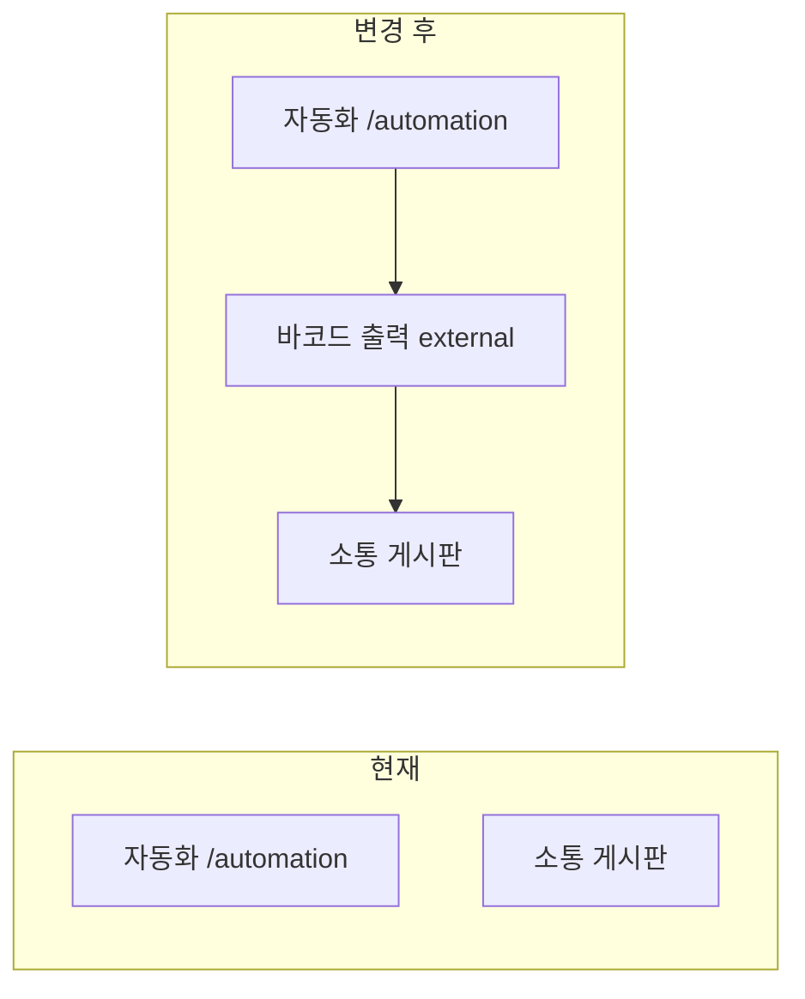

# 바코드 출력 사이드 네비게이션 추가

## 목표

- 사이드바 [`mainNavItems`](src/config/navigation.ts)에서 **자동화** 항목 바로 아래에 **바코드 출력** 추가
- 클릭 시 [라벨 출력 시스템](https://mida-international-label-printer.vercel.app/)이 **새 창**(`target="_blank"`)으로 열림
- 기존 `/automation` 라우트·페이지는 **변경 없음**

## 현재 구조

[`navigation.ts`](src/config/navigation.ts) — `자동화`는 단일 `NavItem`:

```ts
{ title: "자동화", href: "/automation", icon: Bot },
```

[`app-sidebar.tsx`](src/components/layout/app-sidebar.tsx) — 모든 `mainNavItems`는 `NavIconMenuItem` → Next.js `<Link href={item.href}>` 로만 렌더링. **외부 링크 패턴 없음**.



## 구현 (2파일)

### 1. [`src/config/navigation.ts`](src/config/navigation.ts)

- `NavItem` 타입에 선택 필드 추가: `external?: boolean`
- `lucide-react`에서 `Barcode` 아이콘 import
- `mainNavItems`에 `자동화` 바로 다음 항목 추가:

```ts
{
  title: "바코드 출력",
  href: "https://mida-international-label-printer.vercel.app/",
  icon: Barcode,
  external: true,
},
```

### 2. [`src/components/layout/app-sidebar.tsx`](src/components/layout/app-sidebar.tsx)

`NavIconMenuItem`의 `render` prop 분기:

- **내부 링크** (`external` 없음): 기존 `<Link href={item.href} />`
- **외부 링크** (`external: true`): `<a href={item.href} target="_blank" rel="noopener noreferrer" />`

`isNavItemActive` 보완: `item.external` 이거나 `href`가 `http`로 시작하면 **active 처리하지 않음** (현재 pathname과 매칭되지 않도록).

> `NavCollapsibleGroup`은 이번 변경 대상 아님. 접이식 그룹 변환 없이 flat 메뉴 목록에 항목만 추가.

## 검증

1. `npm run build` 통과
2. 사이드바에서 **자동화 → 바코드 출력 → 소통 게시판** 순서 확인
3. **바코드 출력** 클릭 시 새 탭에서 라벨 출력 사이트 열림
4. **자동화** 클릭 시 기존 `/automation` 페이지 정상 이동
5. 사이드바 접힘(icon) 모드에서도 바코드 아이콘·tooltip 동작 확인

## 커밋 메시지 (참고)

```
feat: 사이드바에 바코드 출력 외부 링크 메뉴 추가
```
