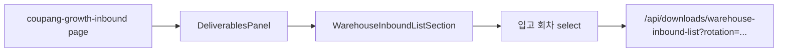

# 입고 회차 기본값·순서 변경

## 대상 화면

[`/downloads/coupang-growth-inbound`](src/app/(dashboard)/downloads/coupang-growth-inbound/page.tsx) → [`DeliverablesPanel`](src/components/deliverables/deliverables-panel.tsx) → [`WarehouseInboundListSection`](src/components/deliverables/warehouse-inbound-list-section.tsx)



## 현재 동작

[`warehouse-inbound-list-section.tsx`](src/components/deliverables/warehouse-inbound-list-section.tsx) 15~20행, 49행:

```typescript
const WAREHOUSE_INBOUND_ROTATION_OPTIONS = [
  { value: "", label: "없음" },   // 첫 번째 + 기본 선택
  { value: "1", label: "1회전" },
  { value: "2", label: "2회전" },
  { value: "3", label: "3회전" },
] as const;

const [inboundRotation, setInboundRotation] = useState("");  // 기본: 없음
```

- `rotation` 쿼리 파라미터가 없거나 `""`이면 서버 [`parseWarehouseInboundRotation`](src/services/deliverables/generate-warehouse-inbound-list-context.ts)이 `0`을 반환 → 엑셀에 회차 컬럼 없음
- `rotation=1`이면 `1회차` 컬럼 1개 포함

## 변경 내용 (1파일)

[`src/components/deliverables/warehouse-inbound-list-section.tsx`](src/components/deliverables/warehouse-inbound-list-section.tsx)만 수정:

1. **옵션 순서 변경** — `없음`을 맨 아래로 이동

```typescript
const WAREHOUSE_INBOUND_ROTATION_OPTIONS = [
  { value: "1", label: "1회전" },
  { value: "2", label: "2회전" },
  { value: "3", label: "3회전" },
  { value: "", label: "없음" },
] as const;
```

2. **기본값 변경** — 초기 state를 `"1"`로 설정

```typescript
const [inboundRotation, setInboundRotation] = useState("1");
```

## 백엔드 변경 없음

- 다운로드/기록 API는 이미 `rotation=1`을 지원함 ([`route.ts`](src/app/api/downloads/warehouse-inbound-list/route.ts), [`warehouse-inbound-deliverables/route.ts`](src/app/api/warehouse-inbound-deliverables/route.ts))
- `handleDownloadClick` / `handleRecordClick`의 `inboundRotation ? &rotation=...` 로직은 `"1"`일 때 `rotation=1`을 정상 전달하므로 그대로 유지

## 검증

1. `/downloads/coupang-growth-inbound` 접속 후 판매자 선택
2. "창고 전송용 입고리스트 생성" → 입고 회차가 **1회전**으로 선택되어 있는지 확인
3. 드롭다운 열었을 때 순서: 1회전 → 2회전 → 3회전 → 없음
4. 기본 상태에서 다운로드 시 엑셀에 **1회차** 컬럼이 포함되는지 확인
5. `없음` 선택 시 회차 컬럼 없는 기존 동작 유지

## 커밋 메시지 제안

```
fix: 창고 입고리스트 생성 시 입고 회차 기본값을 1회전으로 설정
```
