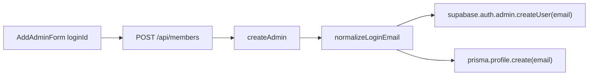

# 관리자 추가: 이메일 → 아이디 + @mida.com 자동 처리

## 참고: 기존 로그인 패턴

로그인은 이미 아이디 입력 + 저장 시 도메인 자동 처리를 사용합니다.

- UI: [`src/components/auth/login-form.tsx`](src/components/auth/login-form.tsx) — 라벨 `아이디`, `type="text"`
- 변환: [`src/lib/auth/normalize-login-email.ts`](src/lib/auth/normalize-login-email.ts)

```typescript
// @ 없으면 @mida.com 붙임, @ 있으면 그대로 사용
export function normalizeLoginEmail(input: string): string {
  const trimmed = input.trim();
  if (!trimmed) return trimmed;
  if (trimmed.includes("@")) return trimmed;
  return `${trimmed}${LOGIN_EMAIL_DOMAIN}`;
}
```

관리자 추가도 **동일 유틸을 서버에서** 호출해 일관성과 API 우회 방지를 보장합니다.



## 변경 파일 (3개)

### 1. 타입 — [`src/services/members/types.ts`](src/services/members/types.ts)

`CreateAdminInput`의 `email` 필드를 `loginId`로 변경:

```typescript
export type CreateAdminInput = {
  loginId: string;
  password: string;
  name?: string;
  role: "admin" | "master";
};
```

`CreatedAdmin.email`은 Supabase/DB에 저장된 실제 이메일이므로 유지.

### 2. 서비스 — [`src/services/members/create-admin.ts`](src/services/members/create-admin.ts)

- `createAdminSchema`: `email: z.email(...)` → `loginId: z.string().trim().min(1, "아이디를 입력해 주세요.")`
- 파싱 후 `const email = normalizeLoginEmail(parsed.data.loginId)`
- `z.email()`로 정규화된 이메일 유효성 검사 (실패 시 `"유효한 아이디를 입력해 주세요."`)
- 이후 로직(중복 확인, Supabase `createUser`, Profile 생성)은 기존 `email` 변수 그대로 사용
- 중복/에러 메시지: `"이미 등록된 이메일입니다."` → `"이미 등록된 아이디입니다."`

### 3. UI — [`src/components/members/add-admin-form.tsx`](src/components/members/add-admin-form.tsx)

로그인 폼과 동일한 UX로 맞춤:

| 항목 | 변경 전 | 변경 후 |
|------|---------|---------|
| state | `email` | `loginId` |
| 라벨 | 이메일 | 아이디 |
| input type | `email` | `text` |
| autoComplete | `off` | `username` |
| placeholder | `admin@example.com` | `admin` |
| API body | `{ email, ... }` | `{ loginId, ... }` |

선택: `FieldDescription` 또는 `CardDescription`에 `@mida.com이 자동으로 붙습니다.` 안내 추가 (로그인과 동일한 동작 설명).

## 변경하지 않는 부분

- [`src/app/api/members/route.ts`](src/app/api/members/route.ts) — `CreateAdminInput` 타입만 따라감, 별도 수정 불필요
- [`src/components/members/members-table.tsx`](src/components/members/members-table.tsx) — 목록은 DB에 저장된 전체 이메일(`admin@mida.com`) 표시 유지
- [`src/lib/auth/normalize-login-email.ts`](src/lib/auth/normalize-login-email.ts) — 기존 함수 재사용, 수정 없음

## 검증

1. 설정 > 회원관리 > 관리자 추가 폼에 **아이디** 필드가 보이는지 확인
2. `testuser` 입력 후 생성 → Supabase/목록에 `testuser@mida.com`으로 저장되는지 확인
3. `testuser@mida.com` 전체 입력 시 그대로 저장되는지 확인 (로그인과 동일)
4. 중복 아이디 시 `"이미 등록된 아이디입니다."` 메시지 확인
5. 생성된 계정으로 로그인 화면에서 `testuser`만 입력해 로그인 가능한지 확인

## 커밋 메시지 제안

```
feat: 관리자 추가 시 아이디 입력 및 @mida.com 자동 변환
```
