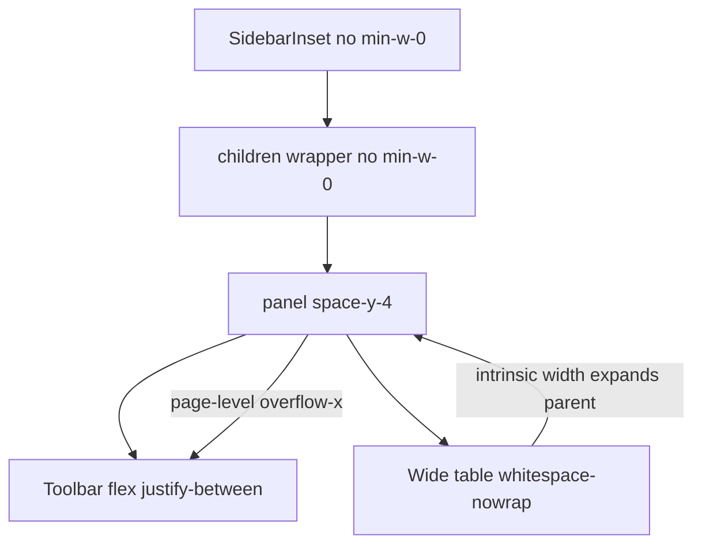

# 목록 페이지 상단 툴바 가로 스크롤 문제 해결

## 원인



- [`SidebarInset`](src/components/ui/sidebar.tsx)과 [`layout.tsx`](src/app/(dashboard)/layout.tsx) children wrapper에 `min-w-0`이 없어 flex 자식이 테이블 최소 너비만큼 **페이지 전체가 넓어짐**
- 툴바 하단은 `sm:justify-between`으로 **페이지 정보(좌) + 페이지네이션(우)** 배치 → 페이지가 넓어지면 이전/다음이 화면 오른쪽 밖으로 밀림
- 일부 툴바 필터 행에 `min-w-[160px]` / `min-w-[200px]` / `lg:flex-row` 고정 폭이 겹쳐 추가 압박 ([`trends-toolbar.tsx`](src/components/inbound-trends/trends-toolbar.tsx)가 가장 심함)

테이블 자체의 가로 스크롤은 정상이나, **스크롤 영역이 페이지 전체로 올라가는 것**이 문제입니다.

## 해결 전략 (2단계)

### 1단계: 레이아웃 체인에 `min-w-0` 추가 (전 페이지 공통)

| 파일 | 변경 |
|------|------|
| [`src/components/ui/sidebar.tsx`](src/components/ui/sidebar.tsx) `SidebarInset` | `flex w-full flex-1 flex-col` → `flex w-full min-w-0 flex-1 flex-col` |
| [`src/app/(dashboard)/layout.tsx`](src/app/(dashboard)/layout.tsx) | children wrapper에 `min-w-0` 추가 |

```tsx
<div className="flex min-w-0 flex-1 flex-col gap-4 p-4">{children}</div>
```

### 2단계: 목록 패널 + 툴바를 뷰포트 너비에 고정

**공통 셸 컴포넌트 신규** (중복 제거):

[`src/components/data-list/data-list-panel.tsx`](src/components/data-list/data-list-panel.tsx)
```tsx
export function DataListPanel({ children }: { children: React.ReactNode }) {
  return (
    <div className="flex w-full min-w-0 flex-col gap-4">{children}</div>
  );
}
```

[`src/components/data-list/data-list-toolbar-shell.tsx`](src/components/data-list/data-list-toolbar-shell.tsx)
```tsx
// w-full min-w-0 overflow-hidden — 툴바는 뷰포트 안, 테이블만 내부 스크롤
export function DataListToolbarShell({ children, className }) { ... }
```

**패널 래퍼 교체** (`space-y-4` div → `DataListPanel`):

- [`inbound-workbench-panel-client.tsx`](src/components/inbound-workbench/inbound-workbench-panel-client.tsx) (대시보드)
- [`trends-panel.tsx`](src/components/inbound-trends/trends-panel.tsx) (추세조회)
- [`coupang-growth-inventory-health-panel.tsx`](src/components/coupang-growth-data/coupang-growth-inventory-health-panel.tsx)
- [`shopling-package-mapping-panel.tsx`](src/components/shopling-data/shopling-package-mapping-panel.tsx)
- 동일 패턴: [`shopling-products-panel.tsx`](src/components/shopling-data/shopling-products-panel.tsx), [`shopling-new-option-products-panel.tsx`](src/components/shopling-data/shopling-new-option-products-panel.tsx)

**툴바 루트에 셸 적용** (6개):

| 툴바 | 비고 |
|------|------|
| [`inbound-workbench-toolbar.tsx`](src/components/inbound-workbench/inbound-workbench-toolbar.tsx) | 이미 `overflow-hidden` 있음 → `w-full min-w-0`만 보강 |
| [`trends-toolbar.tsx`](src/components/inbound-trends/trends-toolbar.tsx) | 필터 행 `flex-wrap` + `min-w-0` |
| [`coupang-growth-inventory-health-toolbar.tsx`](src/components/coupang-growth-data/coupang-growth-inventory-health-toolbar.tsx) | form `flex-wrap`, search `min-w-0 flex-1` |
| [`shopling-package-mapping-toolbar.tsx`](src/components/shopling-data/shopling-package-mapping-toolbar.tsx) | 셸 + search `min-w-0` |
| [`shopling-products-toolbar.tsx`](src/components/shopling-data/shopling-products-toolbar.tsx) | 동일 |
| [`shopling-new-option-products-toolbar.tsx`](src/components/shopling-data/shopling-new-option-products-toolbar.tsx) | trends와 유사 필터 행 wrap |

### 툴바 세부 CSS 변경 (반복 패턴)

1. **루트**: `w-full min-w-0 overflow-hidden`
2. **검색 input**: `min-w-[200px] flex-1` → `min-w-0 flex-1` (Input 기본값이 이미 `min-w-0`)
3. **필터 행** (trends 등): `lg:flex-row` → `flex flex-wrap gap-2` (lg에서도 줄바꿈 허용)
4. **요약 텍스트**: `truncate` 또는 `min-w-0` 추가해 긴 스냅샷 문자열이 행을 밀지 않게
5. **페이지네이션 행**: `shrink-0` on prev/next 그룹 유지, 부모에 `flex-wrap` (이미 대부분 있음)

**Workbench**는 구조가 다르므로 셸만 공유하고, 검색/페이지네이션 영역에 `min-w-0` 보강.

### 테이블 (선택적 정리)

각 `*-table.tsx`의 바깥 `overflow-x-auto` 래퍼는 [`ui/table.tsx`](src/components/ui/table.tsx)와 중복이지만, **패널에 `min-w-0`만 추가해도** 페이지 레벨 overflow는 해소됩니다. 이번 작업에서는 테이블 구조는 건드리지 않음 (범위 최소화).

## 검증

각 페이지에서 **페이지 가로 스크롤 없이** 상단 툴바 전체(검색, 조회, 이전/다음)가 보이는지 확인:

1. `/` 대시보드 (판매자 선택 + 검색 + 페이지네이션)
2. `/trends` 추세조회 (필터 4개 + 검색 + 페이지네이션)
3. `/data/coupang-growth/inventory-health` 쿠팡 그로스
4. `/data/shopling/package-mapping` 패키지 매핑

추가: 창 너비 1280px / 1024px / 모바일에서 툴바가 줄바꿈되며 버튼이 보이는지 확인. 테이블은 **테이블 영역 안에서만** 가로 스크롤.

## 커밋 메시지 제안

```
fix: 데이터 목록 페이지 툴바가 가로 스크롤 없이 보이도록 레이아웃 수정
```
