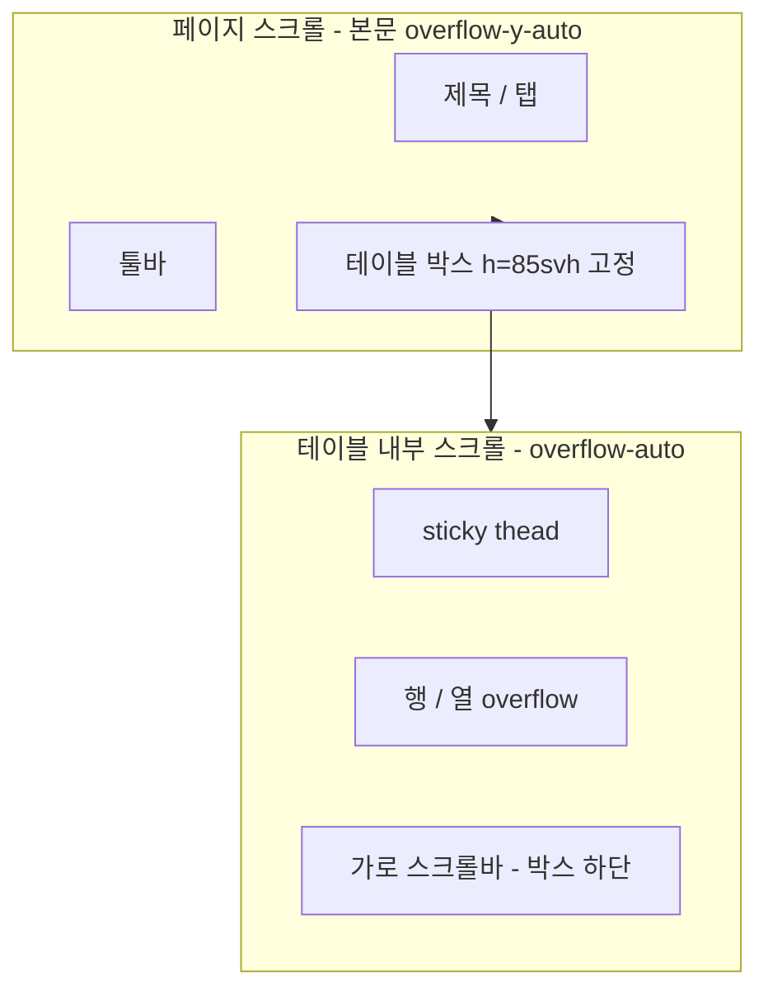

# 목록 테이블 가로 스크롤 접근성 개선

## 문제 (사용자 확인)

1. 가로 스크롤바가 **테이블 전체 높이의 맨 아래**에만 렌더됩니다. 행이 많으면 세로로 끝까지 스크롤한 뒤에야 좌우 스크롤이 가능합니다.
2. 페이지 제목·툴바가 테이블 위에 있어 세로 공간이 부족하고, **페이지 스크롤**과 **테이블 내부 스크롤**이 분리되어야 합니다.



## 해결 방향

1. **이중 스크롤** — 페이지(본문) 스크롤과 테이블 박스 내부 스크롤을 **독립**으로 동작 (`overscroll-contain`으로 전파 방지)
2. **테이블 고정 높이** — `--list-table-height: max(32rem, 85svh)` 로 박스 크기 고정, 내용이 넘치면 박스 **안에서만** 스크롤
3. **페이지 스크롤** — 제목 + 툴바 + 고정 높이 테이블 합이 뷰포트보다 커서 본문을 스크롤하면 제목·툴바를 지나 테이블을 크게 볼 수 있음
4. **`DataListTableScrollArea`** — `h-[var(--list-table-height)]` + `overflow-auto`
5. **sticky 헤더** — 테이블 박스 안에서 `thead` 고정
6. 툴바 sticky 없음 — 페이지 스크롤과 함께 자연스럽게 위로 사라짐

---

## 1. 공통 컴포넌트

### [`src/components/data-list/data-list-table-scroll-area.tsx`](src/components/data-list/data-list-table-scroll-area.tsx)

```tsx
export function DataListTableScrollArea({ children, className }) {
  return (
    <div className={cn(
      "h-[var(--list-table-height)] max-h-[var(--list-table-height)] min-h-[var(--list-table-height)]",
      "min-w-0 shrink-0 overflow-auto overscroll-contain rounded-md border ...",
      className,
    )}>
      {children}
    </div>
  );
}
```

- `--list-table-height`: `max(32rem, 85svh)` — **고정 높이**, 내용과 무관하게 박스 크기 유지
- `overscroll-contain`: 테이블 안에서 스크롤할 때 페이지 스크롤과 섞이지 않음
- 가로·세로 스크롤 모두 박스 **하단/내부**에서 처리

### [`src/components/data-list/data-list-panel.tsx`](src/components/data-list/data-list-panel.tsx)

```tsx
<div className="flex min-w-0 flex-col gap-4">
```

### [`src/components/data-list/data-list-toolbar-shell.tsx`](src/components/data-list/data-list-toolbar-shell.tsx)

- `shrink-0` — 페이지 스크롤 시 툴바도 함께 위로 사라짐 (sticky 없음)

### [`src/components/ui/table.tsx`](src/components/ui/table.tsx)

```tsx
className={cn("relative w-full", containerClassName ?? "overflow-x-auto")}
```

목록 테이블: `<Table containerClassName="overflow-visible">`

### [`src/app/globals.css`](src/app/globals.css)

```css
--app-header-height: 3.5rem;
--dashboard-content-padding-y: 2rem;
--list-toolbar-estimate: 7rem;
--list-table-height: max(32rem, 85svh);
```

---

## 2. 레이아웃 (사이드바 + 본문 스크롤)

| 파일 | 변경 |
|------|------|
| [`src/app/layout.tsx`](src/app/layout.tsx) | `body` `h-full overflow-hidden` |
| [`src/app/(dashboard)/layout.tsx`](src/app/(dashboard)/layout.tsx) | `SidebarProvider` `h-svh overflow-hidden`, `SidebarInset` `overflow-hidden`, children `overflow-y-auto` |
| [`src/components/ui/sidebar.tsx`](src/components/ui/sidebar.tsx) `SidebarInset` | `min-h-0 min-w-0` |

목록 **페이지** — `overflow-hidden` 제거, 자연 스크롤 허용:

- [`src/app/(dashboard)/page.tsx`](src/app/(dashboard)/page.tsx)
- [`src/app/(dashboard)/trends/page.tsx`](src/app/(dashboard)/trends/page.tsx)
- [`src/app/(dashboard)/data/coupang-growth/inventory-health/page.tsx`](src/app/(dashboard)/data/coupang-growth/inventory-health/page.tsx)
- [`src/app/(dashboard)/data/shopling/package-mapping/page.tsx`](src/app/(dashboard)/data/shopling/package-mapping/page.tsx)
- [`src/app/(dashboard)/data/shopling/products/page.tsx`](src/app/(dashboard)/data/shopling/products/page.tsx)
- [`src/app/(dashboard)/data/shopling/new-option-products/page.tsx`](src/app/(dashboard)/data/shopling/new-option-products/page.tsx)
- [`src/app/(dashboard)/data/shopling/layout.tsx`](src/app/(dashboard)/data/shopling/layout.tsx)
- [`src/app/(dashboard)/data/coupang-growth/layout.tsx`](src/app/(dashboard)/data/coupang-growth/layout.tsx)

패턴:

```tsx
<div className="flex min-w-0 flex-col gap-6">
  <div className="shrink-0 space-y-2">{/* h1 — 스크롤 시 사라짐 */}</div>
  <TrendsPanel ... />
</div>
```

---

## 3. 패널 구조 (페이지 스크롤 + 테이블 고정 높이)

```tsx
<DataListPanel>
  <TrendsToolbar ... />           {/* 페이지 스크롤과 함께 이동 */}
  <DataListTableScrollArea>       {/* h=85svh 고정, 내부 overflow-auto */}
    <TrendsTable ... />
  </DataListTableScrollArea>
</DataListPanel>
```

**수정 패널 (6개)**:

- [`inbound-workbench-panel-client.tsx`](src/components/inbound-workbench/inbound-workbench-panel-client.tsx)
- [`trends-panel.tsx`](src/components/inbound-trends/trends-panel.tsx)
- [`coupang-growth-inventory-health-panel.tsx`](src/components/coupang-growth-data/coupang-growth-inventory-health-panel.tsx)
- [`shopling-package-mapping-panel.tsx`](src/components/shopling-data/shopling-package-mapping-panel.tsx)
- [`shopling-products-panel.tsx`](src/components/shopling-data/shopling-products-panel.tsx)
- [`shopling-new-option-products-panel.tsx`](src/components/shopling-data/shopling-new-option-products-panel.tsx)

**툴바**: `shrink-0`만 적용 (sticky 제거)

---

## 4. 테이블 컴포넌트 (6개)

| 파일 | 변경 |
|------|------|
| [`trends-table.tsx`](src/components/inbound-trends/trends-table.tsx) | 이중 래퍼 제거; sticky header `z-20`, sticky left header `z-30` |
| [`inbound-workbench-table.tsx`](src/components/inbound-workbench/inbound-workbench-table.tsx) | 동일 |
| [`coupang-growth-inventory-health-table.tsx`](src/components/coupang-growth-data/coupang-growth-inventory-health-table.tsx) | 동일 |
| [`shopling-package-mapping-table.tsx`](src/components/shopling-data/shopling-package-mapping-table.tsx) | 동일 |
| [`shopling-inventory-table.tsx`](src/components/shopling-data/shopling-inventory-table.tsx) | 동일 |
| [`shopling-new-option-products-table.tsx`](src/components/shopling-data/shopling-new-option-products-table.tsx) | 동일 |

---

## 5. 사용 흐름 (이중 스크롤)

| 스크롤 | 영역 | 동작 |
|--------|------|------|
| **페이지** | 사이드바 오른쪽 본문 (`overflow-y-auto`) | 제목·탭·툴바를 지나 아래로 이동, 테이블 박스 전체를 화면에 맞게 조절 |
| **테이블** | `DataListTableScrollArea` (`h=85svh`, `overflow-auto`) | 행·열이 박스를 넘을 때만 박스 **안에서** 세로·가로 스크롤 |

1. 페이지 진입 — 제목·툴바·테이블 박스(고정 높이)가 세로로 쌓임
2. **본문 스크롤** — 마우스가 테이블 밖(제목·여백)일 때 페이지가 스크롤
3. 제목·툴바가 위로 사라지고 **85svh 테이블 박스**가 화면을 채움
4. **테이블 박스 안**에서 행·열 스크롤 — 가로 스크롤바는 항상 박스 하단

---

## 6. 검증

1. 본문 스크롤과 테이블 내부 스크롤이 **서로 독립** 동작하는지
2. 본문 스크롤 시 제목·툴바가 사라지고 테이블 박스(85svh)가 크게 보이는지
3. 테이블 행·열이 많을 때 **박스 안에서만** 세로·가로 스크롤되는지
4. 가로 스크롤바가 테이블 박스 하단(페이지 맨 아래가 아님)에 있는지

## 커밋 메시지 제안

```
fix: 목록 테이블 스크롤 영역 분리 및 본문 스크롤로 테이블 확대 보기 개선
```
