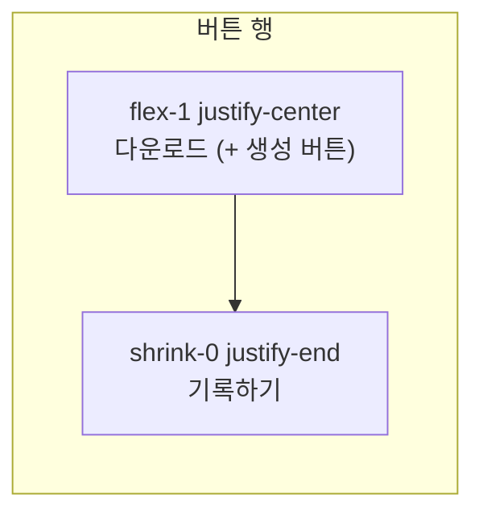

# 산출물 생성 버튼 레이아웃 개선

## 대상 컴포넌트 (3개)

| 페이지 경로 | 컴포넌트 | 변경 요약 |
|-------------|----------|-----------|
| 산출물 > 쿠팡 그로스 입고 > 창고 전송용 입고리스트 | [`warehouse-inbound-list-section.tsx`](src/components/deliverables/warehouse-inbound-list-section.tsx) | 다운로드: 중앙·대형 / 기록하기: 우측·대형 |
| 산출물 > 쿠팡 그로스 입고 > 쿠팡그로스 입고 템플릿 | [`coupang-inbound-template-section.tsx`](src/components/deliverables/coupang-inbound-template-section.tsx) | 다운로드 → 샵플링 출고 순서로 중앙·대형 / 기록하기: 우측·대형 |
| 산출물 > 샵플링 입고 > 샵플링 입고 템플릿 | [`shopling-inbound-template-section.tsx`](src/components/deliverables/shopling-inbound-template-section.tsx) | 다운로드: 중앙·대형 / 라벨 `입고 기록하기` → `기록하기`, 우측·대형 |

## 레이아웃 목표



- **중앙 영역**: `flex flex-1 flex-wrap items-center justify-center gap-3`
- **우측 영역**: `flex shrink-0 justify-end` — 기록하기만 배치
- 모바일: 세로 스택 후 중앙 버튼 → 기록하기 순 (`flex-col gap-4`)

## 공통 스타일 (신규)

[`src/components/deliverables/deliverables-action-bar.tsx`](src/components/deliverables/deliverables-action-bar.tsx) 추가:

```tsx
export const DELIVERABLES_PRIMARY_BUTTON_CLASS =
  "h-11 min-w-[12rem] px-6 text-base";

export function DeliverablesActionBar({
  center,
  end,
}: { center: ReactNode; end?: ReactNode }) {
  return (
    <div className="flex flex-col gap-4 sm:flex-row sm:items-center">
      <div className="flex flex-1 flex-wrap items-center justify-center gap-3">
        {center}
      </div>
      {end ? (
        <div className="flex shrink-0 justify-center sm:justify-end">
          {end}
        </div>
      ) : null}
    </div>
  );
}
```

- 버튼 크기: 사용자 선택 **xl** — `h-11 min-w-[12rem] px-6 text-base` (`size="lg"`와 함께 className 적용)
- 3개 섹션에서 동일 패턴 재사용 → 레이아웃 불일치 방지

## 파일별 변경

### 1. [`warehouse-inbound-list-section.tsx`](src/components/deliverables/warehouse-inbound-list-section.tsx)

**현재** (L178–204): 스냅샷 텍스트와 버튼이 한 줄, 버튼 `size="sm"`, 기록하기·다운로드 모두 우측 정렬

**변경**:
- 스냅샷 텍스트는 버튼 행 **위**에 유지
- `DeliverablesActionBar` 적용:
  - `center`: 다운로드 버튼 1개
  - `end`: 기록하기 (`variant="outline"`, 라벨 유지)

### 2. [`coupang-inbound-template-section.tsx`](src/components/deliverables/coupang-inbound-template-section.tsx)

**현재** (L472–505): 우측 정렬, 순서 `입고 기록하기` → `샵플링 출고 템플릿 생성` → `다운로드`, 모두 `size="sm"`

**변경**:
- `DeliverablesActionBar` 적용:
  - `center`: **다운로드** → **샵플링 출고 템플릿 생성** (순서 교체)
  - `end`: 입고 기록하기 (`variant="outline"`, 라벨 유지)
- disabled/loading 로직은 기존 그대로 유지

### 3. [`shopling-inbound-template-section.tsx`](src/components/deliverables/shopling-inbound-template-section.tsx)

**현재** (L169–187): 우측 정렬, `입고 기록하기` → `다운로드`, `size="sm"`

**변경**:
- `DeliverablesActionBar` 적용:
  - `center`: 다운로드
  - `end`: `기록하기` (문구 변경: `입고 기록하기` → `기록하기`, 로딩 중 `기록 중...` 유지)

## 검증

1. `/downloads/coupang-growth-inbound` — 창고 입고리스트·쿠팡그로스 템플릿 섹션 버튼 위치·크기
2. `/downloads/inbound-list` 또는 샵플링 입고 경로 — 샵플링 입고 템플릿 섹션
3. 모바일 너비에서 중앙/우측 버튼이 세로로 자연스럽게 쌓이는지
4. `npm run build` 통과

## 커밋 메시지 제안

```
fix: 산출물 생성 섹션 다운로드·기록 버튼 크기 및 정렬 개선
```
