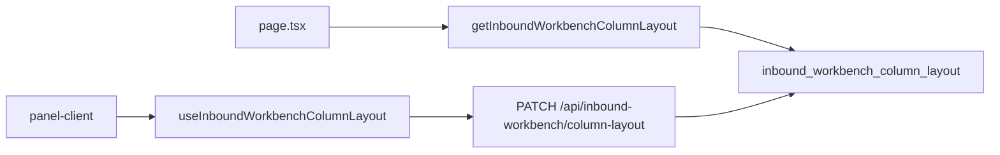

# 대시보드 열 숨김 처리

## 배경

대시보드(`/`)는 [`InboundWorkbenchPanel`](src/components/inbound-workbench/inbound-workbench-panel.tsx) + [`InboundWorkbenchTable`](src/components/inbound-workbench/inbound-workbench-table.tsx)로 구성됩니다. 열 순서·너비는 이미 [`InboundWorkbenchColumnLayout`](src/services/inbound-workbench/inbound-workbench-column-layout.ts)으로 **프로필별 DB**에 저장됩니다.



열 숨김도 **같은 레이아웃 객체·같은 API·같은 테이블**에 `hiddenColumns` 필드를 추가해 재사용합니다.

## UX (사용자 선택 반영)

- 툴바 **「열 숨김」** 버튼 → 드롭다운에 열 목록
- **체크 = 숨김**, **해제 = 표시**
- 목록 순서는 현재 `columnOrder` 기준
- **판매자** 열(다중 계정 시만 표시)은 숨김 대상에서 제외 — 항상 표시
- 마지막 1개 열은 숨길 수 없음 (최소 1열 유지)
- 편집 모드에서는 비활성화 (기존 열 초기화·드래그·리사이즈와 동일)

## 데이터 모델 확장

### Prisma

[`prisma/schema.prisma`](prisma/schema.prisma) `InboundWorkbenchColumnLayout`에 추가:

```prisma
hiddenColumns Json @default("[]") @map("hidden_columns")
```

신규 마이그레이션: `hidden_columns JSONB NOT NULL DEFAULT '[]'`

### 타입·정규화

[`inbound-workbench-column-layout.ts`](src/services/inbound-workbench/inbound-workbench-column-layout.ts):

```ts
export type InboundWorkbenchColumnLayout = {
  columnOrder: InboundWorkbenchSortColumn[];
  columnWidths: Partial<Record<InboundWorkbenchSortColumn, number>>;
  hiddenColumns: InboundWorkbenchSortColumn[];
};
```

- `getDefaultColumnLayout()`: `hiddenColumns: []`
- `normalizeColumnLayout()`: 유효한 sort column만 남기고 중복 제거
- `isColumnVisible(layout, id)`: `!hiddenColumns.includes(id)`

### 영속화

[`persist-inbound-workbench-column-layout.ts`](src/services/inbound-workbench/persist-inbound-workbench-column-layout.ts) — `hiddenColumns` read/write 추가. API [`column-layout/route.ts`](src/app/api/inbound-workbench/column-layout/route.ts)는 전체 layout PATCH이므로 **변경 없음**.

## 훅 확장

[`use-inbound-workbench-column-layout.ts`](src/components/inbound-workbench/use-inbound-workbench-column-layout.ts):

| 추가 | 설명 |
|------|------|
| `hiddenColumns` | 현재 숨김 열 ID 배열 |
| `visibleColumnOrder` | `columnOrder.filter(id => !hiddenSet.has(id))` |
| `setColumnHidden(id, hidden)` | 체크 시 숨김, 해제 시 표시. 마지막 1열 숨김 방지 |
| `isColumnHidden(id)` | UI용 |
| `resetLayout()` | `hiddenColumns`도 `[]`로 초기화 |

저장: 기존 debounce PATCH에 `hiddenColumns` 포함 (`persistLayout` / `persistLayoutImmediate`).

## UI 컴포넌트 (신규)

[`src/components/inbound-workbench/workbench-column-visibility-menu.tsx`](src/components/inbound-workbench/workbench-column-visibility-menu.tsx)

- `DropdownMenu` + `DropdownMenuCheckboxItem` ([`dropdown-menu.tsx`](src/components/ui/dropdown-menu.tsx) 기존 컴포넌트)
- `checked={isColumnHidden(id)}` — 체크 = 숨김
- 라벨: [`INBOUND_WORKBENCH_COLUMN_DEFS`](src/components/inbound-workbench/inbound-workbench-columns.tsx)의 `label` 사용
- `max-h-80 overflow-y-auto`로 20개 열 스크롤 가능
- 상단 `DropdownMenuLabel`: "체크한 열은 숨깁니다"

## 연결

### 툴바

[`inbound-workbench-toolbar.tsx`](src/components/inbound-workbench/inbound-workbench-toolbar.tsx) — **열 초기화** 옆에 `WorkbenchColumnVisibilityMenu` 배치.

### 패널·테이블

[`inbound-workbench-panel-client.tsx`](src/components/inbound-workbench/inbound-workbench-panel-client.tsx):

- 훅에서 `visibleColumnOrder`, `hiddenColumns`, `setColumnHidden` 사용
- 테이블에는 `columnOrder={visibleColumnOrder}` 전달 (숨긴 열은 thead/tbody 모두 미렌더)
- 툴바에 visibility props 전달

[`inbound-workbench-table.tsx`](src/components/inbound-workbench/inbound-workbench-table.tsx) — props 시그니처 변경 없이 `columnOrder`만 visible 목록을 받으면 됨.

## 테스트

[`inbound-workbench-column-layout.test.ts`](src/services/inbound-workbench/inbound-workbench-column-layout.test.ts):

- `hiddenColumns` 기본값 `[]`
- 잘못된 ID 필터링
- `resetLayout` 시 hidden 초기화 (훅 단위 테스트는 선택 — normalize 테스트로 충분)

## 검증

1. `/`에서 **열 숨김** → 체크한 열이 테이블에서 사라지는지
2. 새로고침·로그아웃 후 재로그인해도 숨김 상태 유지
3. **열 초기화** 시 숨김도 함께 해제
4. 편집 모드에서 버튼 비활성화
5. `npm run build` 통과

## 커밋 메시지 제안

```
feat: 대시보드 테이블 열 숨김 설정을 프로필별로 저장
```
