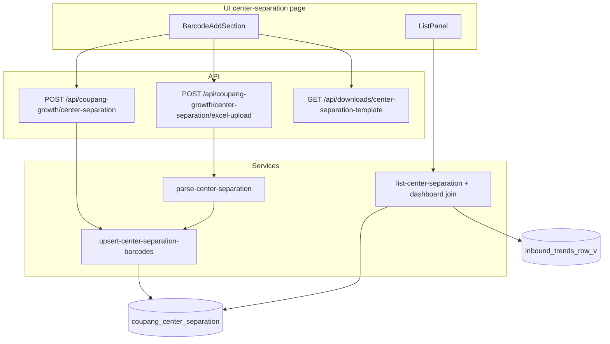

# 센터분리 관리 — 바코드 등록·목록 조회

## 확정 요구사항

| 항목 | 내용 |
|------|------|
| 저장 값 | **바코드만** DB에 저장 (`coupang_center_separation`) |
| 웹 추가 | 상단에서 **바코드 1개 입력** 후 추가 (핵심 UX) |
| 엑셀 | 보조 수단 — 템플릿 헤더 **`바코드` 1열**, 업로드 UI는 컴팩트 |
| 목록 표시 | 등록 바코드 기준으로 **대시보드**(`inbound_trends_row_v`)에서 조회: 쿠팡그로스 상품이름, 옵션명, 자사상품코드, 샵플링 옵션 벨류 |
| upsert | 바코드 기준 추가·갱신 (기존 목록 유지) |



---

## 1. DB 스키마

[`prisma/schema.prisma`](prisma/schema.prisma):

```prisma
model CoupangCenterSeparation {
  id        String   @id @default(cuid())
  barcode   String   @unique @map("barcode")
  createdAt DateTime @default(now()) @map("created_at")
  updatedAt DateTime @updatedAt @map("updated_at")

  @@map("coupang_center_separation")
}
```

마이그레이션:
- `20260625120000_coupang_center_separation` — 테이블 생성
- `20260626120000_center_separation_barcode_only` — 상품 컬럼 제거 (바코드만 유지)

---

## 2. 엑셀 (보조)

**상수** — `src/lib/excel/targets/center-separation.ts`

```ts
export const CENTER_SEPARATION_EXCEL_HEADERS = ["바코드"] as const;
```

**파서** — `parse-center-separation.ts`: `바코드`/`barcode` 헤더만 검증, 빈 바코드 행 스킵

**템플릿** — `center-separation-template.ts`: 헤더 1행(`바코드`)만

---

## 3. 서비스 레이어

`src/services/center-separation/`

| 파일 | 역할 |
|------|------|
| `types.ts` | RowView(대시보드 조인 필드 포함), upsert stats |
| `upsert-center-separation-barcodes.ts` | 바코드 배열 upsert (단건·엑셀 공용) |
| `create-center-separation-barcode.ts` | 웹 단건 추가 |
| `ingest-center-separation-excel.ts` | 엑셀 파싱 → upsert |
| `list-center-separation.ts` | 바코드 페이징 + `inbound_trends_row_v` LEFT JOIN으로 상품 정보 표시 |

목록 검색: 바코드 또는 대시보드 상품명·옵션명·자사상품코드·샵플링 옵션 벨류

### 대시보드 바코드 검증

- 기준: `inbound_trends_row_v` (계정별 최신 템플릿·재고 현황 + 전역 최신 샵플링 스냅샷)
- 계정 구분 없이, 어느 한 계정 대시보드에라도 바코드가 있으면 등록 가능
- `validate-center-separation-barcodes.ts` → known / missing 분리
- **단건**: 없으면 Dialog 알림, DB 미등록
- **대량**: known만 등록, missing 전체 목록을 Dialog로 표시

---

## 4. API

| Method | Route | 설명 |
|--------|-------|------|
| `POST` | `/api/coupang-growth/center-separation` | JSON `{ barcode }` 단건 추가 |
| `POST` | `/api/coupang-growth/center-separation/excel-upload` | `FormData` `file` |
| `GET` | `/api/downloads/center-separation-template` | 바코드 1열 템플릿 |

---

## 5. UI

### 상단 — `center-separation-add-section.tsx`

- **단건 추가** 카드: 바코드 입력 + 추가 버튼 (없는 바코드 → 알림 Dialog)
- **엑셀 대량 등록** 카드: `엑셀 템플릿 다운로드` + `엑셀 업로드` (다이얼로그)
- 업로드 다이얼로그: 드래그/파일 선택 → **확인** 시 등록, **취소**로 닫기
- 대량 업로드 후 없는 바코드가 있으면 **전체 목록 Dialog** (스크롤)

### 하단 목록

- 테이블: 쿠팡그로스 상품이름, 옵션명, 자사상품코드, 샵플링 옵션 벨류, 바코드
- 등록 시점에 대시보드에 없던 바코드는 등록 자체가 차단됨

---

## 6. 검증

1. `npx prisma migrate deploy` 후 `npm run build`
2. 바코드 단건 추가 → 목록에 대시보드 상품 정보 표시
3. 엑셀(바코드 열만) 일괄 업로드
4. 검색·페이징

---

## 범위 외

- 행 삭제 UI
- 판매자 계정별 분리
- 센터분리 데이터를 다른 화면에 연동
