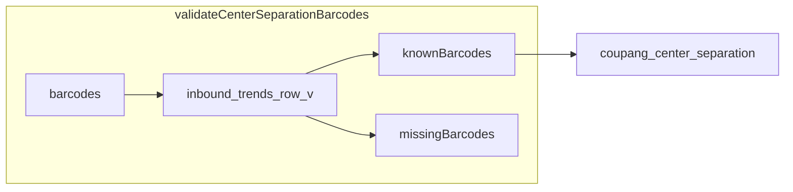

# 센터분리 — 대시보드 바코드 검증

## 검증 기준 (사용자 확인 사항)

**맞습니다.** 목록 조회와 동일하게 [`inbound_trends_row_v`](prisma/migrations/20260621120000_inbound_trends_views/migration.sql)를 기준으로 합니다.

| 데이터 | 스냅샷 기준 |
|--------|-------------|
| 입고 템플릿 | **판매자 계정별** `MAX(snapshot_date)` |
| 재고 현황(health) | **판매자 계정별** `MAX(snapshot_date)` |
| 샵플링 재고 | **전역** 최신 `snapshot_date` |

검증·조회 모두 **계정을 구분하지 않습니다.** 어느 한 계정의 최신 대시보드 행에라도 `TRIM(product_barcode)`가 일치하면 “존재”로 처리합니다.



---

## 1. 서비스 — 바코드 검증

신규 [`src/services/center-separation/validate-center-separation-barcodes.ts`](src/services/center-separation/validate-center-separation-barcodes.ts)

```sql
SELECT DISTINCT TRIM(product_barcode) AS barcode
FROM inbound_trends_row_v
WHERE product_barcode IS NOT NULL
  AND TRIM(product_barcode) <> ''
  AND TRIM(product_barcode) IN (...)
```

- 입력 바코드 trim·dedupe 후 한 번에 조회
- 반환: `{ knownBarcodes: string[], missingBarcodes: string[] }` (입력 순서 유지해 missing 목록 구성)

단위 테스트: known/missing 분리 (DB mock 없이 순수 함수 분리 가능하면 분리, 아니면 ingest 연동 테스트는 생략)

---

## 2. 서비스 — upsert 흐름 변경

[`upsert-center-separation-barcodes.ts`](src/services/center-separation/upsert-center-separation-barcodes.ts)

1. `validateCenterSeparationBarcodes(dedupedBarcodes)` 호출
2. **`knownBarcodes`만** DB upsert
3. 응답에 `missingBarcodes` 포함

[`types.ts`](src/services/center-separation/types.ts) 확장:

```ts
export type UpsertCenterSeparationResult = {
  stats: UpsertCenterSeparationStats;
  missingBarcodes: string[];
};
```

[`create-center-separation-barcode.ts`](src/services/center-separation/create-center-separation-barcode.ts)

- missing이면 `{ ok: false, error: "대시보드에 해당 바코드가 없습니다." }` — **DB 저장 없음**

대량([`ingest-center-separation-excel.ts`](src/services/center-separation/ingest-center-separation-excel.ts))

- known만 등록
- `missingBarcodes.length === deduped.length` 이면 전체 실패 (`ok: false`)
- 일부만 missing이면 `ok: true` + `missingBarcodes` 전체 반환

---

## 3. UI — 알림/팝업

[`center-separation-add-section.tsx`](src/components/center-separation/center-separation-add-section.tsx)

### 단건 추가
- API `ok: false` (바코드 없음) → **Dialog** 제목/본문으로 알림 (예: “대시보드에 해당 바코드가 없습니다.”)
- 기존 인라인 `error` 대신 또는 함께 Dialog 사용 (단건은 Dialog가 더 명확)

### 엑셀 대량
- 업로드 성공 후 `missingBarcodes.length > 0` 이면 **별도 Dialog**
  - 제목: “대시보드에 없는 바코드”
  - 본문: **전체 목록** (`max-h` + `overflow-y-auto` 스크롤, truncate 없음)
  - 건수 표시: `N건`
- 동시에 성공 건수는 기존 `notice`로 표시 (예: “3건 반영 · 없는 바코드 2건”)

Dialog 패턴은 기존 [`Dialog`](src/components/ui/dialog.tsx) + [`shopling-package-mapping-sync-card.tsx`](src/components/shopling-sync/shopling-package-mapping-sync-card.tsx) 재사용.

---

## 4. 계획 파일 갱신

[`.cursor/plans/센터분리_관리_기능_f837fa0f.plan.md`](.cursor/plans/센터분리_관리_기능_f837fa0f.plan.md)에 검증 규칙·UI 동작 섹션 추가.

---

## 5. 검증

1. 단건: 대시보드에 없는 바코드 → Dialog 알림, DB 미등록
2. 단건: 있는 바코드 → 정상 등록
3. 엑셀: 일부 없음 → 있는 것만 등록 + 팝업에 **없는 바코드 전부** 표시
4. 엑셀: 전부 없음 → 등록 없음 + 팝업 또는 에러
5. `npm run build`
