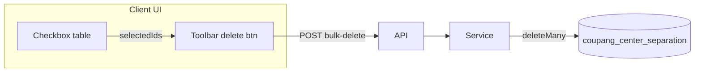

# 센터분리 목록 일괄 삭제

## 목표 UX

- 목록 각 행 + 헤더에 체크박스 (현재 페이지 기준 전체 선택/해제)
- 툴바(목록 테이블 상단)에 **삭제** 버튼 — 선택 0건이면 비활성화
- 클릭 시 확인(`window.confirm`, [shopling-package-mapping-table.tsx](src/components/shopling-data/shopling-package-mapping-table.tsx)와 동일) 후 API 호출 → 성공 시 `router.refresh()` 및 선택 초기화



## 백엔드

### 1. 서비스 — [delete-center-separation-barcodes.ts](src/services/center-separation/delete-center-separation-barcodes.ts) (신규)

- 입력: `ids: string[]`
- 빈 배열 / 공백 id만 있으면 `{ ok: false, error: "삭제할 항목을 선택해 주세요." }`
- `prisma.coupangCenterSeparation.deleteMany({ where: { id: { in: validIds } } })`
- 반환: `{ ok: true, data: { deletedCount: number } }`
- 대시보드 바코드 검증은 **불필요** (등록 시에만 검증, 삭제는 저장된 레코드 제거)

### 2. API — [bulk-delete/route.ts](src/app/api/coupang-growth/center-separation/bulk-delete/route.ts) (신규)

```ts
POST { ids?: string[] }
```

- `requireApiProfile()` + JSON 파싱
- `fromServiceResult(await deleteCenterSeparationBarcodes(body.ids ?? []))`
- 기존 [route.ts](src/app/api/coupang-growth/center-separation/route.ts)는 POST(단건 등록)만 유지

### 3. 타입 — [types.ts](src/services/center-separation/types.ts)

```ts
export type DeleteCenterSeparationResult = { deletedCount: number };
```

## 프론트엔드

### 4. 클라이언트 래퍼 — [center-separation-list-section.tsx](src/components/center-separation/center-separation-list-section.tsx) (신규, `"use client"`)

- `selectedIds: Set<string>` 상태 보유
- `data.rows` / `page` / `search` 변경 시 선택 초기화 (`useEffect`)
- 자식: 확장된 툴바 + 체크박스 테이블

### 5. 툴바 — [center-separation-toolbar.tsx](src/components/center-separation/center-separation-toolbar.tsx)

- 선택 관련 optional props 추가:
  - `selectedCount`, `onBulkDelete`, `isDeleting`
- 건수 표시 옆에 `N건 선택` + `삭제` 버튼 (`variant="destructive"`, `size="sm"`)
- 기존 검색·페이지네이션 UI는 그대로

### 6. 테이블 — [center-separation-table.tsx](src/components/center-separation/center-separation-table.tsx)

- `"use client"` 전환
- 첫 열: 행 체크박스 + 헤더 전체 선택(현재 페이지 `rows` 기준)
- [Checkbox](src/components/ui/checkbox.tsx) 사용
- props: `rows`, `selectedIds`, `onSelectedIdsChange`

### 7. 패널 연결 — [center-separation-panel.tsx](src/components/center-separation/center-separation-panel.tsx)

- 데이터가 있을 때 `CenterSeparationTable` + `CenterSeparationToolbar` 직접 렌더 대신 `CenterSeparationListSection` 사용
- 빈 DB / 검색 무결과 분기는 기존 유지

### 삭제 핸들러 (list-section 내부)

```ts
const result = await apiPost<{ deletedCount: number }>(
  "/api/coupang-growth/center-separation/bulk-delete",
  { ids: [...selectedIds] },
);
```

- 확인 문구: `선택한 N건의 센터분리 바코드를 삭제할까요?`
- 실패 시 툴바/테이블 상단에 `role="alert"` 오류 메시지

## 테스트

- [delete-center-separation-barcodes.test.ts](src/services/center-separation/delete-center-separation-barcodes.test.ts): 빈 `ids` 거부 (deliverable 삭제 테스트와 동일 수준)

## 검증

- `npm run build`
- 목록에서 1건·여러 건 선택 후 삭제 → 목록 갱신·건수 감소
- 페이지 이동/검색 후 선택 상태 초기화 확인
- 선택 없을 때 삭제 버튼 비활성화
