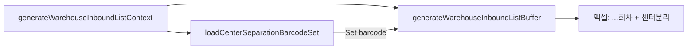

# 창고 전송용 입고리스트 센터분리 열 추가

## 현황

- 엑셀 생성: [`warehouse-inbound-list.ts`](src/lib/excel/generators/warehouse-inbound-list.ts)
  - 기본 7열(`box`~`수량`) + 선택적 회전 열(`1회차`~`3회차`)
  - `columnKeys = [...BASE, ...rotation]` — 회전 수만큼 동적 추가
- 컨텍스트 조립: [`generate-warehouse-inbound-list-context.ts`](src/services/deliverables/generate-warehouse-inbound-list-context.ts) — 회전 배치·패키지 매핑 로드 후 buffer 생성
- 센터분리 바코드: `coupang_center_separation` 테이블, 정규화 규칙은 [`normalize-barcode.ts`](src/lib/center-separation/normalize-barcode.ts)

## 목표 동작

| 조건 | `센터분리` 열 (항상 **마지막**) |
|------|-------------------------------|
| 출력 `바코드`가 센터분리 DB에 존재 (직접 일치) | `○` |
| 없음 | 빈 셀 |

- 회전 0~3개와 무관하게 열 순서: `... 수량 → 1회차 → … → N회차 → 센터분리`
- 매칭: **출력 바코드 ↔ 센터분리 DB 바코드 직접 비교** (패키지→단품 분해 없음, 사용자 선택)



## 구현

### 1. 센터분리 바코드 로더 (신규)

[`src/services/deliverables/load-center-separation-barcode-set.ts`](src/services/deliverables/load-center-separation-barcode-set.ts)

```ts
export async function loadCenterSeparationBarcodeSet(): Promise<Set<string>>
```

- `prisma.coupangCenterSeparation.findMany({ select: { barcode: true } })`
- 각 값에 `normalizeCenterSeparationBarcode` 적용 후 `Set` 반환

### 2. 엑셀 생성기 수정

[`warehouse-inbound-list.ts`](src/lib/excel/generators/warehouse-inbound-list.ts)

- 상수 추가:
  - `CENTER_SEPARATION_COLUMN_KEY = "센터분리"`
  - `CENTER_SEPARATION_MARKER = "○"`
- `GenerateWarehouseInboundListOptions`에 `centerSeparationBarcodes?: Set<string>` 추가
- `getWarehouseInboundListColumnKeys(rotationCount)` → 회전 열 뒤 **항상** `센터분리` append
- `toOutputRows`:
  - 회전 열 처리 후 마지막에 `outputRow["센터분리"]` 설정
  - `normalizeCenterSeparationBarcode(row.productBarcode)`가 Set에 있으면 `○`, 아니면 `""`
- `generateWarehouseInboundListBuffer`의 `columnKeys`·열 너비 계산에 센터분리 열 포함 (`MIN_WIDTH` 8)

### 3. 생성 컨텍스트 연결

[`generate-warehouse-inbound-list-context.ts`](src/services/deliverables/generate-warehouse-inbound-list-context.ts)

- `listWarehouseInboundRows`와 병렬로 `loadCenterSeparationBarcodeSet()` 호출
- `generateWarehouseInboundListBuffer(..., { ..., centerSeparationBarcodes })`에 전달

다운로드 API([`warehouse-inbound-list/route.ts`](src/app/api/downloads/warehouse-inbound-list/route.ts))와 기록 API([`warehouse-inbound-deliverables/route.ts`](src/app/api/warehouse-inbound-deliverables/route.ts))는 모두 `generateWarehouseInboundListContext`를 거치므로 **추가 변경 없음**.

### 4. 테스트

[`warehouse-inbound-list.test.ts`](src/lib/excel/generators/warehouse-inbound-list.test.ts) 보강:

- `rotationCount: 2` + 센터분리 Set에 바코드 포함 → 헤더 마지막이 `센터분리`, 해당 행 셀 `○`
- `rotationCount: 0` + 미등록 바코드 → `센터분리` 열 존재, 셀 빈 값
- `getWarehouseInboundListColumnKeys(3)` → `... 3회차, 센터분리` 순서 검증

## 검증

- `npm run build`
- 산출물 생성 페이지에서 회전 1/2/3 선택 각각 다운로드 → `센터분리`가 항상 맨 오른쪽
- 센터분리 등록 바코드 행에 `○` 표시 확인
