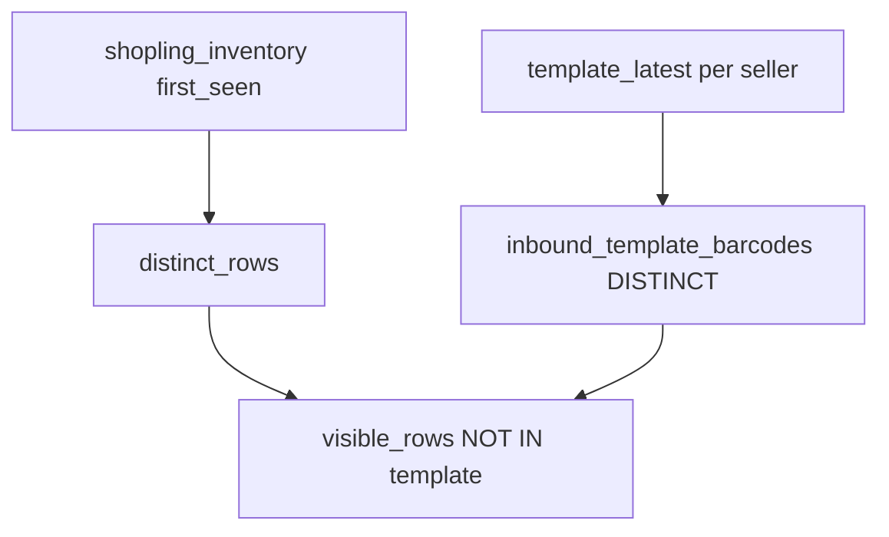

# 신규 옵션 상품 — 입고 템플릿 바코드 제외

## 현황

- 목록: [`list-new-option-products.ts`](src/services/shopling-data/list-new-option-products.ts) — `shopling_inventory` CTE로 **신규 opt_id**를 계산 (뷰/물리 테이블 아님, 조회 쿼리)
- 입고 템플릿: `coupang_growth_inbound_template.product_barcode` — **판매자별 최신 `snapshot_date`** 스냅샷
- 동일 패턴: [`inbound-workbench-query-sql.ts`](src/services/inbound-workbench/inbound-workbench-query-sql.ts)의 `template_snapshot` → `template_latest` → `template_barcodes`



## 목표 동작

- 신규 옵션 상품 **바코드**가 **어느 판매자 계정의 최신 입고 템플릿 업로드**에든 포함되면 목록·건수·페이지네이션에서 **제외**
- DB 삭제/업데이트 없음 — 쿼리 필터만 적용
- 매칭: `TRIM(shopling.barcode) = TRIM(template.product_barcode)` (workbench `template_barcodes`와 동일 규칙)

## 구현

### 1. 공통 CTE 추출 (신규)

[`src/services/shopling-data/latest-inbound-template-barcodes-sql.ts`](src/services/shopling-data/latest-inbound-template-barcodes-sql.ts)

```ts
export function buildLatestInboundTemplateBarcodesCte(): Prisma.Sql
```

- 판매자 필터 **없음** (전체 활성 업로드 계정의 최신 스냅샷 union)
- `template_snapshot` / `template_latest` / `inbound_template_barcodes AS (SELECT DISTINCT TRIM(product_barcode) AS barcode ...)`

workbench와 seller IN 절만 다른 재사용 가능한 SQL fragment.

### 2. 목록 쿼리 수정

[`list-new-option-products.ts`](src/services/shopling-data/list-new-option-products.ts) — `buildBaseQuery` 확장:

1. `buildLatestInboundTemplateBarcodesCte()` CTE 추가
2. `distinct_rows` 다음 `visible_rows` CTE:

```sql
visible_rows AS (
  SELECT dr.*
  FROM distinct_rows dr
  WHERE NOT EXISTS (
    SELECT 1
    FROM inbound_template_barcodes itb
    WHERE TRIM(dr.barcode) = itb.barcode
  )
)
```

3. `COUNT(*)` / `SELECT` 모두 `visible_rows` 기준으로 변경

UI·API 시그니처 변경 없음 ([`page.tsx`](src/app/(dashboard)/data/shopling/new-option-products/page.tsx), panel/toolbar 그대로).

### 3. 테스트

[`latest-inbound-template-barcodes-sql.test.ts`](src/services/shopling-data/latest-inbound-template-barcodes-sql.test.ts) (선택·경량):

- CTE SQL 문자열에 `coupang_growth_inbound_template`, `inbound_template_barcodes` 포함 여부
- 또는 `visible_rows` / `NOT EXISTS` 필터 포함 여부 (스냅샷 테스트)

DB mock 없이 SQL builder smoke test 수준.

## 검증

- `npm run build`
- 입고 템플릿에 있는 바코드로 등록된 신규 옵션 → 목록 미표시
- 템플릿에 없는 신규 옵션 → 기존처럼 표시
- 페이지·검색·기간 필터 건수가 필터 반영 후 정확

## 범위 외

- 판매자별 필터 (현재 페이지에 없음 → 전 계정 최신 템플릿 union)
- 엑셀 파일 내 바코드 공백 정규화(`\s` 제거) — workbench와 동일하게 TRIM만 적용
