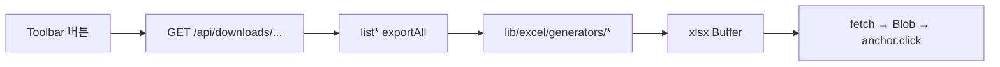

# 목록 테이블 엑셀 다운로드 (10개 전체)

## 범위 (사용자 확정)

| # | 페이지 | 경로 | 현재 상태 |
|---|--------|------|-----------|
| 1 | 대시보드 | `/` | 없음 |
| 2 | 추세조회 | `/trends` | 있음 — **2단 날짜 헤더로 개선** |
| 3 | 재고 현황 | `/data/coupang-growth/inventory-health` | 없음 |
| 4 | 센터분리 관리 | `/data/coupang-growth/center-separation` | 없음 (템플릿만) |
| 5 | 상품정보 | `/data/shopling/products` | 없음 |
| 6 | 패키지 매핑 | `/data/shopling/package-mapping` | 없음 |
| 7 | 신규 옵션 상품 | `/data/shopling/new-option-products` | 없음 |
| 8 | 판매자 계정 | `/data/coupang-growth/seller-accounts` | 없음 |
| 9 | 창고전송 입고 이력 | `/data/dashboard/warehouse-inbound` | 행별 저장 파일만 |
| 10 | 샵플링 입고 이력 | `/data/dashboard/shopling-inbound` | 행별 저장 파일만 |

**제외:** 회원관리, 소통게시판, 산출물 생성(테이블 없음), sync 다이얼로그

## 공통 원칙

- **다운로드 범위:** 화면 필터(판매자, 검색어, 기간 등)는 유지하되 **페이지네이션 무시 → 전체 건 export** (`exportAll: true` 패턴, [`list-inbound-trends.ts`](src/services/inbound-trends/list-inbound-trends.ts) 참고)
- **컬럼:** 화면 테이블 헤더와 동일한 한글 컬럼명 (체크박스·작업 버튼 컬럼 제외)
- **인증:** [`requireApiProfile()`](src/lib/api/auth.ts) + 기존 [`encodeContentDispositionFilename`](src/lib/api/download-helpers.ts)
- **UI:** 각 toolbar에 **「엑셀 다운로드」** 버튼 추가 (추세조회는 기존 「다운로드」 유지)

## 1. 공통 인프라

### [`src/lib/excel/generators/simple-list-export.ts`](src/lib/excel/generators/simple-list-export.ts) (신규)
- `generateSimpleListBuffer({ sheetName, columns, rows })` — `json_to_sheet` + [`autoFitWorksheetColumns`](src/lib/excel/auto-fit-worksheet-columns.ts)
- 단일 헤더 행용 (대부분 목록)

### [`src/lib/excel/generators/inbound-trends-export.ts`](src/lib/excel/generators/inbound-trends-export.ts) (수정)
현재는 flat 컬럼 `2026-03-01(완)`, `2026-03-01` → UI와 동일한 **2행 헤더**로 변경:

| Row1 | 상품명(rowSpan) | … | `3/1`(colSpan 2) | `3/2`(colSpan 2) | … |
| Row2 | (고정 5열 병합) | | `3/1(완)` | `3/1` | … |

- SheetJS `aoa_to_sheet` + `!merges` 사용
- 날짜 표기는 UI [`formatDateHeader`](src/components/inbound-trends/trends-table.tsx)와 동일 (`M/D`)
- 데이터 행은 Row3부터

### [`src/lib/excel/download-list-excel.ts`](src/lib/excel/download-list-excel.ts) (신규)
- `downloadListExcel(apiPath: string): Promise<void>` — fetch + Content-Disposition 파싱 + Blob 다운로드 ( [`warehouse-inbound-list-section.tsx`](src/components/deliverables/warehouse-inbound-list-section.tsx) 패턴 공통화)

### 각 list service에 `exportAll?: boolean` 추가
[`list-inbound-trends.ts`](src/services/inbound-trends/list-inbound-trends.ts)와 동일하게 pagination clause 생략:

- [`list-inbound-workbench.ts`](src/services/inbound-workbench/list-inbound-workbench.ts)
- [`list-inventory-health.ts`](src/services/coupang-growth-data/list-inventory-health.ts)
- [`list-center-separation.ts`](src/services/center-separation/list-center-separation.ts)
- [`list-shopling-inventory.ts`](src/services/shopling-data/list-shopling-inventory.ts)
- [`list-shopling-package-mapping.ts`](src/services/shopling-package-mapping/list-shopling-package-mapping.ts)
- [`list-new-option-products.ts`](src/services/shopling-data/list-new-option-products.ts)
- [`list-warehouse-inbound-deliverables.ts`](src/services/deliverables/list-warehouse-inbound-deliverables.ts)
- [`list-shopling-inbound-deliverables.ts`](src/services/deliverables/list-shopling-inbound-deliverables.ts)

판매자 계정은 페이지네이션 없음 → [`listSellerAccounts`](src/services/coupang-seller-accounts/list-seller-accounts.ts) 그대로 사용

## 2. API 라우트 (9개 신규 + 1개 기존 유지)

| API | Query params (화면 필터 mirror) | Generator |
|-----|----------------------------------|-----------|
| `GET /api/downloads/inbound-workbench` | `sellers`, `q`, `sort`, `dir` | `inbound-workbench-export.ts` |
| `GET /api/downloads/inbound-trends` | *(기존)* | trends export **2행 헤더** |
| `GET /api/downloads/inventory-health` | `seller`, `q` | `inventory-health-export.ts` |
| `GET /api/downloads/center-separation` | `q` | `center-separation-export.ts` |
| `GET /api/downloads/shopling-inventory` | `q` | `shopling-inventory-export.ts` |
| `GET /api/downloads/shopling-package-mapping` | `q` | `shopling-package-mapping-export.ts` |
| `GET /api/downloads/new-option-products` | `days`, `q` | `new-option-products-export.ts` |
| `GET /api/downloads/seller-accounts` | — | `seller-accounts-export.ts` |
| `GET /api/downloads/warehouse-inbound-history` | — | `warehouse-inbound-history-export.ts` |
| `GET /api/downloads/shopling-inbound-history` | — | `shopling-inbound-history-export.ts` |

각 route: [`inbound-trends/route.ts`](src/app/api/downloads/inbound-trends/route.ts) 템플릿 복제

## 3. 페이지별 컬럼 (화면과 동일)

### 대시보드 ([`INBOUND_WORKBENCH_COLUMN_DEFS`](src/components/inbound-workbench/inbound-workbench-columns.tsx))
판매자(다중 선택 시), 상품명, 옵션명, 바코드, 샵플링재고, 자사상품코드, 쿠팡윙재고, 60/7/30일판매, 쿠팡자체추천, 쿠팡입고예정, 안전재고, 쿠팡그로스 입고추천, 입고후 잔여, 실포장수량, 1~3회전, 등급, 소진예상일, 위치

### 재고 현황 ([`coupang-growth-inventory-health-table.tsx`](src/components/coupang-growth-data/coupang-growth-inventory-health-table.tsx))
판매자 계정, 등록상품명, 옵션명, 옵션 ID, 바코드, 샵플링 자사상품코드, 쿠팡윙재고, 7/30/60일판매, 쿠팡자체추천, 쿠팡입고예정, Offer condition, Days of cover, 재고 스냅샷일

### 센터분리 ([`center-separation-table.tsx`](src/components/center-separation/center-separation-table.tsx))
바코드, 등록상품명, 옵션명, 자사상품코드, 등록일시

### 상품정보 / 패키지매핑 / 신규옵션
각 table.tsx 헤더 그대로 (패키지매핑: 작업 컬럼 제외)

### 판매자 계정
쿠팡 판매자 계정, 상태, 생성자, 생성일

### 입고 이력 (2시트)
- **Sheet1 `이력`:** 화면 메인 테이블 컬럼 (작업/삭제 제외)
- **Sheet2 `상세`:** 부모 파일명 + 상세 행 컬럼 flat (창고: 일자/로케이션/등록상품명/…, 샵플링: 바코드/수량)

## 4. Toolbar UI 변경

각 toolbar에 다운로드 버튼 + loading state:

| Toolbar 파일 |
|-------------|
| [`inbound-workbench-toolbar.tsx`](src/components/inbound-workbench/inbound-workbench-toolbar.tsx) |
| [`trends-toolbar.tsx`](src/components/inbound-trends/trends-toolbar.tsx) *(기존 href 유지)* |
| [`coupang-growth-inventory-health-toolbar.tsx`](src/components/coupang-growth-data/coupang-growth-inventory-health-toolbar.tsx) |
| [`center-separation-list-section.tsx`](src/components/center-separation/center-separation-list-section.tsx) 또는 toolbar |
| [`shopling-products-toolbar.tsx`](src/components/shopling-data/shopling-products-toolbar.tsx) |
| [`shopling-package-mapping-toolbar.tsx`](src/components/shopling-data/shopling-package-mapping-toolbar.tsx) |
| [`shopling-new-option-products-toolbar.tsx`](src/components/shopling-data/shopling-new-option-products-toolbar.tsx) |
| [`seller-accounts-panel.tsx`](src/components/coupang-seller-accounts/seller-accounts-panel.tsx) — toolbar 없으면 panel 상단에 버튼 |
| [`warehouse-inbound-record-history-section.tsx`](src/components/deliverables/warehouse-inbound-record-history-section.tsx) |
| [`shopling-inbound-record-history-section.tsx`](src/components/deliverables/shopling-inbound-record-history-section.tsx) |

다운로드 URL은 각 페이지의 `build*Query()` 헬퍼로 현재 필터를 query string에 반영.

## 5. 테스트

- [`inbound-trends-export.test.ts`](src/lib/excel/generators/inbound-trends-export.test.ts): 2행 헤더 merge·서브컬럼명 검증
- generator smoke test 1~2개 (컬럼 순서·빈 데이터)
- `npm run build` 통과

## 구현 순서

1. 공통 generator + client download helper
2. service `exportAll` 추가
3. trends export 2행 헤더 개선 + 테스트
4. API routes + page generators (데이터 7개 → 판매자 → 이력 2개)
5. toolbar 버튼 연결
6. build 검증
