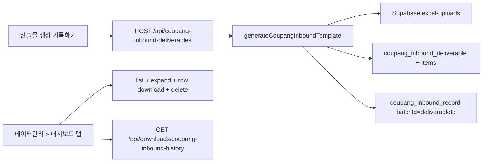

# 쿠팡그로스 입고리스트 이력 (대시보드 탭 + 엑셀/DB 저장)

## 목표

현재 [`recordCoupangInbound`](src/services/deliverables/record-coupang-inbound.ts)는 `coupang_inbound_record`에 **바코드·수량만** 적재하고 **생성된 WING 입고 템플릿 엑셀은 저장하지 않습니다.** 이를 [`recordWarehouseInboundDeliverable`](src/services/deliverables/record-warehouse-inbound-deliverable.ts) / [`recordShoplingInboundDeliverable`](src/services/deliverables/record-shopling-inbound-deliverable.ts)와 같은 구조로 맞춥니다.



## 1. DB 스키마 (Prisma migration)

[`prisma/schema.prisma`](prisma/schema.prisma)에 창고/샵플링 deliverable과 대칭 모델 추가:

**`CoupangInboundDeliverable`** (배치 1건 = 생성된 입고 템플릿 1개)
- `id`, `coupangSellerAccountId`, `storagePath`, `outputFileName`
- `sourceFileName` (업로드한 박스 리스트 원본명, nullable)
- `matchedCount`, `unmatchedCount` (필터 stats, optional int)
- `recordedById`, `recordedAt`
- relations: `CoupangSellerAccount`, `Profile`, `items[]`

**`CoupangInboundDeliverableItem`** (바코드별 상세)
- `deliverableId`, `productBarcode`, `coupangOptionId` (BigInt?), `quantity`

기존 [`CoupangInboundRecord`](prisma/schema.prisma)는 **유지** — 대시보드 1~3회전·[`coupang_inbound_daily_v`](prisma/migrations/20260621120000_inbound_trends_views/migration.sql) 추세조회가 이 테이블을 사용합니다. `batchId`를 **deliverable `id`**로 통일해 이력 삭제 시 회전/추세 데이터도 함께 정리합니다.

## 2. Storage

[`src/lib/supabase/storage.ts`](src/lib/supabase/storage.ts)에 경로 헬퍼 추가:

```ts
getCoupangInboundDeliverableStoragePath(deliverableId, outputFileName)
// coupang-inbound-deliverables/{id}/{outputFileName}
```

[`save-coupang-inbound-deliverable-file.ts`](src/services/deliverables/save-coupang-inbound-deliverable-file.ts) — shopling/warehouse save 패턴 복제.

## 3. 기록 서비스 리팩터

[`record-coupang-inbound.ts`](src/services/deliverables/record-coupang-inbound.ts)를 deliverable 중심으로 확장 (또는 `record-coupang-inbound-deliverable.ts` 신규 + 기존 함수 위임):

1. `generateCoupangInboundTemplate` — **다운로드와 동일** 매칭
2. `aggregateMatchedInboundItems` — 바코드별 집계
3. `deliverableId = crypto.randomUUID()`
4. Storage에 **`generated.buffer`** 업로드, `outputFileName` = [`buildCoupangInboundTemplateFilename`](src/lib/excel/generators/filter-inbound-template.ts)
5. `$transaction`:
   - `coupangInboundDeliverable.create`
   - `coupangInboundDeliverableItem.createMany`
   - `coupangInboundRecord.createMany` (`batchId: deliverableId`) — **기존 회전/추세 로직 유지**

입력에 `sourceFileName`(box list 파일명) 추가.

## 4. 조회·다운로드·삭제 서비스

창고/샵플링 파일을 템플릿으로 복제:

| 서비스 | 참고 |
|--------|------|
| `list-coupang-inbound-deliverables.ts` | [`list-warehouse-inbound-deliverables.ts`](src/services/deliverables/list-warehouse-inbound-deliverables.ts) |
| `get-coupang-inbound-deliverable-file.ts` | warehouse get-file |
| `delete-coupang-inbound-deliverable.ts` | storage 삭제 + deliverable 삭제(cascade items) + **`coupangInboundRecord.deleteMany({ batchId })`** |

[`types.ts`](src/services/deliverables/types.ts)에 list/item view 타입 추가. 페이지네이션은 기존 `normalizeShoplingInboundDeliverablePageSize` 재사용.

## 5. API 라우트

| Method | Path | 역할 |
|--------|------|------|
| GET/POST | `/api/coupang-inbound-deliverables` | 목록 / 기록 |
| GET | `/api/coupang-inbound-deliverables/[id]/download` | 저장된 템플릿 엑셀 |
| DELETE | `/api/coupang-inbound-deliverables/[id]` | 이력+파일+회전 이벤트 삭제 |
| GET | `/api/downloads/coupang-inbound-history` | 전체 이력 2시트 엑셀 (이력+상세) |

- POST body: 현재 [`/api/inbound-records`](src/app/api/inbound-records/route.ts)와 동일 — `FormData(seller, boxListFile)`
- [`/api/inbound-records`](src/app/api/inbound-records/route.ts)는 내부에서 새 record 서비스 호출하도록 **위임 유지** (기존 UI 깨짐 방지) 또는 UI를 새 API로 전환 후 deprecated 주석

## 6. UI — 대시보드 탭 + 이력 화면

### 탭 등록

[`src/config/page-tabs.ts`](src/config/page-tabs.ts) `dashboardTabGroup` 탭 순서 (사용자 확정):

1. 창고전송용 입고리스트
2. **쿠팡그로스 입고리스트** → `/data/dashboard/coupang-inbound`
3. 샵플링 입고

### 페이지

- [`src/app/(dashboard)/data/dashboard/coupang-inbound/page.tsx`](src/app/(dashboard)/data/dashboard/coupang-inbound/page.tsx) — warehouse page 패턴
- [`src/components/deliverables/coupang-inbound-record-history-section.tsx`](src/components/deliverables/coupang-inbound-record-history-section.tsx) — [`warehouse-inbound-record-history-section.tsx`](src/components/deliverables/warehouse-inbound-record-history-section.tsx) 기반

**메인 테이블 컬럼:** 기록일시, 산출물 파일명, 판매자, 원본 박스리스트명, 기록자, 행 수, 수량 합, (선택) 매칭/미매칭 건수  
**펼침 상세:** 바코드, 옵션 ID, 수량  
**행 작업:** 저장 엑셀 다운로드, 삭제  
**상단:** 전체 이력 엑셀 다운로드 (`ListExcelDownloadButton`)

### 산출물 생성 화면 연동

[`coupang-inbound-template-section.tsx`](src/components/deliverables/coupang-inbound-template-section.tsx) `handleRecordInboundClick`:
- `POST /api/coupang-inbound-deliverables` (또는 기존 `/api/inbound-records`가 동일 동작)
- 성공 메시지에 deliverableId/recordedCount 유지

## 7. 엑셀 이력 export

[`warehouse-inbound-history-export.ts`](src/lib/excel/generators/warehouse-inbound-history-export.ts) 패턴:

- Sheet1 `이력`: 메인 테이블 컬럼
- Sheet2 `상세`: 파일명 + 바코드/옵션ID/수량 flat

## 8. 테스트

- `record-coupang-inbound-deliverable` helper 단위 테스트 (aggregate + item create payload)
- delete 시 `batchId` 연동 삭제 검증 (mock prisma)
- generator smoke: 빈/1건 데이터

## 범위外 / 참고

- **기존 `coupang_inbound_record`만 있고 deliverable이 없는 과거 데이터**는 이력 탭에 표시되지 않음 (백필 마이그레이션 없음)
- WING 템플릿 업로드·다운로드 생성 로직 자체는 변경 없음
- `npm run build` + deliverables 관련 test 통과 확인

## 구현 순서

1. Prisma migration + storage helper
2. record/list/get/delete services + types
3. API routes (record → download → delete → history export)
4. dashboard tab + history UI
5. coupang-inbound-template-section API 연결
6. tests + build
