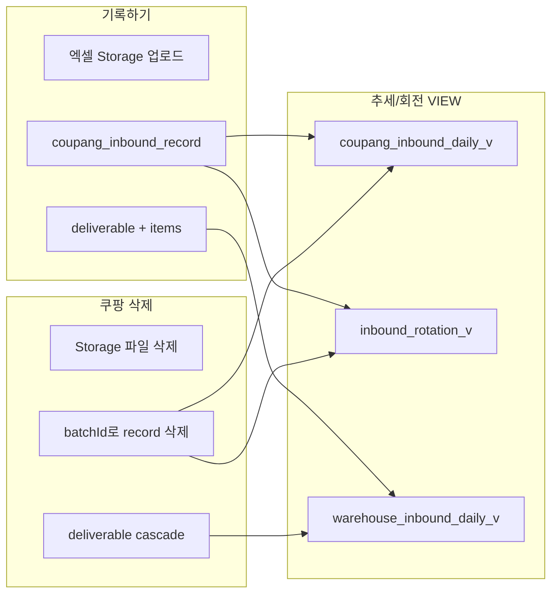

# 대시보드 이력 삭제 — 기록 이전 상태 복원

## 결론

**가능합니다.** 쿠팡그로스·창고전송 탭은 이미 “기록하기” 직후 저장된 분석 데이터까지 함께 삭제합니다. 샵플링은 추세/회전 VIEW에 직접 반영되지 않으므로, 선택하신 대로 **이력+엑셀만** 삭제하는 현재 동작을 유지합니다.



---

## 탭별 현재 동작

| 탭 | 삭제 대상 | 추세관리 반영 | 작업대 회전 반영 |
|---|---|---|---|
| **쿠팡그로스 입고리스트** | Storage 엑셀 + `coupang_inbound_deliverable` + items + **`coupang_inbound_record`(batchId)** | 쿠팡 입고 컬럼 제거 | 1~3회전 수량/일자 제거 |
| **창고전송용 입고리스트** | Storage 엑셀 + `warehouse_inbound_deliverable` + items (cascade) | 창고 입고 컬럼 제거 | 영향 없음 (회전은 쿠팡 record 전용) |
| **샵플링 입고** | Storage 엑셀 + `shopling_inbound_deliverable` + items | 영향 없음 | 영향 없음 (향후 창고 리스트 생성 시 회차 참조만 감소) |

### 쿠팡그로스 — 핵심 코드

[`delete-coupang-inbound-deliverable.ts`](src/services/deliverables/delete-coupang-inbound-deliverable.ts)에서 `batchId = deliverable.id`로 연결된 분석 레코드를 명시 삭제:

```typescript
await prisma.$transaction([
  prisma.coupangInboundRecord.deleteMany({ where: { batchId: id } }),
  prisma.coupangInboundDeliverable.delete({ where: { id } }),
]);
```

기록 시 [`build-coupang-inbound-deliverable-items.ts`](src/services/deliverables/build-coupang-inbound-deliverable-items.ts)에서 동일 `batchId`를 설정하므로, 삭제 = 기록 이전 상태 복원.

### 추세/회전 데이터 소스 (VIEW)

- 쿠팡 추세: `coupang_inbound_daily_v` ← `coupang_inbound_record` ([migration](prisma/migrations/20260621120000_inbound_trends_views/migration.sql))
- 창고 추세: `warehouse_inbound_daily_v` ← `warehouse_inbound_deliverable_item`
- 작업대 회전: `inbound_rotation_v` ← `coupang_inbound_record` ([migration](prisma/migrations/20260616140000_inbound_rotation_view/migration.sql))

VIEW는 실시간 집계이므로 **레코드 삭제 즉시** 추세/회전 화면에 반영됩니다.

---

## 갭 및 개선안

### 1. UI가 영향 범위를 알려주지 않음 (개선 필요)

현재 confirm 문구는 “기록과 저장된 엑셀”만 언급합니다.

- [`coupang-inbound-record-history-section.tsx`](src/components/deliverables/coupang-inbound-record-history-section.tsx)
- [`warehouse-inbound-record-history-section.tsx`](src/components/deliverables/warehouse-inbound-record-history-section.tsx)

**변경 예시**
- 쿠팡: `"… 삭제할까요? 추세관리(쿠팡 입고)와 작업대 회전 수치에서도 제외됩니다."`
- 창고: `"… 삭제할까요? 추세관리(창고 입고) 수치에서도 제외됩니다."`
- 샵플링: 현재 문구 유지 (분석 데이터 미반영)

### 2. 삭제 순서 — Storage 선삭제 리스크 (소규모 개선)

3개 delete 서비스 모두 **Storage 삭제 → DB 삭제** 순서입니다. DB 실패 시 엑셀만 사라지고 이력/분석 데이터는 남는 불일치가 생길 수 있습니다.

**권장 순서:** DB 트랜잭션 먼저 → Storage 삭제 (best-effort). 실패 시에도 분석 데이터 일관성 우선.

대상 파일:
- [`delete-coupang-inbound-deliverable.ts`](src/services/deliverables/delete-coupang-inbound-deliverable.ts)
- [`delete-warehouse-inbound-deliverable.ts`](src/services/deliverables/delete-warehouse-inbound-deliverable.ts)
- [`delete-shopling-inbound-deliverable.ts`](src/services/deliverables/delete-shopling-inbound-deliverable.ts)

### 3. 테스트 보강

- 창고/샵플링: validation 테스트만 존재
- 쿠팡: delete 테스트 파일 없음

**추가:** `delete-coupang-inbound-deliverable.test.ts` — mock prisma로 `deleteMany(batchId)` + deliverable delete 호출 검증 (창고 테스트 패턴 따름).

### 4. 샵플링 — 사용자 선택 반영

연쇄 삭제(창고전송 기록까지 되돌림)는 **하지 않음**. 샵플링↔창고 간 FK/참조 ID가 없어, 이미 저장된 창고 deliverable의 회차 스냅샷은 그대로 유지됩니다.

---

## 검증 시나리오 (수동)

1. **쿠팡그로스:** 기록하기 → 추세/작업대에서 수량 확인 → 대시보드에서 해당 행 삭제 → 동일 바코드 수량이 기록 전으로 복원되는지 확인
2. **창고전송:** 기록하기 → 추세(창고 컬럼) 확인 → 삭제 → 해당 일자 수량 제거 확인
3. **샵플링:** 기록하기 → 삭제 → 대시보드에서만 사라지고, 추세/회전 변화 없음 확인. 이후 창고 리스트 생성 시 회차 참조 배치 수 감소 확인

---

## 구현 범위 요약

| 작업 | 필요 여부 |
|---|---|
| 쿠팡/창고 분석 데이터 연동 삭제 | **이미 구현됨** — 추가 코드 불필요 |
| 샵플링 연쇄 삭제 | **하지 않음** (사용자 선택) |
| confirm 문구에 추세/회전 영향 안내 | **추가** |
| delete 순서 DB-first로 정리 | **추가** (3개 서비스) |
| 쿠팡 delete 단위 테스트 | **추가** |
| `npm run build` + 기존 테스트 실행 | **검증** |

새 migration이나 schema 변경은 **필요 없습니다.**
