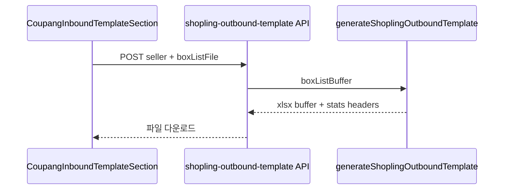

# 쿠팡 입고 섹션에 샵플링 출고 템플릿 생성 버튼

## 목표

[`CoupangInboundTemplateSection`](src/components/deliverables/coupang-inbound-template-section.tsx)에서 업로드한 **동일 엑셀(박스 리스트)** 로 아래 [`ShoplingOutboundTemplateSection`](src/components/deliverables/shopling-outbound-template-section.tsx)과 같이 샵플링 출고 템플릿을 생성·다운로드.

- API: 기존 [`POST /api/downloads/shopling-outbound-template`](src/app/api/downloads/shopling-outbound-template/route.ts) 재사용
- FormData: `seller`, `boxListFile` (샵플링 섹션과 동일)



## 구현

### 1. 클라이언트 다운로드 헬퍼 추출 (권장, 중복 제거)

신규 [`src/lib/deliverables/client/download-shopling-outbound-template.ts`](src/lib/deliverables/client/download-shopling-outbound-template.ts):

- `downloadShoplingOutboundTemplate(sellerId, boxListFile)` 함수
- [`shopling-outbound-template-section.tsx`](src/components/deliverables/shopling-outbound-template-section.tsx)의 `handleDownloadClick` 본문 이동:
  - `fetch("/api/downloads/shopling-outbound-template", { method: "POST", body: formData })`
  - blob 다운로드 + `X-Outbound-*` 헤더 파싱
  - 성공 시 stats 문자열 반환 (notice 표시용)
  - 실패 시 `Error` throw

[`shopling-outbound-template-section.tsx`](src/components/deliverables/shopling-outbound-template-section.tsx)는 이 헬퍼를 호출하도록 **리팩터** (동작 동일 유지).

### 2. [`coupang-inbound-template-section.tsx`](src/components/deliverables/coupang-inbound-template-section.tsx) 수정

| 항목 | 내용 |
|------|------|
| state | `isDownloadingShoplingOutbound` 추가 |
| handler | `handleShoplingOutboundClick` — 헬퍼 호출, `notice` 갱신 |
| 버튼 | 라벨 **「샵플링 출고 템플릿 생성」**, `variant="outline"` |
| 위치 | 기존 버튼 행 (`입고 기록하기`, `다운로드` 옆) |
| 활성 조건 | `hasSeller && excelFile && activeTab === "excel" && !isDownloading && !isRecording && !isDownloadingShoplingOutbound` |

**WING 템플릿(`hasStoredTemplate`) 불필요** — 샵플링 출고 API는 박스 리스트만 사용 ([`route.ts`](src/app/api/downloads/shopling-outbound-template/route.ts) 참고).

이미지 탭: 샵플링 섹션과 같이 엑셀 파일이 없으면 비활성 (OCR 미연동).

### 3. 변경하지 않는 것

- API Route / `generateShoplingOutboundTemplate` 서비스
- `DeliverablesPanel` 구조 (하단 `ShoplingOutboundTemplateSection` 유지)
- 쿠팡 입고 다운로드·입고 기록 로직

## 검증

1. `npm run build` 통과
2. `/downloads/coupang-growth-inbound?seller=...` 에서:
   - 박스 리스트 엑셀 업로드 후 **샵플링 출고 템플릿 생성** 클릭 → `shopling_gross_outbound_*.xlsx` 다운로드
   - 통계 notice (`출고 N건`, 패키지 분해 등) 표시
   - WING 템플릿 없어도 샵플링 출고 버튼은 동작 (엑셀만 있으면 됨)
   - 기존 **다운로드**(쿠팡 입고)·**입고 기록하기** 동작 유지
3. 하단 **샵플링 출고 템플릿 생성** 섹션도 리팩터 후 동일 동작

## 커밋 메시지 (참고)

```
feat: 쿠팡 입고 템플릿 섹션에 샵플링 출고 템플릿 생성 버튼 추가
```
