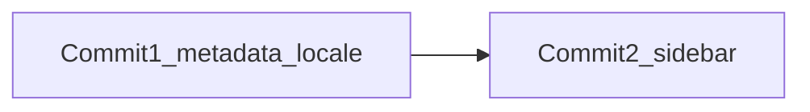

# Commit 1: Root layout 메타·locale 설정

## 범위

- 변경 파일: [src/app/layout.tsx](src/app/layout.tsx) **1개만**
- 커밋 메시지: `chore(layout): set app metadata and lang=ko`

## 현재 상태

```15:18:src/app/layout.tsx
export const metadata: Metadata = {
  title: "Create Next App",
  description: "Generated by create next app",
};
```

- `lang="en"` (create-next-app 기본값)
- 폰트·body 구조는 유지 (이번 커밋에서 변경 없음)

## 변경 내용

### 1. `metadata` 업데이트

```ts
export const metadata: Metadata = {
  title: {
    default: "미즈코스 - 쿠팡그로스 입고 자동화",
    template: "%s | 미즈코스 - 쿠팡그로스 입고 자동화",
  },
  description: "쿠팡그로스 입고 업무 자동화 관리 시스템",
};
```

- `default`: 루트/기본 탭 제목
- `template`: 하위 페이지에서 `title` 지정 시 `대시보드 | 미즈코스 - ...` 형태로 확장

### 2. `lang` 변경

```tsx
<html lang="ko" ...>
```

## 검증

- `npm run dev` 실행 중 `http://localhost:3000` 접속
- 브라우저 탭 제목: `미즈코스 - 쿠팡그로스 입고 자동화`
- 페이지 소스/`html` 태그: `lang="ko"`

## 다음 커밋 (이번 범위 밖)

- Commit 2: `npx shadcn add sidebar`


