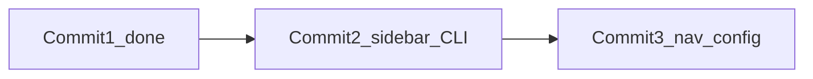

# Commit 2: shadcn sidebar 추가

## 전제

- Commit 1 완료: [src/app/layout.tsx](src/app/layout.tsx) 메타·`lang=ko` 적용됨
- [src/components/ui/sidebar.tsx](src/components/ui/sidebar.tsx) **없음** → 설치 필요
- **커밋 정책:** 작업만 수행. `git commit`은 사용자가 명시적으로 요청할 때만

## 작업 1: sidebar 설치

프로젝트 고정 버전에 맞춰 실행:

```bash
npx shadcn@4.11.0 add sidebar --yes
```

shadcn CLI가 의존 컴포넌트를 자동 추가할 수 있음 (예: `tooltip`, `collapsible`, `src/hooks/use-mobile.ts`). 이미 있는 컴포넌트는 건너뜀.

**예상 생성/변경 파일:**
- `src/components/ui/sidebar.tsx` (필수)
- `src/components/ui/tooltip.tsx` (없으면 추가)
- `src/hooks/use-mobile.ts` (없으면 추가)
- `package-lock.json` (의존성 변경 시)

**기존 파일은 수정하지 않음** — CLI가 생성하는 파일만.

## 작업 2: 스타터 스크립트 반영

[scripts/create-next-admin-starter.sh](scripts/create-next-admin-starter.sh) 84행 `shadcn add` 목록에 `sidebar` 추가:

```bash
# 변경 전
... breadcrumb avatar skeleton --yes

# 변경 후
... breadcrumb avatar skeleton sidebar --yes
```

이렇게 하면 새 프로젝트 생성 시 layout shell에 필요한 sidebar primitive가 처음부터 포함됨.

## 검증

```bash
npm run build
```

- `sidebar.tsx` import 오류 없음
- TypeScript / 빌드 통과

(선택) `npm run dev` 후 에러 없이 기동 확인

## 커밋 (사용자 요청 시에만)

```
chore(ui): add shadcn sidebar
```

포함 대상: CLI 생성 파일 + `scripts/create-next-admin-starter.sh` + `package-lock.json`(변경 시)

## 다음 단계 (이번 범위 밖)

- Commit 3: `src/config/navigation.ts`
- Commit 4~8: AppSidebar, AppHeader, dashboard layout 등


