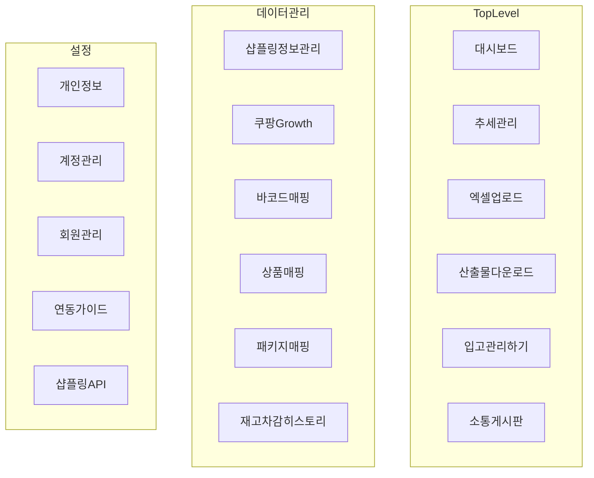

# Commit 3: navigation config 추가

## 전제

- Commit 1~2 완료 (layout 메타, sidebar primitive)
- **커밋 정책:** 작업만 수행. `git commit`은 사용자 명시 요청 시에만
- **범위:** [src/config/navigation.ts](src/config/navigation.ts) **신규 1파일만**

## 이미지 기준 메뉴 구조



브랜드명 **미즈코스**는 사이드바 헤더용 상수로 분리 (`APP_NAME`). Commit 4 `AppSidebar`에서 사용.

## 파일 설계

[src/config/navigation.ts](src/config/navigation.ts):

```ts
import type { LucideIcon } from "lucide-react";
import {
  LayoutDashboard,
  TrendingUp,
  Upload,
  Download,
  MessageSquare,
  Database,
  Link2,
  Layers,
  History,
  User,
  Users,
  UserCog,
  Plug,
  Settings,
} from "lucide-react";

export const APP_NAME = "미즈코스";

export type NavItem = {
  title: string;
  href: string;
  icon: LucideIcon;
};

export type NavGroup = {
  title: string;
  items: NavItem[];
};

export const mainNavItems: NavItem[] = [
  { title: "대시보드", href: "/", icon: LayoutDashboard },
  { title: "추세 관리", href: "/trends", icon: TrendingUp },
  { title: "엑셀 업로드", href: "/excel-upload", icon: Upload },
  { title: "산출물 다운로드", href: "/downloads", icon: Download },
  { title: "입고 관리하기", href: "/inbound", icon: Download },
  { title: "소통 게시판", href: "/board", icon: MessageSquare },
];

export const dataNavGroup: NavGroup = {
  title: "데이터 관리",
  items: [
    { title: "샵플링 정보 관리", href: "/data/shopling", icon: Database },
    { title: "쿠팡 Growth", href: "/data/coupang-growth", icon: TrendingUp },
    { title: "바코드 매핑", href: "/data/barcode-mapping", icon: Link2 },
    { title: "상품 매핑", href: "/data/product-mapping", icon: Layers },
    { title: "패키지 매핑", href: "/data/package-mapping", icon: Layers },
    { title: "재고 차감 히스토리", href: "/data/inventory-history", icon: History },
  ],
};

export const settingsNavGroup: NavGroup = {
  title: "설정",
  items: [
    { title: "개인정보", href: "/settings/profile", icon: User },
    { title: "계정 관리", href: "/settings/accounts", icon: Users },
    { title: "회원관리", href: "/settings/members", icon: UserCog },
    { title: "연동 가이드", href: "/settings/integration-guide", icon: Plug },
    { title: "샵플링 API", href: "/settings/shopling-api", icon: Settings },
  ],
};
```

- `href`는 아직 페이지 없어도 됨 — Commit 6~7에서 route group과 맞춤
- 아이콘은 lucide-react (프로젝트 기존 의존성)
- `입고 관리하기`도 이미지와 동일하게 `Download` 아이콘 사용

## 검증

```bash
npm run build
```

- TypeScript 오류 없음 (navigation.ts만 추가해도 import하는 곳 없으면 빌드 통과)

## 커밋 (사용자 요청 시에만)

```
feat(layout): add navigation config
```

## 다음 커밋 (범위 밖)

- Commit 4: `AppSidebar` — `mainNavItems`, `dataNavGroup`, `settingsNavGroup` 소비
- Commit 7: `(dashboard)` route group 생성 시 `href`와 경로 정렬

## URL 참고 (나중에 맞출 때)

| 메뉴 | href |
|------|------|
| 대시보드 | `/` |
| 추세 관리 | `/trends` |
| 엑셀 업로드 | `/excel-upload` |
| 산출물 다운로드 | `/downloads` |
| 입고 관리하기 | `/inbound` |
| 소통 게시판 | `/board` |
| 데이터 관리 하위 | `/data/*` |
| 설정 하위 | `/settings/*` |
