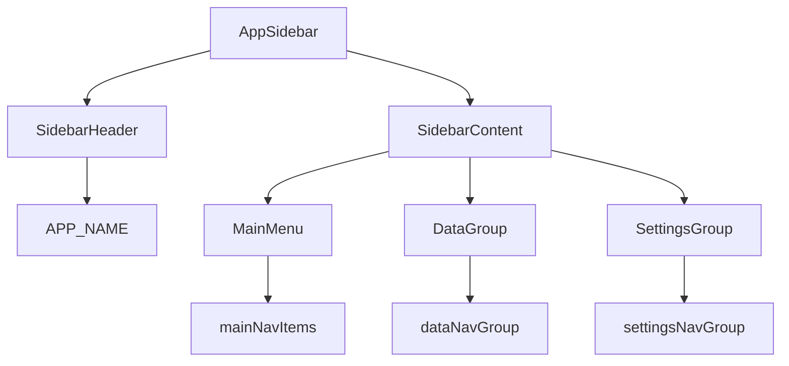

# Commit 4: AppSidebar 컴포넌트

## 전제

- Commit 1~3 완료 (layout 메타, sidebar primitive, navigation config)
- [src/config/navigation.ts](src/config/navigation.ts) 완료
- [src/components/ui/sidebar.tsx](src/components/ui/sidebar.tsx) 설치됨
- **커밋 정책:** 작업만 수행. `git commit`은 사용자 명시 요청 시에만
- **이번 커밋만으로 화면에 안 보임** — `SidebarProvider` + `(dashboard)/layout.tsx`는 Commit 6

## 스타터 스크립트 동기화 규칙 (필수)

`npx shadcn add ...` 로 **새 primitive를 설치할 때마다** 같은 작업에서 [scripts/create-next-admin-starter.sh](scripts/create-next-admin-starter.sh) 84행 `shadcn add` 목록도 함께 업데이트한다.

체크리스트:

1. `npx shadcn@4.11.0 add <component> --yes` 실행
2. 생성된 `src/components/ui/*` 확인
3. 스크립트 84행 목록 끝에 `<component>` 추가
4. `npm run build` 검증

## 작업 0 (선행): collapsible 추가

이미지의 **데이터 관리 / 설정** 접이식 그룹(chevron) 구현에 필요.

```bash
npx shadcn@4.11.0 add collapsible --yes
```

**생성 파일:**

- `src/components/ui/collapsible.tsx`

**스타터 스크립트 변경 (84행):**

```bash
# 변경 후
... skeleton sidebar collapsible --yes
```

## 작업 1: AppSidebar 생성

**신규 파일:** [src/components/layout/app-sidebar.tsx](src/components/layout/app-sidebar.tsx)

`"use client"` — `usePathname()`으로 active 메뉴 표시.

### 구조



### 사용 primitives / 모듈

- `Sidebar`, `SidebarHeader`, `SidebarContent`, `SidebarGroup`, `SidebarGroupContent`, `SidebarGroupLabel`, `SidebarMenu`, `SidebarMenuItem`, `SidebarMenuButton`
- 그룹 하위: `SidebarMenuSub`, `SidebarMenuSubItem`, `SidebarMenuSubButton`
- 접이식: `Collapsible`, `CollapsibleTrigger`, `CollapsibleContent`
- `next/link` + `usePathname` from `next/navigation`
- `ChevronDown` from `lucide-react`
- [src/config/navigation.ts](src/config/navigation.ts) — `APP_NAME`, `mainNavItems`, `dataNavGroup`, `settingsNavGroup`

### 내부 헬퍼 (같은 파일)

| 함수/컴포넌트 | 역할 |
|--------------|------|
| `isNavItemActive` | 현재 경로와 메뉴 href 매칭 (`/`는 exact match) |
| `NavMenuItem` | 상단 메뉴 6개 렌더 |
| `NavCollapsibleGroup` | 데이터 관리 / 설정 접이식 그룹 |
| `AppSidebar` | export — 사이드바 전체 조립 |

### 핵심 패턴

**상단 메뉴 (mainNavItems):**

```tsx
<SidebarMenuButton
  isActive={isNavItemActive(pathname, item.href)}
  render={<Link href={item.href} />}
>
  <item.icon />
  <span>{item.title}</span>
</SidebarMenuButton>
```

**접이식 그룹 (dataNavGroup, settingsNavGroup):**

- 하위 경로 활성 시 `isGroupActive` → `useEffect`로 그룹 자동 열림
- Trigger: 그룹 제목 + `ChevronDown` (열림 시 rotate)
- Content: `SidebarMenuSub` + sub items

**헤더:**

```tsx
<SidebarHeader className="border-b border-sidebar-border px-4 py-3">
  <span className="text-base font-semibold text-primary">{APP_NAME}</span>
</SidebarHeader>
```

## 범위 밖 (이번 커밋 X)

- `AppHeader` (Commit 5)
- `(dashboard)/layout.tsx` (Commit 6)
- `TooltipProvider` in root layout (Commit 6에서 shell 조립 시 추가)
- 실제 페이지 라우트

## 검증

```bash
npm run build
```

- `app-sidebar.tsx` TypeScript / import 오류 없음
- collapsible 설치 후 빌드 통과

(화면 확인은 Commit 6 이후 `npm run dev`로 sidebar 전체 조립 후)

## 커밋 (사용자 요청 시에만)

```
feat(layout): add AppSidebar component
```

포함 대상:

- `src/components/layout/app-sidebar.tsx`
- `src/components/ui/collapsible.tsx`
- `scripts/create-next-admin-starter.sh`

## 다음 커밋 (범위 밖)

- Commit 5: `AppHeader`
- Commit 6: `(dashboard)/layout.tsx` — `SidebarProvider` + `AppSidebar` + `TooltipProvider`
- Commit 7~8: dashboard home + root redirect


