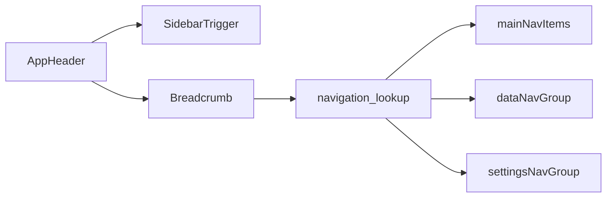

# Commit 5: AppHeader 컴포넌트

## 전제

- Commit 1~4 완료 (`AppSidebar`, `navigation.ts`)
- **커밋 정책:** 작업만 수행. `git commit`은 사용자 명시 요청 시에만
- **범위:** [src/components/layout/app-header.tsx](src/components/layout/app-header.tsx) **신규 1파일**
- **이번 커밋만으로 화면에 안 보임** — Commit 6 `(dashboard)/layout.tsx`에서 조립
- **shadcn 추가 설치 없음** — 기존 `breadcrumb`, `sidebar`, `separator` 사용

## AppHeader 역할



상단 바 구성:

| 영역 | 컴포넌트 | 설명 |
|------|----------|------|
| 왼쪽 | `SidebarTrigger` | 사이드바 토글 (모바일/접기) |
| 가운데 | `Breadcrumb` | 현재 페이지 경로 표시 |
| 오른쪽 | (이번엔 비움) | 사용자 메뉴는 인증 후 추가 |

## 파일 설계

[src/components/layout/app-header.tsx](src/components/layout/app-header.tsx) — `"use client"`

### 내부 헬퍼

| 함수 | 역할 |
|------|------|
| `isNavItemActive` | AppSidebar와 동일한 경로 매칭 |
| `getNavContext` | navigation.ts에서 groupTitle + pageTitle 조회 |
| `HeaderBreadcrumb` | breadcrumb UI 렌더 |

### Breadcrumb 예시

| pathname | breadcrumb |
|----------|------------|
| `/` | `대시보드` |
| `/trends` | `추세 관리` |
| `/data/shopling` | `데이터 관리` > `샵플링 정보 관리` |
| `/settings/profile` | `설정` > `개인정보` |
| 매칭 없음 | `대시보드` (fallback) |

### 레이아웃 마크업

```tsx
<header className="flex h-14 shrink-0 items-center gap-3 border-b border-border px-4">
  <SidebarTrigger />
  <Separator orientation="vertical" className="h-4" />
  <Breadcrumb>...</Breadcrumb>
</header>
```

## 주의사항

- `SidebarTrigger`는 `SidebarProvider` 안에서만 동작 → Commit 6에서 layout 조립 시 함께 연결
- `navigation.ts`는 수정하지 않음

## 검증

```bash
npm run build
```

## 커밋 (사용자 요청 시에만)

```
feat(layout): add AppHeader component
```

포함: `src/components/layout/app-header.tsx`

## 다음 커밋 (범위 밖)

- **Commit 6:** `(dashboard)/layout.tsx` — `SidebarProvider` + `TooltipProvider` + `AppSidebar` + `SidebarInset` + `AppHeader` + `{children}`
- Commit 7~8: dashboard home + root redirect


