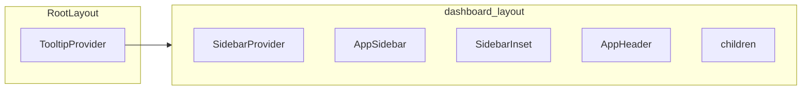
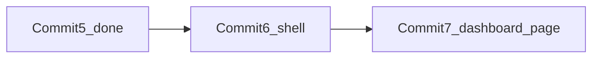

# Commit 6: dashboard route group shell

## 전제

- Commit 1~5 완료 (`AppSidebar`, `AppHeader`, `navigation.ts`)
- **커밋 정책:** 작업만 수행. `git commit`은 사용자 명시 요청 시에만
- **shadcn 추가 설치 없음**

## 변경 파일

| 파일 | 작업 |
|------|------|
| [src/app/(dashboard)/layout.tsx](src/app/(dashboard)/layout.tsx) | **신규** — admin shell 조립 |
| [src/app/layout.tsx](src/app/layout.tsx) | `TooltipProvider`로 `body` children 감싸기 |

## Shell 구조



## 작업 1: root layout — TooltipProvider

`TooltipProvider`로 `body` children 감싸기 (sidebar collapsed 툴팁)

## 작업 2: dashboard layout

`SidebarProvider` + `AppSidebar` + `SidebarInset` + `AppHeader` + content area

## 화면 확인 참고

`src/app/page.tsx`는 `(dashboard)` 밖에 있어 Commit 6만으로 `/`에서 shell 미적용. Commit 7 이후 확인.

## 검증

```bash
npm run build
```

## 커밋 (사용자 요청 시에만)

```
feat(layout): add dashboard route group shell
```

## 다음 커밋

- Commit 7: `(dashboard)/page.tsx` + `app/page.tsx` 정리
- Commit 8: (필요 시) root redirect


