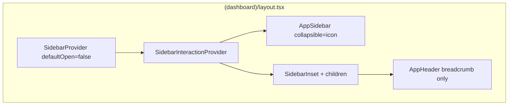
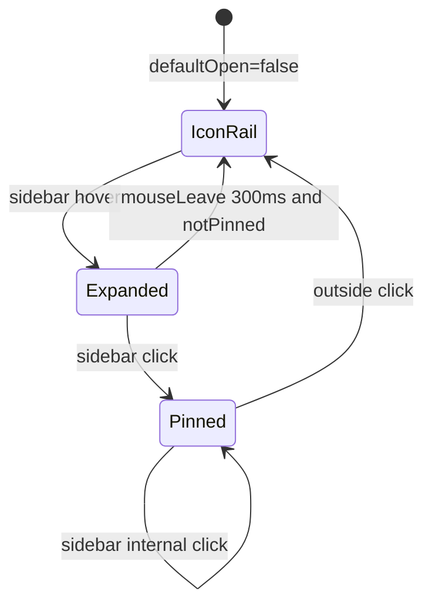

# 공통 레이아웃 사이드바·헤더 UX 완성

## 작업 범위 (변경 파일)

| 파일 | 상태 | 역할 |
|------|------|------|
| [`src/hooks/use-sidebar-hover.ts`](src/hooks/use-sidebar-hover.ts) | 신규 | 사이드바 hover·pin 상호작용 Context |
| [`src/app/(dashboard)/layout.tsx`](src/app/(dashboard)/layout.tsx) | 수정 | Shell 조립·CSS 변수 |
| [`src/components/layout/app-sidebar.tsx`](src/components/layout/app-sidebar.tsx) | 수정 | 사이드바 UI·네비게이션 렌더 |
| [`src/components/layout/app-header.tsx`](src/components/layout/app-header.tsx) | 수정 | 페이지 제목 breadcrumb |
| [`src/config/navigation.ts`](src/config/navigation.ts) | 수정 | NavGroup에 icon 필드 |

`sidebar.tsx` 등 shadcn 원본은 수정하지 않음.

---

## 아키텍처



### 사이드바 상태 머신



| 상태 | UI |
|------|-----|
| 기본 (collapsed) | icon 레일 — 아이콘만, 텍스트 없음 |
| hover | 전체 너비 확장 (20rem) |
| click (pinned) | 확장 유지, 마우스 이탈해도 닫히지 않음 |
| 바깥 클릭 | icon 레일로 복귀 |

---

## 파일별 상세

### 1. [`src/hooks/use-sidebar-hover.ts`](src/hooks/use-sidebar-hover.ts)

**`SidebarInteractionProvider`** + **`useSidebarInteraction()`**

- `openSidebar()` — 닫기 타이머 취소 후 `setOpen(true)`
- `scheduleClose()` — pinned가 아니면 300ms 후 `setOpen(false)`
- `pinSidebar()` — 사이드바 클릭 시 고정
- `unpinSidebar()` — 바깥 `pointerdown` 시 icon 레일 복귀
- `hoverHandlers` — 사이드바 패널·(이전) 헤더 트리거용
- `sidebarInteractionHandlers` — hover + `onClick: pinSidebar`

### 2. [`src/app/(dashboard)/layout.tsx`](src/app/(dashboard)/layout.tsx)

```tsx
<SidebarProvider
  defaultOpen={false}
  style={{
    "--sidebar-width": "20rem",
    "--sidebar-width-icon": "4.25rem",
  }}
>
  <SidebarInteractionProvider>
    <AppSidebar showSidebarTrigger />
    <SidebarInset>
      <AppHeader />
      {children}
    </SidebarInset>
  </SidebarInteractionProvider>
</SidebarProvider>
```

- 펼침 너비: **20rem**
- icon 레일: **4.25rem** (~68px)

### 3. [`src/components/layout/app-sidebar.tsx`](src/components/layout/app-sidebar.tsx)

#### 헤더 (`h-14`, AppHeader와 높이 통일)

| collapsed | expanded |
|-----------|----------|
| 파란 배지 **"미"** (`bg-primary`, `size-10`) | **"미즈코스"** (`text-lg font-semibold`) |

#### icon 레일 (collapsed)

- 메인 nav + **데이터 관리·설정 하위 메뉴 전체**를 개별 아이콘으로 flat 렌더
- 텍스트 `<span>`은 **렌더하지 않음** (글씨 조각 노출 방지)
- 아이콘: `1.35rem`, 버튼: `size-10` 정사각형, 가운데 정렬
- 활성: `bg-primary/12` + 파란 아이콘
- tooltip: `SidebarMenuButton`의 `tooltip` prop

#### 펼침 (expanded)

- 메인 버튼: `h-11`, `text-[0.95rem]`, 아이콘 `1.35rem`, `gap-1.5`
- 그룹 헤더: `py-2.5`, 그룹 아이콘 + chevron
- 서브 메뉴: `h-10`, `text-[0.9rem]`, 아이콘 `size-5`

#### 상호작용

- `<Sidebar collapsible="icon" {...sidebarInteractionHandlers}>`

### 4. [`src/components/layout/app-header.tsx`](src/components/layout/app-header.tsx)

- **SidebarTrigger·PanelLeftIcon·Separator 제거** — breadcrumb만 표시
- breadcrumb: `text-lg font-semibold`
- pathname 기반 페이지 제목 (메인 / 데이터·설정 그룹 2단계)

### 5. [`src/config/navigation.ts`](src/config/navigation.ts)

```ts
export type NavGroup = {
  title: string;
  icon: LucideIcon;  // 추가
  items: NavItem[];
};

dataNavGroup.icon = Database
settingsNavGroup.icon = Settings
```

---

## 검증 체크리스트

```bash
npm run dev
```

- [ ] 초기: 좌측 icon 레일 — "미" 배지 + 전체 메뉴 아이콘 (텍스트 없음)
- [ ] icon hover → tooltip, 사이드바 hover → 전체 확장
- [ ] 확장 중 아이콘·글씨 크기·간격 넉넉함
- [ ] 사이드바 클릭 → pinned 유지
- [ ] 메인 영역 클릭 → icon 레일 복귀
- [ ] 헤더: 패널 아이콘 없음, "대시보드" 등 `text-lg`
- [ ] 사이드바·헤더 상단 `border-b` 높이 `h-14` 정렬

---

## 권장 커밋 (요청 시)

단일 커밋:

```
feat(layout): 사이드바 icon 레일·호버 고정 및 헤더 UX 개선
```

분리 커밋 예시:

1. `feat(layout): SidebarInteractionProvider 및 icon 레일 사이드바`
2. `fix(layout): icon 모드 텍스트 조각 제거 및 타이포·간격 조정`
3. `fix(layout): 헤더 트리거 제거 및 breadcrumb 크기 확대`

---

## 미해결 / 후속

- **모바일**: 헤더 트리거 제거로 Sheet 오픈 경로 없음 → 모바일 전용 트리거 또는 하단 nav 필요 시 별도 작업
- **Cmd+B** 단축키: shadcn 기본 유지 (hover-only 정책과 충돌 가능)
