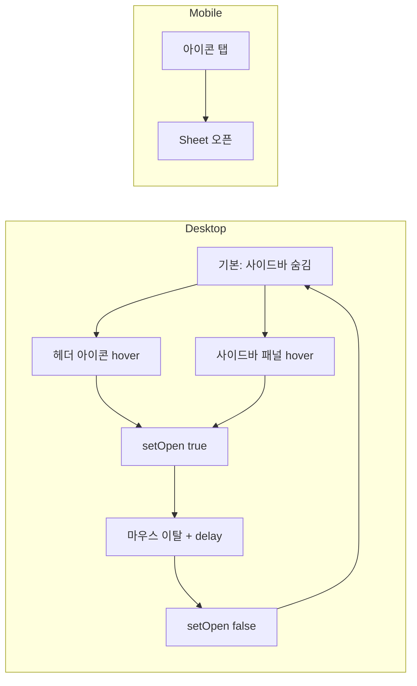

# 사이드바 호버 표시 (기본 숨김)

## 현재 상태

- [`(dashboard)/layout.tsx`](src/app/(dashboard)/layout.tsx): `SidebarProvider` 기본값 `defaultOpen=true` → 사이드바 항상 표시
- [`app-header.tsx`](src/components/layout/app-header.tsx): `SidebarTrigger` — **클릭** 시 `toggleSidebar()`
- [`sidebar.tsx`](src/components/ui/sidebar.tsx): `collapsible="offcanvas"` — `open=false`이면 패널이 화면 밖으로 숨겨짐 (gap `w-0`)

shadcn `sidebar.tsx`는 건드리지 않고, **앱 레이아웃 컴포넌트만** 수정합니다.

## 목표 동작



| 조건 | 동작 |
|------|------|
| 초기 로드 | 사이드바 숨김 (`defaultOpen={false}`) |
| 데스크톱 + 트리거 hover | 사이드바 슬라이드 인 |
| 데스크톱 + 사이드바 패널 hover | 열린 상태 유지 (트리거→패널 이동 가능) |
| 데스크톱 + hover 이탈 | ~150ms 후 닫힘 |
| 모바일 | hover 불가 → 기존 `SidebarTrigger` 클릭으로 Sheet |
| `showSidebarTrigger={false}` | 아이콘·구분선 미렌더, 사이드바도 미렌더 |

## 수정 파일 (4개)

### 1. 신규 [`src/hooks/use-sidebar-hover.ts`](src/hooks/use-sidebar-hover.ts)

공유 호버 로직:

- `useSidebar()`의 `setOpen` 사용
- `onMouseEnter`: 닫기 타이머 취소 후 `setOpen(true)`
- `onMouseLeave`: `setTimeout(150ms)` 후 `setOpen(false)`
- `hoverHandlers` 객체 반환 (`onMouseEnter`, `onMouseLeave`)

트리거와 사이드바 패널 **양쪽**에 동일 핸들러를 붙여 마우스가 아이콘에서 패널로 이동해도 닫히지 않게 합니다.

### 2. [`src/app/(dashboard)/layout.tsx`](src/app/(dashboard)/layout.tsx)

```tsx
<SidebarProvider defaultOpen={false}>
  <AppSidebar />
  <SidebarInset>
    <AppHeader showSidebarTrigger />
    ...
  </SidebarInset>
</SidebarProvider>
```

- `defaultOpen={false}` — 기본 숨김
- `showSidebarTrigger` prop으로 트리거·사이드바 연동 명시

### 3. [`src/components/layout/app-sidebar.tsx`](src/components/layout/app-sidebar.tsx)

- `showSidebarTrigger?: boolean` prop 추가 (기본 `true`, dashboard에서 전달)
- `showSidebarTrigger === false`이면 `return null`
- `useSidebarHover()`로 받은 `hoverHandlers`를 `<Sidebar {...hoverHandlers}>`에 전달  
  (`Sidebar`의 `sidebar-container` div에 `...props`가 전달되므로 동작함)

### 4. [`src/components/layout/app-header.tsx`](src/components/layout/app-header.tsx)

- `AppHeader({ showSidebarTrigger = false })` prop 추가
- `showSidebarTrigger`가 `true`일 때만 아이콘 + `Separator` 렌더
- 데스크톱: `useSidebarHover()` + `Button`(ghost, icon-sm, `PanelLeftIcon`) — **클릭 토글 없음**
- 모바일: 기존 `SidebarTrigger` 유지 (Sheet 탭 오픈)
- `useIsMobile()`로 분기

레이아웃에서 `showSidebarTrigger`를 sidebar/header 양쪽에 동일하게 넘겨 **아이콘 없으면 사이드바도 DOM에 없음** 조건 충족.

## 변경하지 않는 것

- [`sidebar.tsx`](src/components/ui/sidebar.tsx) — shadcn 원본 유지
- 쿠키(`sidebar_state`) — 초기 마운트 시 읽지 않으므로 `defaultOpen={false}`면 새로고침 시에도 숨김 유지
- `Cmd+B` 단축키 — 기존 동작 유지 (필요 시 후속으로 비활성화 가능)

## 검증

```bash
npm run dev
```

- [ ] `/` 로드 시 사이드바 안 보임, 메인 콘텐츠 전체 너비
- [ ] 헤더 패널 아이콘 hover → 사이드바 나타남
- [ ] 아이콘에서 사이드바로 마우스 이동 → 열린 상태 유지
- [ ] 사이드바·아이콘 모두에서 마우스 이탈 → 닫힘
- [ ] 모바일 뷰포트: 아이콘 탭 → Sheet 오픈

커밋은 사용자 요청 시:

```
feat(layout): 사이드바 기본 숨김 및 헤더 호버 시 표시
```
