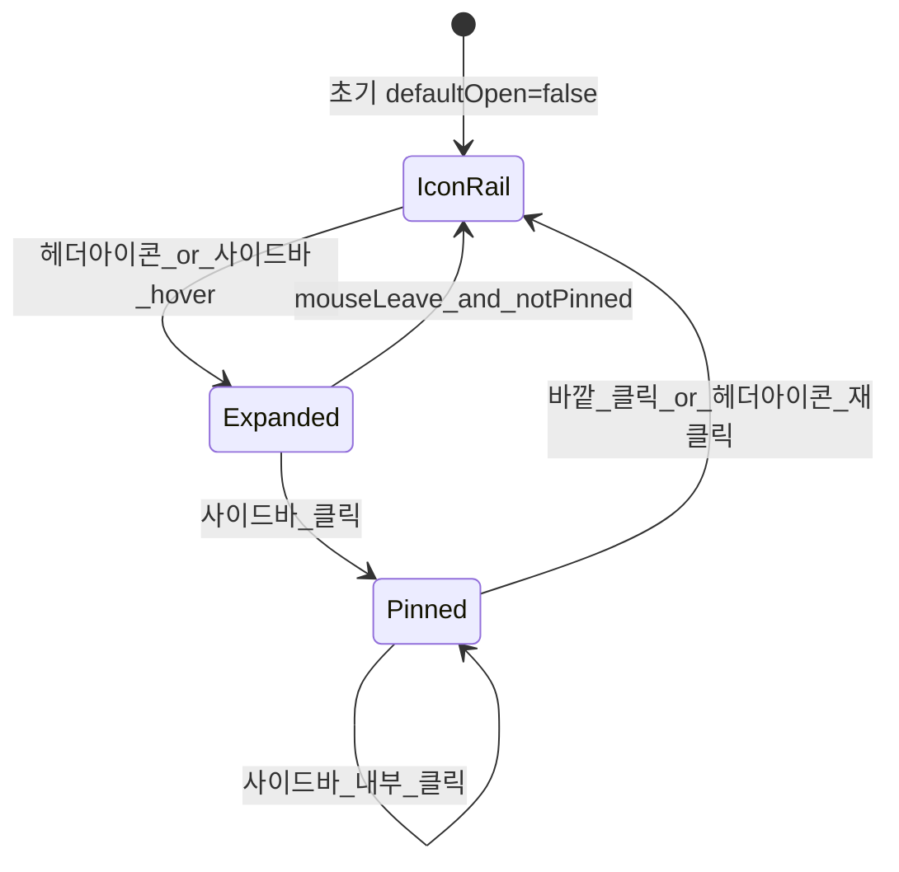

# 사이드바 icon 기본 + 클릭 고정

## 문제 원인

1. **완전 숨김 (`collapsible="offcanvas"` + `defaultOpen={false}`)**  
   사이드바가 화면 밖에 있어 헤더 아이콘 → 패널 이동 시 hover 영역이 끊김 → 150ms 후 닫힘 → 깜빡임

2. **호버 상태 미공유**  
   [`use-sidebar-hover.ts`](src/hooks/use-sidebar-hover.ts)가 [`app-header.tsx`](src/components/layout/app-header.tsx)와 [`app-sidebar.tsx`](src/components/layout/app-sidebar.tsx)에서 **각각 독립 호출** → 타이머·pinned 상태가 분리됨

3. **클릭 고정 없음**  
   사이드바 내부 클릭해도 `onMouseLeave`만으로 닫힘

## 목표 동작



| 상태 | UI |
|------|-----|
| 기본 | 좌측 **icon 레일**만 표시 (`collapsible="icon"`, `open=false`) |
| hover (헤더 아이콘 또는 사이드바) | 전체 너비로 확장 |
| 사이드바 아무 곳 클릭 | **pinned** — 마우스 이탈해도 유지 |
| pinned + 바깥 클릭 | icon 레일로 복귀 |

## 수정 (4파일, `sidebar.tsx` 미수정)

### 1. [`src/hooks/use-sidebar-hover.ts`](src/hooks/use-sidebar-hover.ts) → Context 기반으로 확장

`SidebarInteractionProvider` + `useSidebarInteraction()` 추가:

- **공유 상태**: `isPinned` (useRef 또는 useState)
- `openSidebar()` — 타이머 취소, `setOpen(true)`
- `scheduleClose()` — `isPinned`이면 무시, 아니면 300ms 후 `setOpen(false)` (delay 소폭 증가)
- `pinSidebar()` — `isPinned = true`, `setOpen(true)`, 타이머 취소
- `unpinSidebar()` — `isPinned = false`, `setOpen(false)` → icon 레일
- `hoverHandlers` — `{ onMouseEnter: openSidebar, onMouseLeave: scheduleClose }`
- `sidebarInteractionHandlers` — hover + `onClick: pinSidebar` (사이드바 패널용)
- **document `pointerdown` 리스너** (pinned일 때만): 사이드바·헤더 트리거 밖 클릭 시 `unpinSidebar()`

기존 `useSidebarHover()`는 `useSidebarInteraction()` alias로 유지하거나 호출부 일괄 교체.

### 2. [`src/app/(dashboard)/layout.tsx`](src/app/(dashboard)/layout.tsx)

```tsx
<SidebarProvider defaultOpen={false}>
  <SidebarInteractionProvider>
    <AppSidebar showSidebarTrigger />
    <SidebarInset>
      <AppHeader showSidebarTrigger />
      ...
    </SidebarInset>
  </SidebarInteractionProvider>
</SidebarProvider>
```

Provider가 header·sidebar **형제 컴포넌트를 감싸** 상태를 공유.

### 3. [`src/components/layout/app-sidebar.tsx`](src/components/layout/app-sidebar.tsx)

```tsx
<Sidebar
  collapsible="icon"
  {...sidebarInteractionHandlers}
>
```

- `collapsible="icon"` — 기본 icon 레일 유지 (offcanvas 제거)
- hover + click 핸들러를 `sidebar-container`에 전달 (기존과 동일 props 경로)
- icon 모드에서 [`SidebarMenuButton`](src/components/ui/sidebar.tsx)이 라벨 숨기고 아이콘만 표시 (shadcn 기본 동작)

### 4. [`src/components/layout/app-header.tsx`](src/components/layout/app-header.tsx)

- `useSidebarInteraction()`의 `hoverHandlers` 사용 (공유 Context)
- 데스크톱 트리거: hover만 (기존 유지)
- 선택: pinned 상태에서 트리거 클릭 시 `unpinSidebar()` 토글 (바깥 클릭과 동일 효과) — 구현 시 트리거에 `data-sidebar-trigger` ref로 outside-click 예외 처리

## 깜빡임 해소 포인트

- icon 레일이 **항상 화면에 있음** → 헤더 아이콘에서 좌측으로 이동 시 연속 hover 영역
- 타이머·pinned가 **단일 Context**에서 관리
- 사이드바 클릭 시 pinned → 이동·호버 이탈과 무관하게 유지

## 검증

```bash
npm run dev
```

- [ ] 초기: 좌측 icon 레일만 보임 (메뉴 텍스트 없음)
- [ ] 헤더 아이콘 hover → 전체 사이드바 확장, 이동 중 깜빡임 없음
- [ ] icon 레일 hover → 확장
- [ ] 확장 후 사이드바 아무 곳 클릭 → pinned 유지
- [ ] pinned 상태에서 메인 영역 클릭 → icon 레일로 복귀
- [ ] 모바일: Sheet 탭 동작 유지

커밋 (요청 시):

```
fix(layout): 사이드바 icon 기본 표시 및 클릭 고정
```
