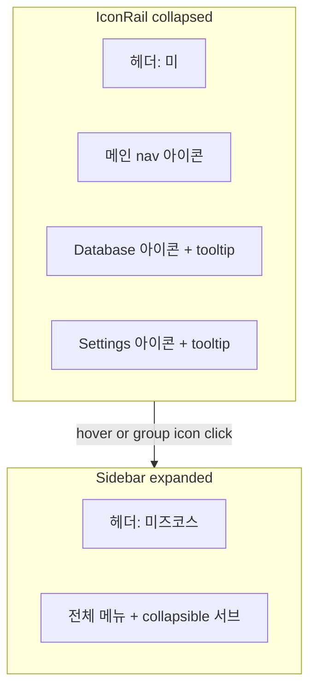

# 사이드바 icon 모드 UX 개선

## 현재 문제

| 항목 | 원인 |
|------|------|
| "미즈코스" 깨짐 | [`app-sidebar.tsx`](src/components/layout/app-sidebar.tsx) 헤더가 항상 전체 텍스트 렌더, icon 레일 너비 `3rem` |
| 데이터 관리·설정 안 보임 | [`NavCollapsibleGroup`](src/components/layout/app-sidebar.tsx)이 텍스트 `CollapsibleTrigger`만 사용; shadcn이 icon 모드에서 `SidebarGroupLabel` 숨김 + `SidebarMenuSub` `hidden` |
| 너무 좁음 | [`sidebar.tsx`](src/components/ui/sidebar.tsx) 기본값: 펼침 `16rem`, icon `3rem`, 메뉴 버튼 icon 모드 `size-8` (32px) |

## 목표

- **접힘(icon)**: 헤더 → **"미"** 배지, 메인 메뉴 아이콘 유지, **데이터 관리·설정 그룹 아이콘** 표시 (tooltip)
- **펼침**: 기존처럼 "미즈코스" + 전체 라벨·서브메뉴
- **너비**: icon 레일·펼침 너비·아이콘 크기 소폭 증가

## 수정 (3파일, `sidebar.tsx` 미수정)

### 1. [`src/config/navigation.ts`](src/config/navigation.ts)

`NavGroup`에 `icon` 필드 추가:

```ts
export type NavGroup = {
  title: string;
  icon: LucideIcon;
  items: NavItem[];
};

export const dataNavGroup = { title: "데이터 관리", icon: Database, items: [...] };
export const settingsNavGroup = { title: "설정", icon: Settings, items: [...] };
```

### 2. [`src/app/(dashboard)/layout.tsx`](src/app/(dashboard)/layout.tsx)

`SidebarProvider`에 CSS 변수 오버라이드 (shadcn 원본 상수 대체):

```tsx
<SidebarProvider
  defaultOpen={false}
  style={
    {
      "--sidebar-width": "18rem",
      "--sidebar-width-icon": "4.5rem",
    } as React.CSSProperties
  }
>
```

- 펼침: `16rem` → **`18rem`**
- icon 레일: `3rem` → **`4.5rem`** (헤더 "미"·아이콘 여유)

### 3. [`src/components/layout/app-sidebar.tsx`](src/components/layout/app-sidebar.tsx)

#### 3a. 헤더 — `useSidebar().state` 분기

```tsx
const { state } = useSidebar();

<SidebarHeader className="... group-data-[collapsible=icon]:justify-center">
  {state === "collapsed" ? (
    <span className="flex size-9 items-center justify-center rounded-lg bg-primary/10 text-sm font-bold text-primary">
      미
    </span>
  ) : (
    <span className="text-base font-semibold text-primary">{APP_NAME}</span>
  )}
</SidebarHeader>
```

icon 모드 헤더 패딩: `px-4` → `state === "collapsed" ? "px-2 justify-center" : "px-4"`

#### 3b. `NavCollapsibleGroup` — collapsed / expanded 이중 렌더

`useSidebar().state === "collapsed"` 일 때:

```tsx
<SidebarMenu>
  <SidebarMenuItem>
    <SidebarMenuButton
      tooltip={group.title}
      isActive={isGroupActive}
      onClick={() => {
        setOpen(true);           // sidebar 펼침
        setCollapsibleOpen(true); // 그룹 열기
      }}
    >
      <group.icon />
      <span>{group.title}</span>
    </SidebarMenuButton>
  </SidebarMenuItem>
</SidebarMenu>
```

- shadcn `SidebarMenuButton`의 `tooltip` prop → icon 모드에서 우측 툴팁 (기존 메인 메뉴와 동일)
- `state === "expanded"` → 기존 `Collapsible` + 서브메뉴 UI 유지

#### 3c. 메뉴 아이콘 크기 (선택, app 레벨만)

`NavMenuItem` / collapsed group 버튼에 `className="[&_svg]:size-5"` 추가해 icon 레일에서 아이콘을 약간 키움 (버튼은 shadcn `size-8` 유지, 4.5rem 레일에 맞음).

## 동작 요약



## 검증

```bash
npm run dev
```

- [ ] 기본 icon 레일: "미" 배지, 메인·데이터·설정 아이콘 모두 보임 (텍스트 없음)
- [ ] 데이터/설정 아이콘 hover → tooltip 표시
- [ ] 펼침 시 "미즈코스" + 기존 collapsible 서브메뉴
- [ ] icon 레일·펼침 너비가 이전보다 넓음

커밋 (요청 시):

```
fix(layout): icon 사이드바 헤더·그룹 아이콘 및 너비 개선
```
