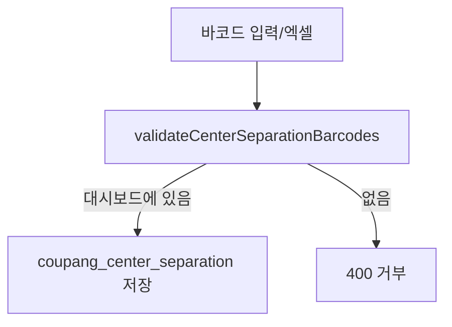
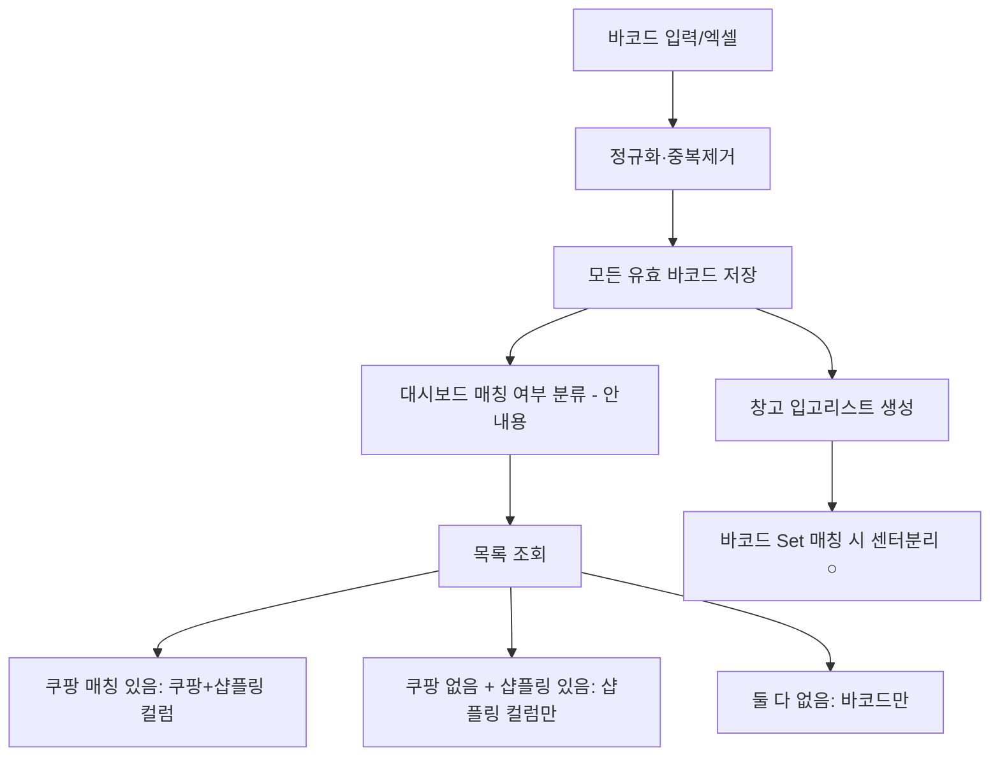

# 센터분리 바코드 선등록 및 단계별 상품정보 표시

## 현재 동작과 문제

등록 흐름이 **쿠팡 Growth 대시보드(`inbound_trends_row_v`)에 있는 바코드만** 허용합니다.

핵심 차단 지점:

- [`src/services/center-separation/validate-center-separation-barcodes.ts`](src/services/center-separation/validate-center-separation-barcodes.ts) — `inbound_trends_row_v` 조회
- [`src/services/center-separation/create-center-separation-barcode.ts`](src/services/center-separation/create-center-separation-barcode.ts) L26-31 — 단건 등록 거부
- [`src/services/center-separation/upsert-center-separation-barcodes.ts`](src/services/center-separation/upsert-center-separation-barcodes.ts) L46-51 — 전량 미매칭 시 거부, L57-65 — `knownBarcodes`만 저장

반면 **저장·표시·산출물 인프라는 이미 바코드 중심**입니다.

| 구간 | 현재 상태 |
|------|-----------|
| DB | [`CoupangCenterSeparation`](prisma/schema.prisma) — `barcode`만 저장 (마이그레이션 `center_separation_barcode_only` 완료) |
| 목록 | [`list-center-separation.ts`](src/services/center-separation/list-center-separation.ts) — `LEFT JOIN inbound_trends_row_v` (미매칭 시 `-` 표시) |
| 창고 입고리스트 | [`warehouse-inbound-list.ts`](src/lib/excel/generators/warehouse-inbound-list.ts) — `loadCenterSeparationBarcodeSet()` Set에 있으면 `○` 표시 |

**요청하신 “매칭되면 센터분리 넣기”는 산출물 쪽에서 이미 구현됨.** 등록만 막혀 있어 선등록 바코드가 DB에 안 들어가는 것이 핵심 문제입니다.

## 목표 동작

## 구현 계획

### 1. 등록 로직 — 검증을 “차단”에서 “분류”로 전환

**[`upsert-center-separation-barcodes.ts`](src/services/center-separation/upsert-center-separation-barcodes.ts)**

- `dedupedBarcodes` 전체를 `partitionKnownBarcodesByExisting` 대상으로 변경 (현재는 `knownBarcodes`만)
- `knownBarcodes.length === 0` 조기 실패 제거
- `validateCenterSeparationBarcodes` 결과의 `missingBarcodes`는 **저장 후 안내용**으로만 반환 (필드명 유지, 의미만 “대시보드 미연동”으로 변경)
- 성공 조건: 신규 생성 1건 이상 **또는** 기존 등록 건 존재 (전부 중복이어도 ok)

**[`create-center-separation-barcode.ts`](src/services/center-separation/create-center-separation-barcode.ts)**

- 대시보드 미매칭 시 `CENTER_SEPARATION_MISSING_BARCODE_ERROR` 반환 제거
- 중복·빈 바코드 검증만 유지 후 `upsertCenterSeparationBarcodes` 호출

**[`validate-center-separation-barcodes.ts`](src/services/center-separation/validate-center-separation-barcodes.ts)**

- 쿼리 로직 유지, 함수 주석/이름 의도만 “등록 허용 여부” → “대시보드 연동 여부 분류”로 정리
- (선택) 파일명은 변경하지 않고 호출부 의미만 수정 — diff 최소화

**[`types.ts`](src/services/center-separation/types.ts)**

- `CENTER_SEPARATION_MISSING_BARCODE_ERROR` / `CENTER_SEPARATION_ALL_MISSING_ERROR` 문구를 차단용이 아닌 안내용으로 수정하거나, UI 전용 상수로 분리
- `CENTER_SEPARATION_ALL_MISSING_ERROR`는 upsert에서 더 이상 사용하지 않음

### 2. 목록 조회 — 샵플링 최신 스냅샷 fallback (사용자 확인 반영)

**[`list-center-separation.ts`](src/services/center-separation/list-center-separation.ts)** SQL 보강:

- 기존 `dashboard_lookup` (`inbound_trends_row_v`) 유지
- 추가 `shopling_lookup` CTE:
  - `shopling_inventory`의 `MAX(snapshot_date)` 기준 최신 행
  - `DISTINCT ON (TRIM(barcode))` 로 바코드당 1행
  - `ptn_goods_cd`, `option_value AS shopling_option_value` 선택
- SELECT 시:
  - `registered_product_name`, `option_name` → 대시보드만 (쿠팡 없으면 null → UI `-`)
  - `ptn_goods_cd` → `COALESCE(dashboard.ptn_goods_cd, shopling.ptn_goods_cd)`
  - `shopling_option_value` → `COALESCE(dashboard.shopling_option_value, shopling.shopling_option_value)`
- `buildSearchCondition`에도 샵플링 fallback 경로 추가 (쿠팡 없는 바코드도 자사상품코드·샵플링 옵션으로 검색 가능)

### 3. UI 문구·다이얼로그 조정

**[`center-separation-add-section.tsx`](src/components/center-separation/center-separation-add-section.tsx)**

- 카드 설명: “대시보드에 있는 상품만” 문구 제거 → “바코드만 먼저 등록 가능, 상품정보는 연동 시 자동 표시”
- 단건 추가: `singleMissingDialogOpen` 차단 다이얼로그 제거 → 성공 시 notice에 “상품정보 미연동 N건” 안내
- 엑셀 업로드: `!result.ok && missingBarcodes` 조기 return 제거 (전량 미연동이어도 저장 성공)
- 결과 다이얼로그 제목/설명: “등록되지 않았습니다” → “등록됐으나 상품정보가 아직 없습니다”
- `summarizeUpsert`: `대시보드 없음` → `상품정보 미연동`

**[`page.tsx`](src/app/(dashboard)/data/coupang-growth/center-separation/page.tsx)**

- 페이지 설명 1줄 동일하게 수정

### 4. 산출물(센터분리 마킹) — 변경 없음

[`generate-warehouse-inbound-list-context.ts`](src/services/deliverables/generate-warehouse-inbound-list-context.ts) + [`load-center-separation-barcode-set.ts`](src/services/deliverables/load-center-separation-barcode-set.ts)는 DB에 저장된 모든 바코드를 Set으로 읽어 [`resolveCenterSeparationMarker`](src/lib/excel/generators/warehouse-inbound-list.ts)에 전달합니다.

선등록 바코드가 나중에 입고리스트 행의 `productBarcode`와 일치하면 자동으로 `○`가 찍힙니다. **추가 코드 불필요.**

### 5. 테스트

| 파일 | 내용 |
|------|------|
| [`partition-center-separation-barcodes.test.ts`](src/services/center-separation/partition-center-separation-barcodes.test.ts) | 기존 유지 |
| `upsert-center-separation-barcodes.test.ts` (신규) | 전량 미연동 바코드도 create 대상인지, `missingBarcodes`가 안내용으로 반환되는지 |
| [`create-center-separation-barcode.test.ts`](src/services/center-separation/create-center-separation-barcode.test.ts) | 미연동 바코드도 ok 반환 (mock 또는 통합 수준) |
| `list-center-separation` SQL | shopling fallback COALESCE 동작 (가능하면 raw query 단위 테스트 또는 수동 검증) |

## 변경 파일 요약

| 우선순위 | 파일 | 변경 |
|----------|------|------|
| 핵심 | `upsert-center-separation-barcodes.ts` | 전체 바코드 저장, 차단 제거 |
| 핵심 | `create-center-separation-barcode.ts` | 대시보드 필수 검증 제거 |
| 핵심 | `list-center-separation.ts` | 샵플링 fallback JOIN |
| UI | `center-separation-add-section.tsx`, `page.tsx` | 문구·다이얼로그 |
| 보조 | `types.ts` | 상수 문구 정리 |
| 테스트 | upsert/create 테스트 | 신규·보강 |

**스키마/마이그레이션 변경 없음.**

## 검증 시나리오

1. 쿠팡·샵플링 모두 없는 바코드 단건 추가 → 목록에 바코드만 `-` 컬럼으로 표시
2. 샵플링만 있는 바코드 추가 → 자사상품코드·샵플링 옵션만 채워짐
3. 쿠팡 대시보드 있는 바코드 → 기존과 동일 전체 컬럼
4. 엑셀에 연동/미연동 혼합 → 전부 저장, 미연동 건수 안내 다이얼로그
5. 미연동 바코드를 먼저 등록 후 쿠팡/샵플링 동기화 → 목록 새로고침 시 컬럼 자동 채움
6. 등록 바코드가 입고리스트에 나타날 때 엑셀 `센터분리` 열에 `○` 표시
