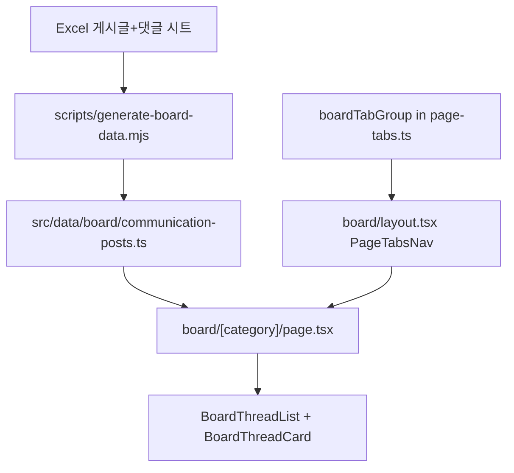

# 소통게시판 정적 데이터 + 카테고리 탭 UI

## 목표

[`소통게시판_의사소통기록_20260619 (2).xlsx`](c:/Users/midac/Desktop/소통게시판_의사소통기록_20260619%20(2).xlsx)의 **게시글·댓글** 시트를 기반으로, 사이드바 [`/board`](src/config/navigation.ts) 링크에 실제 페이지를 만듭니다.

- **상단 탭**: [`data/dashboard/layout.tsx`](src/app/(dashboard)/data/dashboard/layout.tsx)와 동일한 [`PageTabsNav`](src/components/layout/page-tabs-nav.tsx) 패턴
- **데이터**: DB/API 없이 **정적 하드코딩** (작성자명 그대로: 관리자, U2DIA 개발자, MIZCOS, 김주웅, AI 시스템, 시스템)
- **제외**: 첨부파일, 게시글ID/댓글ID/항목ID 등 사용자 비노출 필드
- **표시**: 게시글 → 댓글 **시간순 대화 흐름** (Excel `의사소통_통합` 시트의 `구분: 게시글|댓글` 순서와 동일)

## 데이터 규모 (확인됨)

| 카테고리 | 게시글 수 |
|---------|----------|
| 공지 | 18 (고정 10건 포함) |
| 요청사항 | 66 |
| 버그/오류 | 3 |
| 일반 | 6 |
| **합계** | **93** + **411** 댓글 (~312KB JSON) |

## 아키텍처



## 1. Excel → 정적 TS 변환 스크립트

**파일**: [`scripts/generate-board-data.mjs`](scripts/generate-board-data.mjs) (신규)

- 입력: CLI 인자로 Excel 경로 (기본값: 사용자 Desktop 파일 경로)
- `xlsx` 패키지 사용 (프로젝트에 이미 [`package-lock.json`](package-lock.json)에 존재)
- `게시글` 시트에서: 카테고리, 제목, 작성자, 작성일시, 내용, 고정(Y/N)
- `댓글` 시트에서: 게시글번호로 그룹 → 댓글순번/작성일시 순 정렬
- **출력**: [`src/data/board/communication-posts.ts`](src/data/board/communication-posts.ts)

**데이터 타입** (내부 번호/ID 없음):

```ts
export type BoardCategory = "공지" | "버그/오류" | "요청사항" | "일반";

export type BoardMessage = {
  kind: "post" | "comment";
  author: string;
  createdAt: string; // "2026-03-25 10:35"
  content: string;
};

export type BoardThread = {
  category: BoardCategory;
  title: string;
  pinned: boolean;
  messages: BoardMessage[]; // [0]=게시글, 이후=댓글 시간순
};

export const boardThreads: BoardThread[];
```

- `messages[0]`은 항상 게시글 본문, 이후 항목은 댓글
- 첨부파일·담당자·칸반티켓 등은 생성 단계에서 drop

## 2. 상단 탭 설정

**파일**: [`src/config/page-tabs.ts`](src/config/page-tabs.ts)

`boardTabGroup` 추가 후 `pageTabGroups` 배열에 등록:

| 탭 | href |
|----|------|
| 전체 | `/board/all` |
| 공지 | `/board/notice` |
| 버그/오류 | `/board/bug` |
| 요청사항 | `/board/request` |
| 일반 | `/board/general` |

slug ↔ 카테고리 매핑은 [`src/data/board/categories.ts`](src/data/board/categories.ts)에 상수로 정의.

## 3. 라우트

| 파일 | 역할 |
|------|------|
| [`src/app/(dashboard)/board/layout.tsx`](src/app/(dashboard)/board/layout.tsx) | `PageTabsNav` + children |
| [`src/app/(dashboard)/board/page.tsx`](src/app/(dashboard)/board/page.tsx) | `/board/all`로 redirect (downloads/dashboard 패턴) |
| [`src/app/(dashboard)/board/[category]/page.tsx`](src/app/(dashboard)/board/[category]/page.tsx) | slug 검증 후 스레드 목록 렌더 |

- `requireProfile()` 호출 (다른 dashboard 페이지와 동일)
- invalid slug → `notFound()`

## 4. UI 컴포넌트

**디렉터리**: [`src/components/board/`](src/components/board/)

### `board-thread-list.tsx`
- `categorySlug`로 `boardThreads` 필터 (`all`이면 전체)
- 정렬: **고정 게시글 우선** → 게시글 작성일시 **최신순**
- 스레드 수 표시 (예: "총 66건")

### `board-thread-card.tsx`
- 헤더: 제목, 카테고리 Badge, 고정 Pin 아이콘(고정=Y), 첫 메시지 작성일시
- 본문: `messages`를 순회하며 타임라인 렌더
  - **게시글**: 제목 아래 본문 블록 (작성자 + 일시 + 내용)
  - **댓글**: 들여쓰기/좌측 border로 구분, 작성자 + 일시 + 내용
- 긴 본문: `whitespace-pre-wrap` (Excel의 `━━━` 구분선 유지)
- 작성자별 아바타 이니셜/색상: 6명 하드코딩 맵 (예: 관리자=primary, MIZCOS=green 등)

### `board-empty-state.tsx`
- 해당 카테고리 게시글 0건일 때 (현재는 없지만 방어용)

**스타일**: 기존 [`Card`](src/components/ui/card.tsx), [`Badge`](src/components/ui/badge.tsx) 재사용 — 새 디자인 시스템 도입 없음.

## 5. 헤더 breadcrumb (선택적 보완)

[`src/components/layout/app-header.tsx`](src/components/layout/app-header.tsx)의 `getNavContext`에 `/board` 분기 추가:

- breadcrumb: `소통 게시판 > {활성 탭명}` (downloads/dashboard와 동일 패턴)

## 6. 검증

1. `node scripts/generate-board-data.mjs "<excel-path>"` 실행 → TS 파일 생성
2. `npm run build` — 대용량 정적 데이터 포함 빌드 통과
3. 수동 확인: `/board/all`, `/board/notice` 등 탭 전환, 고정글 상단, 댓글 시간순, ID/첨부 미노출

## 구현 순서

1. 스크립트 + `communication-posts.ts` 생성 (실데이터 commit)
2. `categories.ts` + `page-tabs.ts` 탭 그룹
3. `board/` layout + pages
4. `components/board/` UI
5. `app-header` breadcrumb 보완
6. build 검증

## 범위 밖 (이번 작업 제외)

- 게시글 작성/댓글 입력 (읽기 전용 아카이브)
- 첨부파일 다운로드/표시
- DB/Supabase 연동
- 검색/페이지네이션 (93건은 스크롤로 충분)
