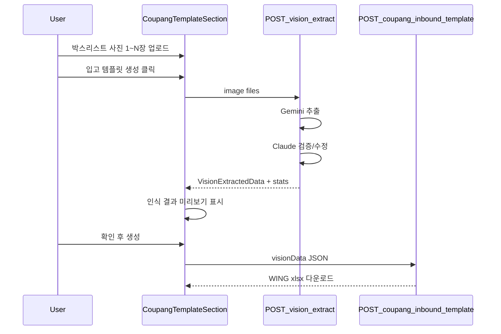

# 입고리스트 이미지 OCR 연동 (쿠팡그로스 입고 템플릿)

## 현재 상태

- UI: [`coupang-inbound-template-section.tsx`](src/components/deliverables/coupang-inbound-template-section.tsx)에 **이미지 업로드 탭**이 있으나 다운로드 시 `"준비 중입니다"` stub만 동작
- 백엔드: [`filter-inbound-template.ts`](src/lib/excel/generators/filter-inbound-template.ts)에 **`BoxListInput` image 분기**가 이미 구현됨

```28:35:src/lib/excel/generators/filter-inbound-template.ts
export type VisionExtractedData = {
  columns: string[];
  rows: Record<string, string>[];
};

export type BoxListInput =
  | { source: "excel"; boxListBuffer: ArrayBuffer | Buffer }
  | { source: "image"; visionData: VisionExtractedData };
```

- `convertVisionRowsToBoxList()`는 **가용 컬럼을 수량보다 우선** → 첨부 사진의 빨간 펜 수정(가용=0, 4 등) 패턴과 일치
- Vision API 코드·AI SDK 의존성은 **현재 repo에 없음** (`package.json`에 Gemini/Anthropic 패키지 없음)

## 목표 UX



사용자 선택: **쿠팡 템플릿만**, **Gemini + Claude 검증**.

---

## 1. Vision 추출 라이브러리 (신규)

**디렉터리:** `src/lib/vision/`

| 파일 | 역할 |
|------|------|
| `types.ts` | `VisionExtractedData`, `VisionExtractResult`, `VisionExtractStats` |
| `prompts/extract-box-list.ts` | Gemini/Claude 공통 지시문 (한국어 표, 손글씨 규칙) |
| `parse-vision-json.ts` | LLM JSON 응답 파싱·정규화 (zod) |
| `extract-with-gemini.ts` | `@google/generative-ai`로 이미지 → JSON |
| `verify-with-claude.ts` | `@anthropic-ai/sdk`로 Gemini 결과 + 원본 이미지 재검증 |
| `merge-vision-results.ts` | 다중 이미지 row 병합 (바코드 중복 시 수량 합산) |
| `extract-box-list-from-images.ts` | 오케스트레이터 (Gemini → Claude → merge) |

**프롬프트 핵심 규칙** (첨부 사진 형식 대응):

- 컬럼: `date`, `location`, `등록상품명`, `옵션`, `바코드`, `수량`, `가용`
- **빨간 펜 손글씨 `가용` 값이 있으면 최종 수량으로 사용** (인쇄 `수량`에 X/취소선이 있어도 가용 우선)
- 행 왼쪽 X 표시 + 가용 0 → quantity 0
- 여백 메타: `박스 - 15` → 각 row의 `box` 필드 또는 `metadata.boxNumber`
- 바코드: 13자리 숫자, 공백 제거
- row별 `confidence` (0~1) 포함

**출력 스키마** (기존 `VisionExtractedData` 호환):

```typescript
{
  columns: ["date","location","등록상품명","옵션","바코드","수량","가용","confidence"],
  rows: [{ "바코드": "2016340979072", "가용": "2", "등록상품명": "...", ... }]
}
```

**환경 변수** ([`.env.example`](.env.example) 추가):

- `GEMINI_API_KEY` (필수)
- `ANTHROPIC_API_KEY` (필수 — Claude 검증)
- `GEMINI_VISION_MODEL` (기본 `gemini-2.5-flash`)
- `ANTHROPIC_VISION_MODEL` (기본 `claude-sonnet-4-20250514`)

미설정 시 API는 `"Vision AI API 키가 설정되지 않았습니다"` 명확 오류 반환.

---

## 2. API 라우트

### A. OCR 전용 — `POST /api/vision/extract-box-list`

**파일:** [`src/app/api/vision/extract-box-list/route.ts`](src/app/api/vision/extract-box-list/route.ts)

- `requireApiProfile()` 인증
- FormData: `images[]` (1~5장, jpeg/png, max ~10MB/장)
- 응답:

```typescript
{
  ok: true,
  data: {
    visionData: VisionExtractedData,
    stats: {
      imageCount, rowCount, validBarcodeRows,
      skippedRows, lowConfidenceRows, correctionCount,
      boxNumbers: string[]
    }
  }
}
```

- `maxDuration` 60~120s (Vercel function timeout 고려)

### B. 템플릿 생성 API 확장

**파일:** [`src/app/api/downloads/coupang-inbound-template/route.ts`](src/app/api/downloads/coupang-inbound-template/route.ts)

- 기존 `boxListFile` (excel) 유지
- 추가: `visionData` (JSON string) 또는 `boxListImages[]` (원샷 OCR+생성)
- **권장:** UI는 2단계 — OCR API → 확인 → `visionData`만 POST (비용·재시도 분리)

`generateCoupangInboundTemplate({ boxListInput: { source: "image", visionData } })` 호출 → 기존 merge 로직 재사용.

### C. 기록 API 확장

**파일:**

- [`src/app/api/coupang-inbound-deliverables/route.ts`](src/app/api/coupang-inbound-deliverables/route.ts)
- [`src/app/api/inbound-records/route.ts`](src/app/api/inbound-records/route.ts)

- `boxListFile` 대신 `visionData` JSON 수용
- `sourceFileName`: `"이미지_N장.jpg"` 등

---

## 3. UI 연동

**파일:** [`src/components/deliverables/coupang-inbound-template-section.tsx`](src/components/deliverables/coupang-inbound-template-section.tsx)

변경 사항:

1. 이미지 탭: **다중 선택** (`multiple`, `imageFiles[]`)
2. `"준비 중"` stub 제거
3. **생성 클릭 시:**
   - `POST /api/vision/extract-box-list` → 로딩 `"이미지 분석 중..."`
   - 인식 결과 **미리보기 테이블** (바코드, 상품명, 옵션, 수량, confidence 경고)
   - stats: `"인식 N건 / 수정 반영 M건 / 저신뢰 K건"`
4. **확인 후** `POST /api/downloads/coupang-inbound-template` with `visionData`
5. **기록하기**도 `visionData` 경로 지원 (`canRecordInbound`를 image+visionData 기준으로)
6. 저신뢰(<0.7) 행은 UI에서 노란색 강조

신규 소형 컴포넌트 (같은 폴더):

- `vision-extract-preview-table.tsx` — 인식 row 표시

---

## 4. 기존 변환 로직 보강 (최소)

**파일:** [`src/lib/excel/generators/filter-inbound-template.ts`](src/lib/excel/generators/filter-inbound-template.ts)

- `convertVisionRowsToBoxList`: quantity 결정 시 **가용 > 수량** 우선 유지, 둘 다 없으면 skip
- `validateVisionBoxListData`: 오류 메시지에 `correctionCount`·`boxNumbers` 힌트 추가 (선택)
- 단위 테스트 추가: [`src/lib/excel/generators/filter-inbound-template.test.ts`](src/lib/excel/generators/filter-inbound-template.test.ts) — 가용 우선·손글씨 0건 fixture

---

## 5. 의존성

```bash
npm install @google/generative-ai @anthropic-ai/sdk
```

---

## 6. 테스트·검증

| 테스트 | 내용 |
|--------|------|
| `parse-vision-json.test.ts` | LLM JSON fixture 파싱, zod 검증 |
| `filter-inbound-template.test.ts` | 가용 우선 수량, barcode/qty 필터 |
| `merge-vision-results.test.ts` | 다중 이미지 바코드 합산 |
| 수동 | 첨부 2장(IDEA1st, 6.15추가) → 바코드·수량·X표시 0건·박스번호 확인 |

`npm run build` + unit test 통과.

---

## 범위 밖 (이번 작업 제외)

- **창고전송용 입고리스트** (DB 자동 생성 — 별도 기능)
- 텔레그램 webhook 재연동
- 미리보기에서 셀 직접 편집 (v2 후보)
- OpenAI Vision (Gemini+Claude로 충분)

## 사용자 설정 (배포 후)

1. Vercel env: `GEMINI_API_KEY`, `ANTHROPIC_API_KEY`
2. 재배포
3. 쿠팡 Growth WING 템플릿 선행 업로드 (기존과 동일)
4. 이미지 탭 → 박스리스트 사진 → 분석 → 확인 → 템플릿 생성
