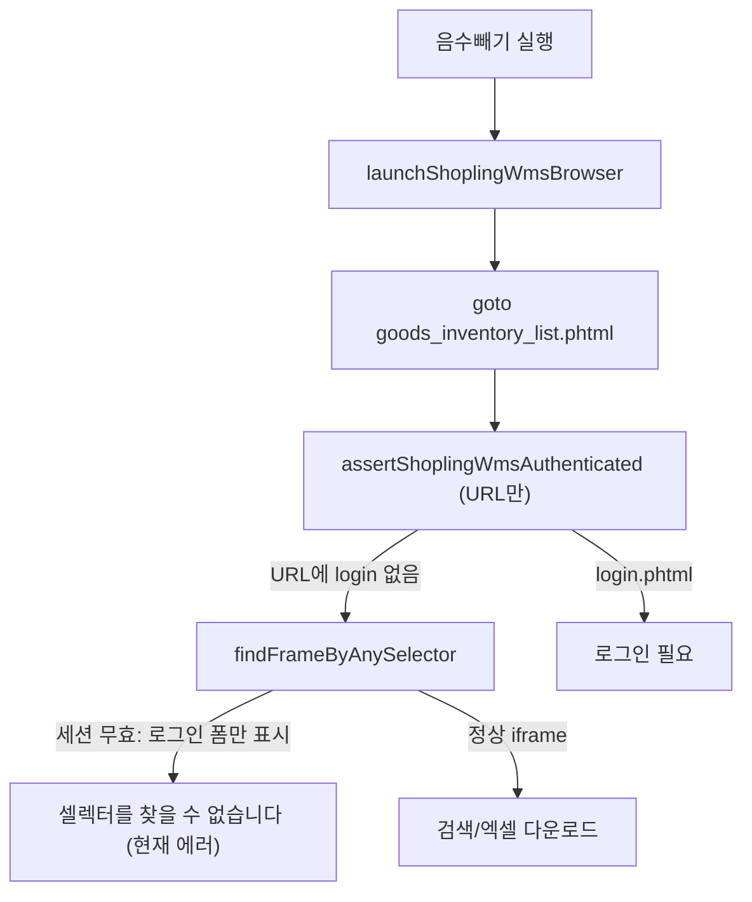

# 재고 음수빼기 셀렉터 오류 수정

## 원인 분석

에러 메시지는 [`findFrameByAnySelector`](src/lib/shopling-wms/browser/frames.ts)가 60초 동안 아래 셀렉터를 **모든 프레임**에서 찾지 못했을 때 발생합니다.

```54:76:src/lib/shopling-wms/browser/frames.ts
export async function findFrameByAnySelector(
  page: Page,
  selectors: readonly string[],
  timeoutMs = getShoplingWmsFrameWaitMs(),
): Promise<Frame> {
  // ... count > 0 이면 반환 ...
  throw new Error(`셀렉터를 찾을 수 없습니다: ${selectors.join(", ")}`);
}
```

현재 인증 검사는 **URL만** 확인합니다.

```83:89:src/lib/shopling-wms/browser/frames.ts
export async function assertShoplingWmsAuthenticated(page: Page): Promise<void> {
  if (isShoplingWmsLoginPage(page.url())) {
    throw new Error("샵플링 WMS 로그인이 필요합니다...");
  }
}
```

플러그인으로 전송한 세션([`/api/automation/shopling-negative-stock/session`](src/app/api/automation/shopling-negative-stock/session/route.ts))은 DB에 쿠키가 있어도 **서버 측 Playwright**에서 만료·도메인 불일치 등으로 무효일 수 있습니다. 이 경우 `/invntryn/goods_inventory_list.phtml` URL은 그대로인데 **본문/iframe에 로그인 폼**(`#login_id`)만 렌더링되어, 재고 검색 셀렉터가 전부 없어집니다.



사용자는 **플러그인 세션**을 사용 중이므로, 수정의 1순위는 **세션 무효 시 명확한 안내**이고, 2순위는 **iframe 로딩·가시성·셀렉터 폴백** 보강입니다.

---

## 수정 범위

### 1. 로그인 폼 감지 및 세션 만료 처리

**파일:** [`src/lib/shopling-wms/browser/frames.ts`](src/lib/shopling-wms/browser/frames.ts), [`src/lib/shopling-wms/session-store.ts`](src/lib/shopling-wms/session-store.ts)

- `SHOPLING_LOGIN_ANCHOR_SELECTORS` 추가: `#login_id`, `input[name="login_id"]`, `#login_pw`
- `detectShoplingLoginFrame(page)` — 모든 frame에서 로그인 입력 존재 여부 확인
- `assertShoplingWmsAuthenticated(page)` 확장: URL **또는** 로그인 프레임 감지 시 아래 메시지 throw
  - `"샵플링 WMS 세션이 만료되었습니다. 샵플링에 로그인한 뒤 크롬 플러그인으로 세션을 다시 전송해 주세요."`
- `findFrameByAnySelector` 타임아웃 직전에도 로그인 프레임 재확인 → 동일 세션 만료 메시지 (긴 셀렉터 목록 대신)
- `session-store.ts`에 `clearShoplingWmsSession(userId)` 추가
- 로그인 감지 시 [`run-negative-stock.ts`](src/lib/shopling-wms/negative-stock/run-negative-stock.ts) phase1 catch에서 `clearShoplingWmsSession` 호출 → `phase: "session"` 반환

### 2. 페이지/iframe 로딩 대기 강화

**파일:** [`src/lib/shopling-wms/browser/frames.ts`](src/lib/shopling-wms/browser/frames.ts), [`src/lib/shopling-wms/negative-stock/phase1-download-inventory.ts`](src/lib/shopling-wms/negative-stock/phase1-download-inventory.ts)

- `gotoShoplingPath`: `waitUntil: "domcontentloaded"` 유지 + `page.waitForLoadState("networkidle", { timeout: ... }).catch()` (타임아웃 시 진행)
- 재고 목록 진입 후 `page.waitForFunction(() => document.querySelectorAll('iframe').length > 0, { timeout })` 또는 frame 수 증가 대기 (Shopling WMS는 phase3에서도 iframe 내 버튼 사용)
- `findFrameByAnySelector` / `findFrameBySelector`: `count > 0` 대신 **`isVisible()`** 확인 (숨겨진 DOM 매칭 방지)

### 3. 재고 검색 셀렉터·로케이터 폴백 확장

**파일:** [`src/lib/shopling-wms/negative-stock/inventory-search-form.ts`](src/lib/shopling-wms/negative-stock/inventory-search-form.ts), [`src/lib/shopling-wms/browser/select-option.ts`](src/lib/shopling-wms/browser/select-option.ts)

- `INVENTORY_SEARCH_FRAME_SELECTORS`에 추가:
  - `input[value="EXCEL 저장"]` (대문자 EXCEL — phase3와 동일 패턴)
  - `input[value*="엑셀"]`
- `firstVisibleLocator`를 **실제 visible** 검사로 수정 (`locator.first().isVisible()`)
- `findInventorySearchFrame`에 Playwright role 폴백 추가 (CSS 실패 시):
  - frame별 `getByRole("button", { name: "검색" })`, `getByRole("button", { name: /엑셀/i })` 시도
- `configureNegativeStockSearch`: 시작/종료 입력란을 `input[type="text"]` + 인접 라벨 텍스트(가용, 재고) 기반으로 찾는 최후 폴백 (선택적, 셀렉터 변경 대비)

### 4. 실패 시 디버그 아티팩트 (운영 진단용)

**파일:** [`src/lib/shopling-wms/negative-stock/phase1-download-inventory.ts`](src/lib/shopling-wms/negative-stock/phase1-download-inventory.ts)

- phase1 catch에서 `page.screenshot({ path: runDir/phase1-failure.png, fullPage: true })` best-effort 저장
- 에러 메시지에 `현재 URL` 포함 (로그인/리다이렉트 여부 확인 용이)

### 5. 테스트

**신규:** `src/lib/shopling-wms/browser/shopling-auth.test.ts`

- 로그인 HTML fixture에서 `detectShoplingLoginFrame` 로직(순수 함수로 분리 시) true/false 검증
- 재고 검색 HTML fixture에서 앵커 셀렉터 목록 중 하나라도 매칭되는지 검증

기존 [`parse-negative-inventory.test.ts`](src/lib/shopling-wms/excel/parse-negative-inventory.test.ts) 패턴을 따름.

---

## 검증 방법

1. **세션 만료 시나리오**: DB에 오래된 세션 → 실행 → `"세션이 만료되었습니다... 플러그인으로..."` 메시지 확인 (긴 셀렉터 목록 X)
2. **정상 시나리오**: 샵플링 로그인 → 플러그인 세션 전송 → 음수빼기 → phase1 엑셀 다운로드 성공
3. `npm run build` 및 신규 unit test 통과

## 변경하지 않는 것

- 플러그인 ZIP 자체, UI 레이아웃 (에러 메시지만 개선되면 충분)
- phase2/phase3 로직 (phase1 성공 후 기존 흐름 유지)
