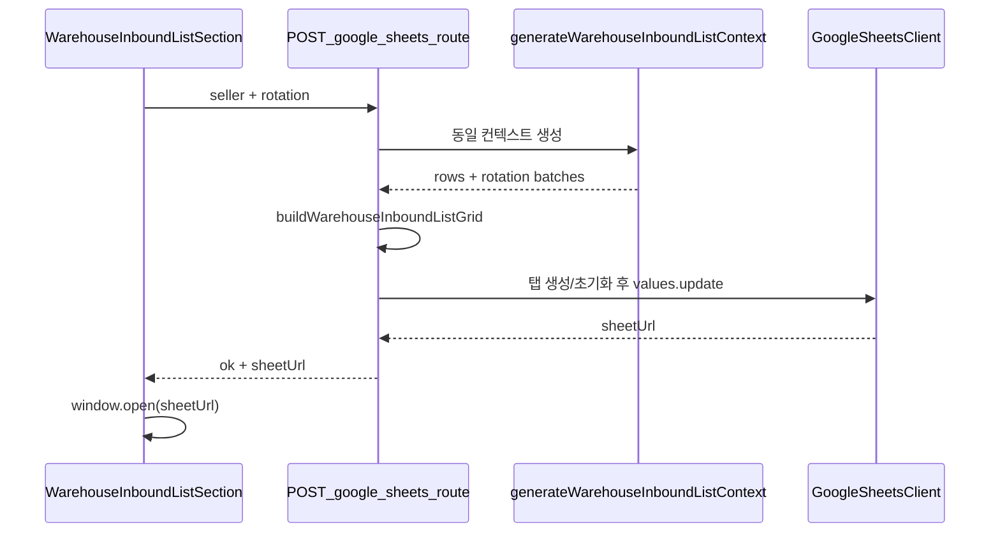

# 창고전송용 입고리스트 — Google Sheets 시트 복사

## 목표

[`warehouse-inbound-list-section.tsx`](src/components/deliverables/warehouse-inbound-list-section.tsx) 다운로드 버튼 옆에 **시트 복사** 버튼 추가. 클릭 시 다운로드 API와 **동일한 seller + 입고 회차(rotation)** 조건으로 리스트를 생성하고, Google Sheets API로 스프레드시트에 그대로 씁니다.

---

## 데이터 동일성 (엑셀 = 시트)

현재 엑셀은 [`warehouse-inbound-list.ts`](src/lib/excel/generators/warehouse-inbound-list.ts)의 `toOutputRows` + `getWarehouseInboundListColumnKeys`로 생성됩니다.

**추가:** 공용 함수 `buildWarehouseInboundListGrid(rows, options)` export

- 반환: `{ sheetTitle, headers: string[], rows: string[][] }`
- `sheetTitle`: 기존 `getKstSheetName(todayDate)`와 동일 (예: `6.17요청`) — 엑셀 시트명과 일치
- `headers`: 컬럼 키 순서 (`box`, `date`, …, `1회차`…, `센터분리`)
- `rows`: 각 데이터 행을 headers 순서의 문자열 배열로 변환 (빈 셀은 `""`)

`generateWarehouseInboundListBuffer`는 내부에서 이 grid 함수를 재사용하도록 리팩터 (중복 로직 제거).

다운로드 API [`warehouse-inbound-list/route.ts`](src/app/api/downloads/warehouse-inbound-list/route.ts)와 시트 API 모두 [`generateWarehouseInboundListContext`](src/services/deliverables/generate-warehouse-inbound-list-context.ts)를 호출 → **회차/패키지/센터분리 포함 동일 데이터** 보장.

---

## Google Sheets 연동 (신규)

### 환경변수 ([`.env.example`](.env.example) 추가)

| 변수 | 용도 |
|---|---|
| `GOOGLE_SERVICE_ACCOUNT_KEY` | 서비스 계정 JSON 문자열 (Vercel env) |
| `GOOGLE_SHEET_ID` | 대상 스프레드시트 ID |

미설정 시 API는 `503` + 안내 메시지 (`Google Sheets 연동이 설정되지 않았습니다.`).

### 라이브러리

- `googleapis` 패키지 추가

### 서버 모듈

1. [`src/lib/google-sheets/client.ts`](src/lib/google-sheets/client.ts) — `server-only`
   - JSON 파싱 + `GoogleAuth` (scope: `spreadsheets`)
   - env 유효성 검사 헬퍼

2. [`src/lib/google-sheets/write-grid-to-sheet.ts`](src/lib/google-sheets/write-grid-to-sheet.ts)
   - 입력: `spreadsheetId`, `sheetTitle`, `headers`, `rows`
   - 동작:
     1. 스프레드시트 메타 조회
     2. `sheetTitle` 탭 없으면 `addSheet`로 생성
     3. 해당 탭 `values.clear` (기존 내용 제거)
     4. `A1`부터 `[headers, ...rows]` `values.update` (`valueInputOption: USER_ENTERED`)
   - 반환: `https://docs.google.com/spreadsheets/d/{id}/edit#gid={gid}`

3. [`src/services/deliverables/push-warehouse-inbound-list-to-google-sheets.ts`](src/services/deliverables/push-warehouse-inbound-list-to-google-sheets.ts)
   - `generateWarehouseInboundListContext` → `buildWarehouseInboundListGrid` → write

### API

[`src/app/api/downloads/warehouse-inbound-list/google-sheets/route.ts`](src/app/api/downloads/warehouse-inbound-list/google-sheets/route.ts)

- `POST` (또는 `GET` with query — 다운로드와 동일하게 query 사용 가능하나 mutation 성격상 **POST** 권장)
- Query/body: `seller`, `rotation` (기존 [`parseWarehouseInboundRotation`](src/services/deliverables/generate-warehouse-inbound-list-context.ts) 재사용)
- `requireApiProfile` 적용
- Response: `{ ok: true, data: { sheetUrl, rowCount, sheetTitle } }`

---

## UI 변경

[`warehouse-inbound-list-section.tsx`](src/components/deliverables/warehouse-inbound-list-section.tsx)

- `DeliverablesActionBar` `center`에 버튼 2개 배치 (기존 bar가 `:nth-child(2)` gap 지원)
  - **다운로드** (기존)
  - **시트 복사** (outline 또는 secondary)
- `handleSheetCopyClick`:
  - `POST /api/downloads/warehouse-inbound-list/google-sheets?seller=…&rotation=…`
  - 성공 시 `window.open(sheetUrl, "_blank")` + notice (`N건을 Google 시트에 복사했습니다.`)
  - 실패 시 서버 error 메시지 표시 (권한/설정 미비 포함)
- 로딩 상태: `isCopyingToSheet` (다운로드/기록과 동시 비활성)
- **기록하기** 활성 조건: 다운로드 성공과 동일하게 시트 복사 성공 후에도 `canRecordInbound = true` (동일 데이터 확인 경로)

---

## 운영 설정 (사용자 측)

스프레드시트 **공유 → 서비스 계정 이메일**에 **편집자** 권한 부여 필요. 권한 없으면 API 403 → UI에 `"스프레드시트 편집 권한을 확인해 주세요."` 안내.

---

## 테스트

1. [`warehouse-inbound-list.test.ts`](src/lib/excel/generators/warehouse-inbound-list.test.ts)
   - `buildWarehouseInboundListGrid` 헤더/행이 `generateWarehouseInboundListBuffer` xlsx 파싱 결과와 일치하는지 검증

2. [`write-grid-to-sheet.test.ts`](src/lib/google-sheets/write-grid-to-sheet.test.ts) (선택, mock fetch/google client)
   - 탭 없을 때 addSheet + update 호출 순서 검증 (google client mock)

3. `npm run build` + 관련 unit test 실행

---

## 범위 외

- 클립보드 붙여넣기 방식
- 샵플링/쿠팡그로스 deliverable 시트 복사
- 스프레드시트 ID를 판매자별로 분기 (현재는 `GOOGLE_SHEET_ID` 단일)
