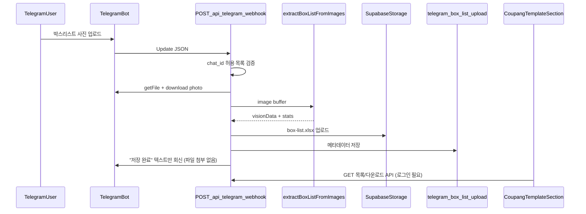

# 텔레그램 이미지 → OCR → 엑셀 자동 저장

## 결론

**가능합니다.** 현재 repo에는 OCR 파이프라인이 이미 구현되어 있고, 텔레그램 연동 코드만 없습니다.

| 구분 | 상태 |
|------|------|
| Gemini + Claude OCR | [`src/lib/vision/extract-box-list-from-images.ts`](src/lib/vision/extract-box-list-from-images.ts) |
| 박스리스트 엑셀 생성 | [`src/lib/vision/client/vision-box-list-client.ts`](src/lib/vision/client/vision-box-list-client.ts) (`buildBoxListExcelFile`) |
| Supabase Storage 업로드 | [`src/lib/supabase/storage.ts`](src/lib/supabase/storage.ts) (`uploadExcelFile`) |
| 텔레그램 봇/webhook | **없음** (과거 mizucos 운영 이력만 [`communication-posts.ts`](src/data/board/communication-posts.ts)에 기록) |

선택하신 방향:
- **저장**: Supabase Storage (텔레그램 방에 파일 답장 X)
- **봇/방**: 기존 운영 그룹 (HEERAH, chat ID 예: `-1003730657434`)

---

## 목표 흐름



생성되는 엑셀 형식은 웹 **이미지 탭**과 동일합니다 (`바코드`, `수량`, 선택 컬럼). 이 파일을 앱에서 받아 **엑셀 탭**에 그대로 사용할 수 있습니다.

---

## 구현 설계 (기존 기능과 분리)

### 1. 서버용 엑셀 빌더 분리

[`buildBoxListExcelFile`](src/lib/vision/client/vision-box-list-client.ts)는 브라우저 `File` 객체를 반환하므로, 서버/텔레그램용으로 버퍼 빌더를 추가합니다.

- 신규: `src/lib/vision/build-box-list-excel-buffer.ts`
- 기존 `buildBoxListExcelFile`는 이 함수를 재사용 (동작 변경 없음)

### 2. 텔레그램 모듈 (신규, 독립)

`src/lib/telegram/`:

| 파일 | 역할 |
|------|------|
| `config.ts` | `TELEGRAM_BOT_TOKEN`, `TELEGRAM_ALLOWED_CHAT_IDS`, `TELEGRAM_WEBHOOK_SECRET`, `TELEGRAM_ENABLED` |
| `client.ts` | `getFile`, `downloadFile`, `sendMessage` (fetch 기반, 별도 npm 패키지 불필요) |
| `parse-update.ts` | photo/document 메시지 파싱, `update_id` 추출 |
| `is-allowed-chat.ts` | 허용 chat_id 화이트리스트 |

`src/services/telegram-box-list/process-telegram-photo.ts`:
- photo buffer → `extractBoxListFromImages` → `buildBoxListExcelBuffer`
- `uploadExcelFile`로 Storage 저장
- DB row 생성
- 실패 시 텔레그램에 짧은 오류 메시지 (엑셀 미첨부)

Storage 경로 예: `telegram-box-list/{uploadId}/box-list.xlsx`

### 3. DB 스키마 (신규 테이블)

Prisma 모델 `TelegramBoxListUpload` (기존 deliverable 테이블과 분리):

- `id`, `storagePath`, `outputFileName`
- `telegramChatId`, `telegramMessageId`, `telegramUpdateId` (중복 처리용 unique)
- `telegramUserName` (선택)
- `rowCount`, `imageCount`, `status` (`processing` / `completed` / `failed`)
- `errorMessage`, `createdAt`, `completedAt`

`telegramUpdateId` unique → Telegram webhook 재시도 시 중복 OCR 방지

### 4. API 라우트

| 라우트 | 인증 | 역할 |
|--------|------|------|
| `POST /api/telegram/webhook` | **없음** (Bot secret header 검증) | 사진 수신 → OCR → 저장 |
| `GET /api/telegram/box-list-uploads` | 로그인 | 최근 업로드 목록 |
| `GET /api/telegram/box-list-uploads/[id]/download` | 로그인 | 엑셀 다운로드 |

Webhook 라우트 설정:
- `export const runtime = "nodejs"`
- `export const maxDuration = 120` (OCR와 동일, [`extract-box-list/route.ts`](src/app/api/vision/extract-box-list/route.ts) 참고)

**미들웨어 예외 필수**: 현재 [`src/middleware.ts`](src/middleware.ts)는 비로그인 API를 401로 막습니다. `/api/telegram/webhook`을 [`shopling-negative-stock/session`](src/middleware.ts)과 같이 인증 게이트 밖으로 추가해야 합니다.

### 5. 앱 UI (다운로드)

[`coupang-inbound-template-section.tsx`](src/components/deliverables/coupang-inbound-template-section.tsx) **엑셀 탭 상단**에 작은 패널 추가:

- "텔레그램 업로드" 최근 N건 목록 (시각, 행 수, 상태)
- **다운로드** 버튼 → 받은 xlsx를 엑셀 탭 dropzone에 바로 넣거나 파일 저장

별도 페이지 없이, 사용자가 텔레그램 → 앱 → 쿠팡 템플릿 생성까지 한 화면에서 이어지게 합니다.

### 6. 환경변수 ([`.env.example`](.env.example))

```env
TELEGRAM_ENABLED=false
TELEGRAM_BOT_TOKEN=
TELEGRAM_ALLOWED_CHAT_IDS=-1003730657434
TELEGRAM_WEBHOOK_SECRET=
```

- `TELEGRAM_ENABLED=false` 기본값 → 기능 미설정 시 webhook 즉시 503 (기존 배포 영향 없음)
- `TELEGRAM_ALLOWED_CHAT_IDS`: 쉼표 구분, HEERAH 그룹 ID 포함

---

## 배포/운영 설정 (코드 외 작업)

기존 그룹에 봇이 이미 있다면 토큰만 재사용 가능합니다. 없다면:

1. BotFather에서 봇 확인/생성 → `TELEGRAM_BOT_TOKEN` 설정
2. HEERAH 그룹에 봇 초대 + 사진 읽기 권한 확인
3. Vercel Production URL 기준 webhook 등록:

```bash
curl "https://api.telegram.org/bot<TOKEN>/setWebhook" \
  -d "url=https://<your-domain>/api/telegram/webhook" \
  -d "secret_token=<TELEGRAM_WEBHOOK_SECRET>"
```

4. 그룹에서 테스트 사진 1장 업로드 → Supabase Storage `telegram-box-list/` 경로 및 앱 목록 확인

텔레그램 회신은 **상태 텍스트만** (예: "OCR 완료 · 15행 · 앱에서 다운로드") — 엑셀 파일은 첨부하지 않습니다.

---

## 주의사항

- **OCR 시간**: 사진 1장당 수십 초~2분. Vercel Hobby는 10초 제한이 있어 **Pro(120s)** 또는 동등 환경 필요. 현재 vision API도 `maxDuration = 120`을 사용 중.
- **앨범/연속 사진**: 1 update = 1 photo 처리로 시작. 같은 메시지의 `media_group_id` 묶음 처리는 2단계 개선으로 분리 가능.
- **actual_packing_overrides 자동 반영 없음**: 과거 텔레그램 vision은 DB에 직접 반영했으나, 현재 정책은 **박스리스트 엑셀 = 진리값**. 이번 기능도 엑셀 저장만 하고 DB override는 건드리지 않음.
- **롤백 용이성**: `src/lib/telegram/`, `src/services/telegram-box-list/`, webhook API, Prisma migration, UI 패널만 제거하면 기존 웹 OCR/엑셀 흐름에 영향 없음.

---

## 검증 계획

1. `TELEGRAM_ENABLED=false` → webhook 503, 기존 앱 기능 정상
2. 허용되지 않은 chat_id → 무시 + 200 (Telegram 재시도 방지)
3. HEERAH 그룹 테스트 사진 → Storage 파일 + DB row + 앱 목록 표시
4. 앱에서 다운로드한 xlsx → 엑셀 탭 업로드 → 기존 **다운로드/샵플링 출고/기록하기** 버튼 정상 동작
5. 동일 `update_id` 재전송 → 중복 저장 없음
