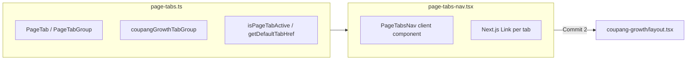

# Commit 1: 공통 상단 탭 인프라

## 범위

- **추가:** 2개 신규 파일
- **변경 없음:** 라우트, Prisma, API, 사이드바/헤더
- **커밋:** 사용자 확인 후 구현 완료 시점에만 수행 (명시 요청 시)

## 설계



### URL 기반 탭 (클라이언트 상태 X)

- 탭 클릭 = `next/link`로 실제 라우트 이동
- 활성 탭 = `usePathname()` + [`app-header.tsx`](src/components/layout/app-header.tsx)와 동일한 prefix 매칭 규칙
- 기존 [`tabs.tsx`](src/components/ui/tabs.tsx)의 `variant="line"` 스타일 재사용 (시각적 일관성)

## 파일별 구현

### 1. [`src/config/page-tabs.ts`](src/config/page-tabs.ts) (신규)

타입 및 탭 그룹 정의:

```ts
export type PageTab = { title: string; href: string };

export type PageTabGroup = {
  id: string;
  basePath: string;
  tabs: PageTab[];
};
```

헬퍼:

- `isPageTabActive(pathname, href)` — `app-sidebar`의 `isNavItemActive`와 동일 로직
- `getDefaultTabHref(group)` — `group.tabs[0].href` (redirect용, Commit 2에서 사용)
- `findPageTabGroup(pathname)` — `pathname.startsWith(basePath)`로 그룹 조회 (향후 레이아웃 자동 연결용)

초기 데이터:

```ts
export const coupangGrowthTabGroup: PageTabGroup = {
  id: "coupang-growth",
  basePath: "/data/coupang-growth",
  tabs: [
    {
      title: "쿠팡 판매자 계정 관리",
      href: "/data/coupang-growth/seller-accounts",
    },
  ],
};

export const pageTabGroups: PageTabGroup[] = [coupangGrowthTabGroup];
```

### 2. [`src/components/layout/page-tabs-nav.tsx`](src/components/layout/page-tabs-nav.tsx) (신규)

`"use client"` 컴포넌트:

```ts
type PageTabsNavProps = {
  tabs: PageTab[];
  className?: string;
};
```

구현 요점:

- [`Tabs`](src/components/ui/tabs.tsx) + `TabsList variant="line"` 래핑
- 각 탭은 `TabsTrigger`의 `render={<Link href={tab.href} />}` 패턴 (사이드바 [`NavIconMenuItem`](src/components/layout/app-sidebar.tsx)과 동일한 Base UI render 방식)
- `usePathname()`으로 활성 탭 판별 → `data-active` 또는 `aria-current="page"` 처리
- `Tabs` root `value`를 현재 pathname과 매칭되는 tab href로 설정 (시각적 underline 동기화)
- 하단 border: `border-b border-border`로 섹션 구분선

Props는 `PageTabGroup` 전체 또는 `tabs` 배열만 받도록 하여, Commit 2 레이아웃에서 `tabs={coupangGrowthTabGroup.tabs}` 형태로 사용.

## Commit 2와의 연결 (이번 커밋에서는 미구현)

Commit 2에서 아래만 추가하면 탭이 화면에 붙음:

```tsx
// data/coupang-growth/layout.tsx (예정)
<PageTabsNav tabs={coupangGrowthTabGroup.tabs} />
{children}
```

## 검증

- `npm run build` — 타입/린트 통과
- Commit 1 단독으로는 라우트가 없어 브라우저 확인은 Commit 2 이후; 이번엔 빌드 성공으로 마무리

## 후속 커밋 요약 (참고)

| Commit | 내용 |
|--------|------|
| 2 | `data/coupang-growth` layout + redirect + placeholder 페이지 |
| 3 | `CoupangSellerAccount` Prisma + 서비스 |
| 4 | 판매자 계정 목록/등록 UI |
