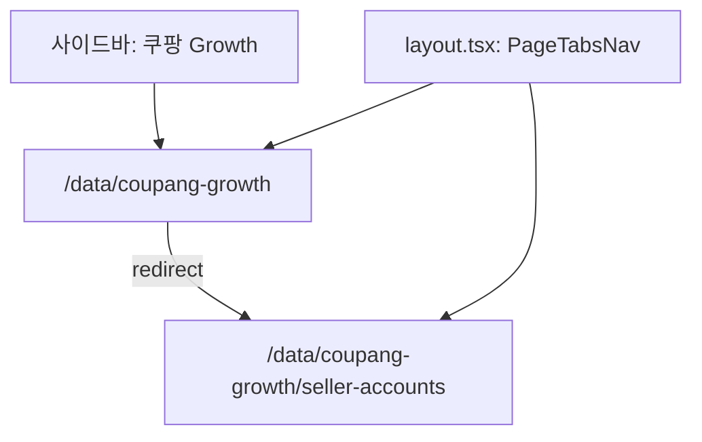

# Commit 2: 쿠팡 Growth 섹션 셸

## 전제

- Commit 1 완료: [`page-tabs.ts`](src/config/page-tabs.ts), [`page-tabs-nav.tsx`](src/components/layout/page-tabs-nav.tsx)
- 사이드바 메뉴 [`navigation.ts`](src/config/navigation.ts)에 `/data/coupang-growth` 이미 등록됨
- **범위:** 라우트 3파일 신규, DB/API/UI 없음
- **커밋 메시지 (컨벤션):** `feat(MIDACGIA-16): 쿠팡 Growth 섹션 라우트 및 상단 탭 레이아웃 추가`

## 라우트 구조



| 경로 | 파일 | 역할 |
|------|------|------|
| `/data/coupang-growth` | `page.tsx` | 첫 탭으로 redirect |
| `/data/coupang-growth/*` | `layout.tsx` | 공통 상단 탭 |
| `/data/coupang-growth/seller-accounts` | `seller-accounts/page.tsx` | placeholder 본문 |

## 파일별 구현

### 1. [`src/app/(dashboard)/data/coupang-growth/layout.tsx`](src/app/(dashboard)/data/coupang-growth/layout.tsx)

```tsx
import { PageTabsNav } from "@/components/layout/page-tabs-nav";
import { coupangGrowthTabGroup } from "@/config/page-tabs";

export default function CoupangGrowthLayout({ children }: { children: React.ReactNode }) {
  return (
    <div className="flex flex-col gap-4">
      <PageTabsNav tabs={coupangGrowthTabGroup.tabs} className="-mx-4 px-4" />
      {children}
    </div>
  );
}
```

- 부모 [`(dashboard)/layout.tsx`](src/app/(dashboard)/layout.tsx)의 `p-4` 안에 있으므로 `-mx-4 px-4`로 탭 구분선을 콘텐츠 영역 너비에 맞춤
- `requireProfile`은 layout이 아닌 각 page에서 처리 (기존 [`settings/accounts/page.tsx`](src/app/(dashboard)/settings/accounts/page.tsx) 패턴)

### 2. [`src/app/(dashboard)/data/coupang-growth/page.tsx`](src/app/(dashboard)/data/coupang-growth/page.tsx)

```tsx
import { redirect } from "next/navigation";
import { coupangGrowthTabGroup, getDefaultTabHref } from "@/config/page-tabs";

export default function CoupangGrowthPage() {
  redirect(getDefaultTabHref(coupangGrowthTabGroup));
}
```

### 3. [`src/app/(dashboard)/data/coupang-growth/seller-accounts/page.tsx`](src/app/(dashboard)/data/coupang-growth/seller-accounts/page.tsx)

- `await requireProfile()` — 미로그인 시 `/login` redirect
- 제목·설명 placeholder (Commit 4에서 테이블/폼으로 교체)

```tsx
<div className="space-y-6">
  <div className="space-y-2">
    <h1 className="text-2xl font-semibold tracking-tight">쿠팡 판매자 계정 관리</h1>
    <p className="text-muted-foreground">
      쿠팡 Wing 판매자 계정을 등록하고 관리합니다.
    </p>
  </div>
</div>
```

## 변경하지 않는 것

- [`app-header.tsx`](src/components/layout/app-header.tsx) — `/data/coupang-growth/*`는 이미 `데이터 관리 > 쿠팡 Growth` breadcrumb 매칭됨 (`isNavItemActive` prefix 규칙)
- [`page-tabs.ts`](src/config/page-tabs.ts) — Commit 1에서 정의 완료
- Prisma, API

## 검증

1. `npm run build` 통과
2. 브라우저:
   - 사이드바 **데이터 관리 > 쿠팡 Growth** 클릭 → `/data/coupang-growth/seller-accounts`로 이동
   - 상단 **쿠팡 판매자 계정 관리** 탭 표시 (탭 1개라 underline 활성)
   - placeholder 제목·설명 표시

## 후속 (Commit 3~4)

| Commit | 내용 |
|--------|------|
| 3 | `CoupangSellerAccount` Prisma + 서비스 |
| 4 | 판매자 계정 목록/등록 UI |
