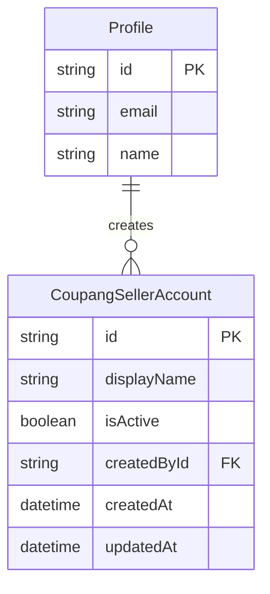

# Commit 3: CoupangSellerAccount Prisma + 서비스

## 전제

- Commit 1~2 및 PageTabsNav 스타일 완료
- 사용자 확정 필드: **displayName, isActive, 생성일(createdAt), 생성자(createdBy)** 만 저장
- vendorId / API Key 등은 **이번 커밋 범위 밖** (추후 확장)
- **범위:** schema, migration, services — API Route·UI 없음

## 데이터 모델



### [`prisma/schema.prisma`](prisma/schema.prisma) 추가

```prisma
model CoupangSellerAccount {
  id          String   @id @default(cuid())
  displayName String
  isActive    Boolean  @default(true)
  createdById String
  createdAt   DateTime @default(now())
  updatedAt   DateTime @updatedAt

  createdBy Profile @relation(fields: [createdById], references: [id], onDelete: Restrict)

  @@index([createdById])
  @@index([createdAt])
}
```

[`Profile`](prisma/schema.prisma)에 역관계 추가:

```prisma
coupangSellerAccounts CoupangSellerAccount[]
```

- `onDelete: Restrict` — 생성자 Profile 삭제 시 고아 레코드 방지
- `displayName` unique 제약 없음 (동일 표시명 허용, Commit 4에서 필요 시 추가)

### 마이그레이션

- `prisma/migrations/20250611180000_add_coupang_seller_account/migration.sql` 생성 (`prisma migrate dev` 또는 수동 SQL + lock 일관성)
- 로컬/Supabase: `npx prisma migrate deploy` + `npx prisma generate`

## 서비스 레이어

[`src/services/members/`](src/services/members/) 패턴 따름: `types.ts` + 함수 파일 분리, `MembersResult` 스타일 결과 타입.

### [`src/services/coupang-seller-accounts/types.ts`](src/services/coupang-seller-accounts/types.ts)

```ts
export type CreateSellerAccountInput = {
  displayName: string;
  isActive?: boolean;
  createdById: string;
};

export type SellerAccountView = {
  id: string;
  displayName: string;
  isActive: boolean;
  createdAt: Date;
  createdBy: {
    id: string;
    email: string;
    name: string | null;
  };
};

export type SellerAccountsResult<T = void> =
  | { ok: true; data: T }
  | { ok: false; error: string };
```

### [`src/services/coupang-seller-accounts/list-seller-accounts.ts`](src/services/coupang-seller-accounts/list-seller-accounts.ts)

- `prisma.coupangSellerAccount.findMany`
- `orderBy: { createdAt: "desc" }`
- `include: { createdBy: { select: { id, email, name } } }`
- 반환: `SellerAccountView[]`

### [`src/services/coupang-seller-accounts/create-seller-account.ts`](src/services/coupang-seller-accounts/create-seller-account.ts)

- zod 검증: `displayName` — `z.string().trim().min(1, "표시명을 입력해 주세요.").max(100)`
- `isActive` — optional, default `true`
- `createdById` — 서비스 호출측(Commit 4 API/page)에서 전달
- `prisma.coupangSellerAccount.create` + `createdBy` include → `SellerAccountView` 반환
- 실패 시 `{ ok: false, error }` (members [`create-admin.ts`](src/services/members/create-admin.ts)와 동일)

## 변경하지 않는 것

- [`seller-accounts/page.tsx`](src/app/(dashboard)/data/coupang-growth/seller-accounts/page.tsx) — Commit 4에서 서비스 연결
- API Route — Commit 4
- AuditLog — 이번 커밋 미포함 (필요 시 Commit 4에서 `member_create` 패턴으로 추가)

## 검증

1. `npx prisma migrate deploy` (또는 dev DB에 마이그레이션 적용)
2. `npx prisma generate`
3. `npm run build` 통과
4. (선택) `tsx` one-liner 또는 Commit 4 전 임시로 서비스 import 타입 체크만 확인

## 커밋 메시지 (컨벤션)

```
feat(MIDACGIA-16): CoupangSellerAccount Prisma 스키마·마이그레이션·서비스 추가
```

## Commit 4 예고

- `GET/POST /api/coupang-seller-accounts` Route Handler
- `seller-accounts/page.tsx`에 목록 테이블 + 등록 폼
- `createSellerAccount` 호출 시 `createdById` = `requireProfile().id`
