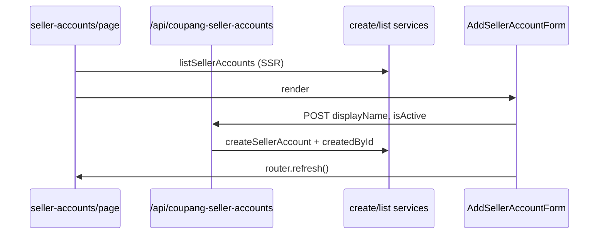

# Commit 4: 판매자 계정 목록/등록 UI + API

## 전제

- Commit 3 완료: [`CoupangSellerAccount`](prisma/schema.prisma), [`listSellerAccounts`](src/services/coupang-seller-accounts/list-seller-accounts.ts), [`createSellerAccount`](src/services/coupang-seller-accounts/create-seller-account.ts)
- 권한: 로그인한 관리자 전원 (`requireProfile` / `requireApiProfile`) — master 전용 아님
- **커밋 메시지:** `feat(MIDACGIA-16): 쿠팡 판매자 계정 API 및 관리 UI 추가`

## 흐름



## 1. API Route

### [`src/app/api/coupang-seller-accounts/route.ts`](src/app/api/coupang-seller-accounts/route.ts) (신규)

[`/api/members/route.ts`](src/app/api/members/route.ts) 패턴:

| Method | 인증 | 동작 |
|--------|------|------|
| `GET` | `requireApiProfile` | `listSellerAccounts()` → `jsonSuccess` |
| `POST` | `requireApiProfile` | body 파싱 후 `createSellerAccount({ ...body, createdById: auth.profile.id })` → `fromServiceResult(..., { successStatus: 201 })` |

POST body 타입 (클라이언트용, `createdById` 제외):

```ts
type CreateSellerAccountBody = {
  displayName: string;
  isActive?: boolean;
};
```

- `logRouteError` + try/catch
- AuditLog: 이번 커밋 미포함 (Commit 3 계획과 동일)

## 2. UI 컴포넌트

### [`src/components/coupang-seller-accounts/seller-accounts-table.tsx`](src/components/coupang-seller-accounts/seller-accounts-table.tsx)

[`members-table.tsx`](src/components/members/members-table.tsx) 참고:

| 컬럼 | 내용 |
|------|------|
| 표시명 | `displayName` |
| 상태 | `Badge` — 활성 `default` / 비활성 `secondary` |
| 생성자 | `createdBy.name ?? createdBy.email` |
| 생성일 | `ko-KR` dateStyle medium |

빈 목록: `등록된 판매자 계정이 없습니다.`

### [`src/components/coupang-seller-accounts/add-seller-account-form.tsx`](src/components/coupang-seller-accounts/add-seller-account-form.tsx)

[`add-admin-form.tsx`](src/components/members/add-admin-form.tsx) 참고:

- 필드: **표시명** (`Input`, required), **활성** ([`Checkbox`](src/components/ui/checkbox.tsx), default checked)
- `apiPost("/api/coupang-seller-accounts", { displayName, isActive })`
- 성공 시 폼 초기화 + `router.refresh()`
- Card: 제목 `판매자 계정 추가`, 설명 한 줄

## 3. 페이지 연결

### [`src/app/(dashboard)/data/coupang-growth/seller-accounts/page.tsx`](src/app/(dashboard)/data/coupang-growth/seller-accounts/page.tsx)

[`settings/members/page.tsx`](src/app/(dashboard)/settings/members/page.tsx) 구조:

```tsx
await requireProfile();
const accounts = await listSellerAccounts();

return (
  <div className="space-y-6">
    {/* 기존 h1 + 설명 유지 */}
    <AddSellerAccountForm />
    <Card>
      <CardHeader>...</CardHeader>
      <CardContent>
        <SellerAccountsTable accounts={accounts} />
      </CardContent>
    </Card>
  </div>
);
```

## 변경하지 않는 것

- Prisma schema / migration
- [`page-tabs.ts`](src/config/page-tabs.ts), layout
- 서비스 함수 시그니처 (필요 시 types에 `CreateSellerAccountBody`만 API용으로 types.ts에 추가 가능)

## 검증

1. `npm run build` 통과
2. 브라우저 `/data/coupang-growth/seller-accounts`:
   - 판매자 계정 추가 (표시명 + 활성 체크)
   - 목록에 표시명·상태·생성자·생성일 표시
   - 새로고침 후에도 유지

## 파일 요약

| 파일 | 작업 |
|------|------|
| `src/app/api/coupang-seller-accounts/route.ts` | 신규 |
| `src/components/coupang-seller-accounts/seller-accounts-table.tsx` | 신규 |
| `src/components/coupang-seller-accounts/add-seller-account-form.tsx` | 신규 |
| `src/services/coupang-seller-accounts/types.ts` | `CreateSellerAccountBody` 타입 추가 (선택) |
| `seller-accounts/page.tsx` | 서비스 + 컴포넌트 연결 |
