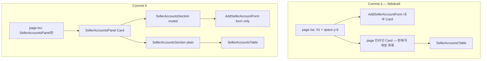

# Commit 5: 판매자 계정 패널 통합 및 섹션 시각 구분

## 전제

- **기준 커밋:** `0ebdce6` — `feat(MIDACGIA-16): 쿠팡 판매자 계정 API 및 관리 UI 추가`
- **이 계획이 대체하는 초안:** [`seller_account_ux_polish_e2bd6597.plan.md`](seller_account_ux_polish_e2bd6597.plan.md) (SellerAccountsList 분리안은 미구현·미커밋, 패널 통합으로 대체)
- **커밋 메시지 (UI):** `style(MIDACGIA-16): 판매자 계정 패널 통합 및 섹션 시각 구분`

## Commit 4 실제 상태 (before)

`0ebdce6`의 [`seller-accounts/page.tsx`](src/app/(dashboard)/data/coupang-growth/seller-accounts/page.tsx):

- `h1` + 설명 블록
- [`AddSellerAccountForm`](src/components/coupang-seller-accounts/add-seller-account-form.tsx) — **자체 Card** 래퍼
- **page 인라인 Card** — `판매자 계정 목록` 제목 + `SellerAccountsTable`
- `SellerAccountsList` 컴포넌트는 **존재하지 않음**

## 변경 방향



- **하나의 Card** 안에 두 **inset 섹션** (rounded border + 배경 톤 차이)
- 폼 Card 제거 → 패널 섹션이 제목·설명 담당
- 별도 `SellerAccountsList` 파일 없이 패널에 흡수

## 디자인 토큰 (신규 DS 없음)

| 레이어 | 클래스 | 역할 |
|--------|--------|------|
| 패널 헤더 | `border-b bg-muted/30` | 페이지 주제 블록 |
| 패널 본문 | `bg-muted/15 gap-4` | 섹션 사이 연한 바탕 |
| 계정 추가 | `variant="muted"` → `bg-muted/50` | 입력 영역 |
| 계정 목록 | `variant="plain"` → `bg-background` | 테이블 대비 |
| 섹션 제목 | `bg-primary` 세로 바 + `border-b border-border/60` | 구역 라벨 |
| 테이블 | `rounded-md border`, 헤더 `bg-muted/40` | 데이터 영역 |
| 빈 목록 | `border-dashed bg-muted/30` | 0건 상태 |

## 변경 파일 (Commit 5 UI 커밋)

| 파일 | 변경 |
|------|------|
| [`seller-accounts-panel.tsx`](src/components/coupang-seller-accounts/seller-accounts-panel.tsx) | **신규** — Panel + Section |
| [`seller-accounts/page.tsx`](src/app/(dashboard)/data/coupang-growth/seller-accounts/page.tsx) | Panel만 렌더 |
| [`add-seller-account-form.tsx`](src/components/coupang-seller-accounts/add-seller-account-form.tsx) | Card 제거, 가로 폼, 라벨·placeholder |
| [`seller-accounts-table.tsx`](src/components/coupang-seller-accounts/seller-accounts-table.tsx) | 래퍼·빈 상태·헤더 스타일 |
| [`create-seller-account.ts`](src/services/coupang-seller-accounts/create-seller-account.ts) | zod 메시지 통일 |

**변경 없음:** Prisma, API Route, `page-tabs.ts`, list 서비스. DB 필드 `displayName` 유지.

## 워킹 트리 — UI 커밋 제외 (별도 chore 권장)

| 파일 | 내용 |
|------|------|
| [`package.json`](package.json) | `dev`/`build`에 `prisma generate` prefix |
| [`.gitignore`](.gitignore) | `.cursor` 추가 |

## 검증 (완료)

- `npx next build` — TypeScript·16 routes 생성 **통과** (2025-06-11)
- 참고: `npm run dev` 실행 중 Windows에서 `prisma generate`가 EPERM 날 수 있음 → build 전 dev 서버 중지 권장

### 브라우저 체크리스트

`/data/coupang-growth/seller-accounts`:

- [ ] 본문 `h1` 없음 (탭 + breadcrumb만)
- [ ] 한 Card 안 계정 추가(회색) / 계정 목록(흰 배경) 구분
- [ ] 섹션 제목 왼쪽 primary 세로 바
- [ ] 0건 dashed 빈 상태 박스
- [ ] 계정 추가 후 목록·Badge 건수 갱신
- [ ] 라벨 `쿠팡 판매자 계정`, placeholder `mizucos`

## 실행 — Git 커밋

### 1) UI/UX 커밋 (이 계획 본문)

```powershell
git add src/components/coupang-seller-accounts/seller-accounts-panel.tsx
git add src/app/(dashboard)/data/coupang-growth/seller-accounts/page.tsx
git add src/components/coupang-seller-accounts/add-seller-account-form.tsx
git add src/components/coupang-seller-accounts/seller-accounts-table.tsx
git add src/services/coupang-seller-accounts/create-seller-account.ts

git commit -m "style(MIDACGIA-16): 판매자 계정 패널 통합 및 섹션 시각 구분"
```

### 2) 인프라 커밋 (선택·분리)

```powershell
git add package.json .gitignore

git commit -m "chore: dev/build에 prisma generate 추가 및 .cursor gitignore"
```

## MIDACGIA-16 커밋 이력 (참고)

| # | 메시지 |
|---|--------|
| 1 | `feat(MIDACGIA-16): page-tabs 설정 및 PageTabsNav 공통 컴포넌트 추가` |
| 2 | `feat(MIDACGIA-16): 쿠팡 Growth 섹션 라우트 및 상단 탭 레이아웃 추가` |
| — | `style(MIDACGIA-16): PageTabsNav 관리자형 underline 탭 스타일 적용` |
| 3 | `feat(MIDACGIA-16): CoupangSellerAccount Prisma 스키마·마이그레이션·서비스 추가` |
| 4 | `feat(MIDACGIA-16): 쿠팡 판매자 계정 API 및 관리 UI 추가` |
| **5** | **`style(MIDACGIA-16): 판매자 계정 패널 통합 및 섹션 시각 구분`** ← 이번 |

## 후속 (범위 밖)

- `SellerAccountsSection` → 공통 `PageSection` 추출
- 계정 수정·삭제, vendorId/API 키
- 쿠팡 Growth 추가 탭
