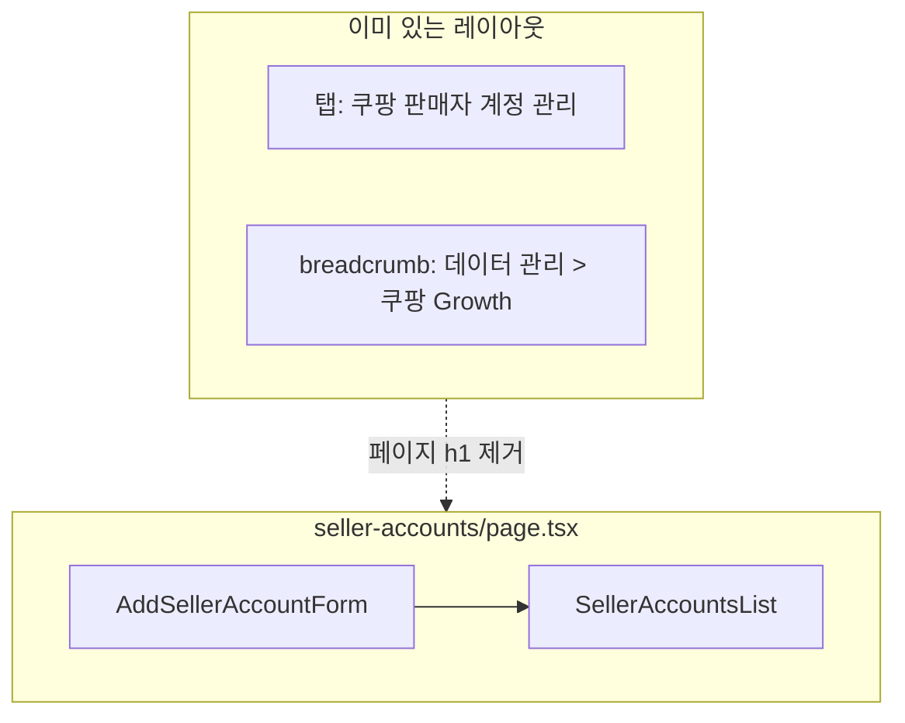

# 판매자 계정 페이지 UX 정리

> **대체됨:** 최종 실행·커밋 가이드는 [`commit_5_seller_accounts_panel_polish_f4a82c1e.plan.md`](commit_5_seller_accounts_panel_polish_f4a82c1e.plan.md)를 사용하세요.

## 배경

현재 [`seller-accounts/page.tsx`](src/app/(dashboard)/data/coupang-growth/seller-accounts/page.tsx)에 `h1 쿠팡 판매자 계정 관리`가 있고, 상단 탭([`page-tabs.ts`](src/config/page-tabs.ts))·헤더 breadcrumb(`데이터 관리 > 쿠팡 Growth`)과 **3중 중복**됩니다.

목록 영역은 page에 Card가 인라인으로 있어 추가 폼(`AddSellerAccountForm`)과 **구조 대칭이 없음**.

## 변경 방향



- 페이지 본문 **h1 + 설명 블록 삭제** — 탭이 섹션 제목 역할 (설정 > 회원관리와 달리 탭+breadcrumb이 이미 있음)
- 필드/컬럼 라벨 **표시명 → 쿠팡 판매자 계정**
- placeholder **`mizucos`**
- 목록을 **`SellerAccountsList` 컴포넌트**로 추출해 추가 폼과 대칭

## 파일별 작업

### 1. 라벨·문구 통일

| 위치 | 변경 |
|------|------|
| [`add-seller-account-form.tsx`](src/components/coupang-seller-accounts/add-seller-account-form.tsx) | `FieldLabel`: 쿠팡 판매자 계정, `placeholder="mizucos"`, CardDescription 간결화 |
| [`seller-accounts-table.tsx`](src/components/coupang-seller-accounts/seller-accounts-table.tsx) | `TableHead`: 표시명 → 쿠팡 판매자 계정 |
| [`create-seller-account.ts`](src/services/coupang-seller-accounts/create-seller-account.ts) | zod 메시지: `쿠팡 판매자 계정을 입력해 주세요.` / `100자 이하...` |

DB 필드명 `displayName`은 유지 (스키마/API 변경 없음).

### 2. 신규 [`seller-accounts-list.tsx`](src/components/coupang-seller-accounts/seller-accounts-list.tsx)

[`add-seller-account-form.tsx`](src/components/coupang-seller-accounts/add-seller-account-form.tsx)와 대칭되는 **목록 전용 Card 래퍼**:

```tsx
export function SellerAccountsList({ accounts }: { accounts: SellerAccountView[] }) {
  return (
    <Card>
      <CardHeader>
        <CardTitle>계정 목록</CardTitle>
        <CardDescription>등록된 쿠팡 판매자 계정입니다.</CardDescription>
      </CardHeader>
      <CardContent>
        <SellerAccountsTable accounts={accounts} />
      </CardContent>
    </Card>
  );
}
```

[`add-seller-account-form.tsx`](src/components/coupang-seller-accounts/add-seller-account-form.tsx) CardTitle도 **`계정 추가`**로 맞춤 (추가/목록 쌍으로 구분).

### 3. [`seller-accounts/page.tsx`](src/app/(dashboard)/data/coupang-growth/seller-accounts/page.tsx) 슬림화

```tsx
return (
  <div className="space-y-6">
    <AddSellerAccountForm />
    <SellerAccountsList accounts={accounts} />
  </div>
);
```

- `h1` / `p` 설명 블록 **삭제**
- 인라인 Card 제거 → `SellerAccountsList` 사용

### 4. 변경하지 않는 것

- [`page-tabs.ts`](src/config/page-tabs.ts) 탭 제목 (페이지 컨텍스트 유지)
- [`app-header.tsx`](src/components/layout/app-header.tsx) breadcrumb
- Prisma / API / DB

## 검증

1. `npm run build` 통과
2. `/data/coupang-growth/seller-accounts`:
   - 상단 탭만 제목 역할, 본문에 큰 h1 없음
   - **계정 추가** Card / **계정 목록** Card 두 블록 명확히 구분
   - 입력 라벨 `쿠팡 판매자 계정`, placeholder `mizucos`
   - 테이블 첫 컬럼 `쿠팡 판매자 계정`

## 커밋 메시지 (컨벤션)

```
style(MIDACGIA-16): 판매자 계정 페이지 라벨 정리 및 섹션 컴포넌트 분리
```
