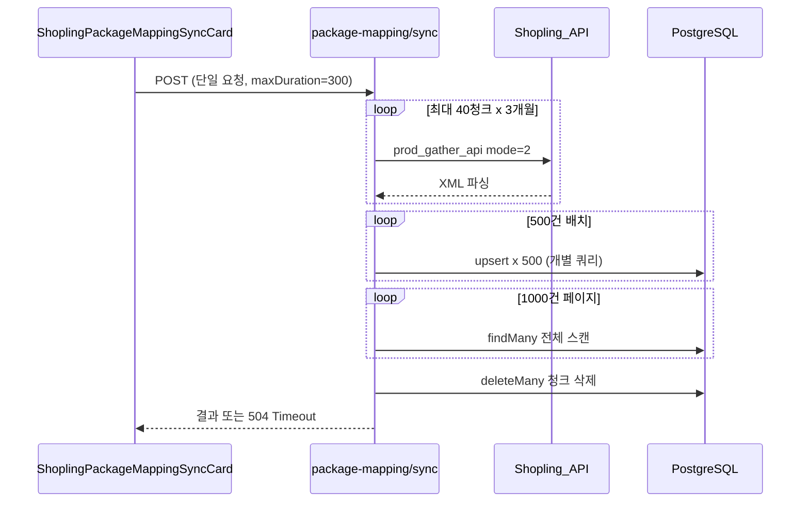
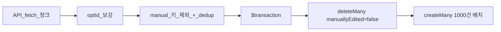

# 패키지 매핑 동기화 300초 타임아웃 해결

## 원인 분석

현재 동기화는 단일 API 요청(`POST /api/shopling/package-mapping/sync`)에서 **전 과정을 순차 실행**합니다.

| 구간 | 현재 구현 | 문제 |
|------|-----------|------|
| API fetch | [`fetch-shopling-package-source.ts`](src/services/shopling-package-mapping/fetch-shopling-package-source.ts) — 최대 40청크 순차 HTTP | 재고 동기화와 동일 (~1~2분 수준, 단독으로는 통과 가능) |
| DB upsert | [`sync-shopling-package-mapping.ts`](src/services/shopling-package-mapping/sync-shopling-package-mapping.ts) L195~227 — **배치당 500회 개별 `upsert`** | ~1만 건이면 DB 왕복 수만 건 → **수 분 소요** |
| prune | L239~316 — 전체 테이블 페이지네이션 + `deleteMany` | upsert 이후 추가 수십 초 |

Vercel Pro 함수 상한은 **300초 고정**([`route.ts`](src/app/api/shopling/package-mapping/sync/route.ts) `maxDuration = 300`). `maxDuration`을 더 올릴 수 없으므로 **실행 시간 자체를 줄여야** 합니다.

재고 동기화([`sync-shopling-inventory.ts`](src/services/shopling-sync/sync-shopling-inventory.ts))는 동일한 API fetch 후 **`deleteMany` + `createMany`(1000건 배치)** 로 1~2분 내 완료됩니다. 패키지 매핑만 개별 upsert + prune 구조라 타임아웃이 발생합니다.

## 해결 방향 (선택: bulk reload)

`manually_edited = false` 인 자동 행만 삭제한 뒤, API에서 파싱한 행을 `createMany`로 재적재합니다.

- `manually_edited = true` 행: `deleteMany` 대상 제외 → **수동 편집 보호 유지**
- API에 없는 자동 행: 삭제 후 재삽입 안 됨 → **prune 효과를 reload에 흡수**
- downstream([`load-outbound-decompose-context.ts`](src/services/deliverables/load-outbound-decompose-context.ts))은 `id`가 아닌 `packageBarcode`/`singleBarcode`/`mapCnt`만 사용 → **행 id 재생성 무해**

## 구현 상세

### 1. DB 적재 로직 교체 — [`sync-shopling-package-mapping.ts`](src/services/shopling-package-mapping/sync-shopling-package-mapping.ts)

**삭제할 코드**
- `upsertPackageMappingRows()` — 개별 upsert 루프
- `pruneStalePackageMappings()` — 전체 스캔 prune
- `UPSERT_*` 상수 및 `computeUpsertTransactionTimeoutMs()`

**추가할 코드** (재고 동기화 패턴 복제)
- `CREATE_MANY_BATCH_SIZE = 1000`
- `reloadPackageMappingRows()`:
  1. `prisma.$transaction` 내에서 `deleteMany({ where: { manuallyEdited: false } })`
  2. `dedupedRows`를 1000건씩 `createMany`
  3. tx timeout: `INGEST_TX_*`와 동일한 공식 재사용 (30s + 15s × 배치 수, cap 240s)

**stats 의미 조정** (UI 호환 유지)
- `upserted`: `createMany`로 삽입한 건수
- `deleted`: `deleteMany`로 제거된 자동 행 수 (기존 prune 삭제 수와 유사한 의미)
- `prune_skipped`: `true` 고정 (별도 prune 단계 없음)
- `prune_protected_manual`: 기존과 동일하게 수동 행 수 집계 가능

### 2. API route — 변경 최소

[`src/app/api/shopling/package-mapping/sync/route.ts`](src/app/api/shopling/package-mapping/sync/route.ts)
- `maxDuration = 300` 유지 (이미 상한)
- 선택: `vercel.json`에 해당 route에 `memory: 3008` 추가 — 대용량 XML 파싱 시 OOM 방지 (negative-stock run과 동일)

### 3. UI — 변경 없음 (권장)

[`shopling-package-mapping-sync-card.tsx`](src/components/shopling-sync/shopling-package-mapping-sync-card.tsx)는 기존 단일 POST 유지. bulk reload로 300초 내 완료되면 UX 변경 불필요.

**선택적 개선** (이번 범위 밖, 필요 시 후속):
- Vercel 504 HTML 응답 시 [`api-client.ts`](src/lib/api-client.ts)에서 "서버 시간 초과" 메시지 표시

### 4. 테스트

신규 단위 테스트 파일 추가 권장: `src/services/shopling-package-mapping/sync-shopling-package-mapping.test.ts`
- dedup Map 로직 (기존 `duplicates_removed` 검증)
- manual 키 제외 후 insert 대상 건수 계산

로컬/스테이징에서 실제 동기화 1회 실행 후:
- Vercel 로그에 300s timeout 없음
- stats `upserted` / `deleted` 정상
- `/data/shopling/package-mapping` 데이터 정합성
- `manually_edited = true` 행이 덮어쓰이지 않았는지 확인

## 예상 효과

| 항목 | Before | After |
|------|--------|-------|
| DB 쿼리 수 | ~10,000 upsert + 전체 scan | 1 deleteMany + ~10 createMany |
| DB 소요 시간 | 3~5분+ | 수 초~수십 초 |
| 전체 소요 | 300초 초과 | API fetch(~1~2분) + DB(~30초) ≈ **2~3분 이내** |

## 리스크 및 완화

- **수동 행과 동일 (packageOptId, singleOptId) 키**: insert 대상에서 이미 제외 중 → unique 충돌 없음
- **트랜잭션 실패 시**: delete 후 insert 실패하면 자동 행 일시 공백 → 단일 `$transaction`으로 원자성 보장
- **API fetch만으로 300초 초과**하는 극단 케이스: 이번 변경 후에도 발생 시, 후속으로 청크별 분할 API + 진행률 UI 검토
