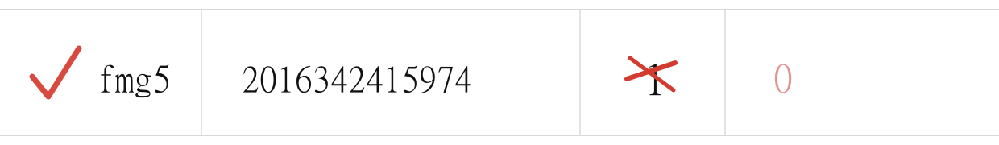
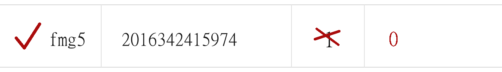

# 이미지 OCR — 빨간 채널 전처리 (취소/0 인식 개선)

박스리스트 사진에서 **취소 표시(수량 위 빨간 X·취소선) + 오른쪽에 손으로 쓴 빨간 "0"** 을
AI가 자주 놓치는 문제를 개선하기 위한 설계 문서.

## 1. 배경 / 문제

- 보정 숫자(특히 `0`)가 **흐리고 작은 빨간 잉크**라, 검은 인쇄 글자에 묻혀 잘 안 보인다.
- 모델은 이미지를 내부적으로 **축소**해서 읽는데, 이때 흐린 빨간 0이 더 사라진다.
- 파이프라인: **Gemini(추출) → Claude(검증)** 2단계. (`src/lib/vision/*`)
- 증상: "취소하고 0을 써도 대부분 인식 못 함", "같은 사진도 될 때/안 될 때가 있음".

## 2. 이미 반영된 개선 (커밋 `02e853e`, 배포 완료)

프롬프트 **규칙은 그대로 두고** 인식 보조만 추가:

- 프롬프트에 **빨간 잉크 색 단서** + `"0"` 최다누락 케이스 강조 문구 추가.
- Claude 검증이 Gemini 결과에 끌려가지 않도록 **행별 독립 재검사** 지시.
- Gemini/Claude **`temperature: 0`** → 같은 사진은 항상 같은 결과(흔들림 제거).

이것은 "잘 봐라"에 해당한다. 아래 전처리는 "**잘 보이게 만들어준다**"로, 근본 처방이다.

## 3. 다음 단계 — 빨간 채널 전처리 (미착수)

개념: AI에 보내기 **전에** "빨간 펜 자국만 진하게" 만드는 필터를 한 번 씌운다.
빨간 잉크는 색 데이터상 **빨강(R)만 높고 초록·파랑은 낮다** → `redness = R - max(G, B)` 로 판별.

### 실제 처리 결과 (sharp 로 생성)

**① 원본** — 인쇄된 `1` 위 빨간 취소선/X, 오른쪽에 흐린 빨간 `0`.

**② 빨간 채널만 추출 (개념 확인용)** — 빨간 표시만 남고 인쇄 글자는 사라짐.

**③ 강화 원본 (권장·아무것도 안 지움)** — 원본은 그대로 두고 **빨간 것만 진하게**.
바코드·상품명·수량 모두 유지.

## 4. 바코드 매칭은 안 깨지나? (핵심 우려에 대한 답)

> "다 지우면 기존 바코드 매칭이 틀리지 않나? 순서 매칭이 어긋나지 않나?"

**안 깨진다. 이유:**

1. **바코드는 항상 원본에서 읽는다.** 전처리본은 취소/0 판독 보조일 뿐, 바코드·상품명·수량 판독의
   기준은 언제나 원본 이미지다.
2. **매칭은 "순서/위치"가 아니라 바코드 "값"으로 한다.**
   - `src/lib/excel/generators/filter-inbound-template.ts` — 템플릿 각 행의 바코드로
     `qtyMap.get(barcode)` 조회.
   - `src/lib/excel/parsers/parse-box-inbound-list.ts` `buildBarcodeQtyMap` — 바코드별 수량 맵,
     중복 바코드는 **합산**.
   - 따라서 **행 순서가 바뀌거나 일부 행이 빠져도, 바코드 숫자가 같으면 매칭된다.** 위치 무관.
3. 그래서 **②(빨간 것만 남긴 이미지)를 단독으로 쓰면** 오히려 어떤 0이 어떤 행 것인지 문맥을 잃을 수
   있다 → **그렇게 쓰지 않는다.**

### 권장 방식: ③ 강화 원본

- 원본에 빨간 표시만 진하게 한 **1장**을 사용 → 바코드·글자·수량이 다 남아있어 **문맥/순서 문제 자체가
  없다.** 비용도 적다(1장).
- (대안 A: 원본 + ② 2장 전송 — 빨강은 더 또렷하지만 2장이라 비용↑, 위치 정렬에 의존.)

## 5. 안전장치

- 전처리 **실패 시 자동으로 원본만 사용** (fallback).
- **환경변수 on/off 스위치** (예: `VISION_RED_PREPROCESS`) → 문제 시 코드 롤백 없이 즉시 원복.
- 기존 **프롬프트 규칙 / 엑셀 반영 경로는 불변.** 전처리는 "AI에 들어가는 이미지 화질"만 바꾸는 앞단계.

## 6. 구현 계획 (미착수)

1. **1단계** — sharp 전처리(방식 ③ 강화 원본) + on/off 스위치 + 실패 fallback.
2. **2단계** — 수량·가용 열만 크롭 확대 → 축소돼도 작은 0 판독력↑.
3. **회귀 방지** — 실제 취소/0 사진 골든셋으로 프롬프트·전처리 변경 시 정확도 확인.

> 이 문서의 예시 이미지는 시트의 한 행을 흉내 낸 것. 실제 촬영본으로 동일 처리해 효과를 검증한 뒤
> 1단계 구현에 착수한다.
